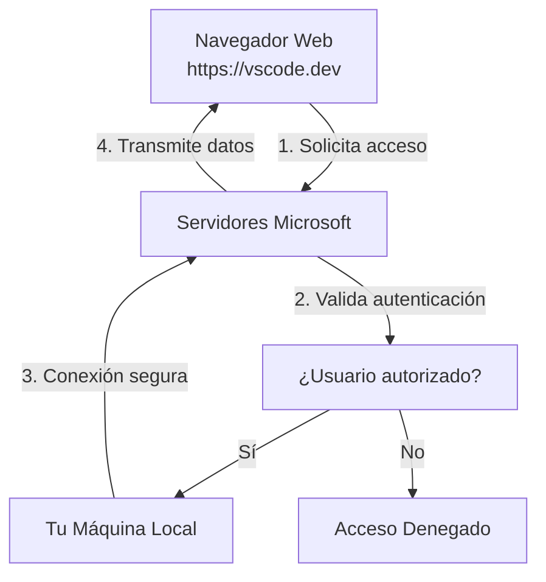

# Guía de Uso: Code CLI Tunnel

> [!INFO] Contexto
> Esta guía explica cómo exponer tu entorno de desarrollo local de forma segura utilizando el túnel oficial de VS Code. Ideal para compartir sesiones o acceder a tu máquina remotamente.

---

## ¿Qué es Code Tunnel?

Es una herramienta de la CLI de VS Code que permite crear un enlace seguro entre tu máquina y un cliente externo (navegador o otro VS Code), sin necesidad de configurar SSH complejo o abrir puertos en el router.


---

## Descarga e Instalación

### Visual Studio Code (Recomendado)
- **Windows/macOS**: [code.visualstudio.com](https://code.visualstudio.com/download)
- **Linux**: `sudo snap install code` o descarga desde la web oficial

### Code CLI Standalone (Servidores/CI/CD)
Para máquinas sin interfaz gráfica:
```bash
# macOS
curl -Lk 'https://code.visualstudio.com/sha/download?build=stable&os=cli-darwin-arm64' --output vscode_cli.zip

# Linux
curl -Lk 'https://code.visualstudio.com/sha/download?build=stable&os=cli-linux-x64' --output vscode_cli.tar.gz
```

> [!TIP] Descarga directa
> También puedes descargar desde: [update.code.visualstudio.com](https://update.code.visualstudio.com/latest/cli-alpine-x64/stable)

---

## Prerrequisitos

1. Tener **Visual Studio Code** instalado (o Code CLI standalone).
2. Una cuenta de **GitHub** o **Microsoft**.

---

## Paso a Paso

### 1. Instalación / Verificación

El comando `code` suele instalarse automáticamente con VS Code. Abre tu terminal y verifica:

```bash
code --version
# Si no funciona, abre VS Code, presiona F1 y escribe:
# "Shell Command: Install 'code' command in PATH"
```

### 2. Iniciar el Túnel

Ejecuta el siguiente comando en tu terminal:

```bash
code tunnel
```

> [!NOTE] Primera vez
> Si es la primera vez que lo usas, te pedirá aceptar los términos de licencia y loguearte con GitHub/Microsoft. Sigue las instrucciones en pantalla (te dará un código y una URL para autenticarte).

### 3. Configurar el Nombre (Opcional)

Puedes asignar un nombre específico a tu máquina para identificarla fácilmente:

```bash
code tunnel --name "mi-maquina-trabajo"
```

### 4. Compartir el Acceso

Una vez el túnel esté activo, la terminal mostrará algo como:

> [!SUCCESS] Output Exitoso
> *Open this link in your browser: https://vscode.dev/tunnel/mi-maquina-trabajo*

Copia ese enlace y envíalo a tu compañero.

---

## Entendiendo la URL del Túnel

### ¿Qué es `https://vscode.dev/tunnel/mi-maquina-trabajo`?

Esta URL permite acceder **remotamente** a tu instancia de VS Code desde cualquier navegador web. Es como tener VS Code "en la nube" pero ejecutándose en tu máquina local.

**Componentes de la URL:**
- `vscode.dev` → Versión web de VS Code (corre en el navegador)
- `/tunnel/` → Indica que se usará un túnel de conexión
- `mi-maquina-trabajo` → Nombre único que identifica TU máquina



### ¿Público o Privado?

**Por defecto: PRIVADO** ✅

El túnel requiere autenticación:
- Solo usuarios con tu cuenta de GitHub/Microsoft pueden acceder
- Necesitan iniciar sesión en vscode.dev
- No es accesible públicamente sin permisos

### Configuración de Puertos

**No necesitas configurar puertos manualmente.** El túnel funciona de forma diferente:

| Aspecto | Cómo funciona |
|---------|---------------|
| **Puerto local** | VS Code expone el puerto interno automáticamente |
| **Puerto externo** | No existe - usa HTTPS sobre el túnel de Microsoft |
| **Firewall** | No necesitas abrir puertos en tu router |
| **URL base** | Siempre usa el puerto 443 (HTTPS) estándar |

### ¿Qué se comparte exactamente?

Cuando alguien abre tu URL, accede a:
- ✅ Tu workspace de VS Code completo
- ✅ Terminales integradas
- ✅ Servidores de desarrollo (localhost:3000, etc.)
- ✅ Extensiones instaladas
- ✅ Configuraciones y atajos

**No comparte:**
- ❌ Otras aplicaciones de tu PC
- ❌ Archivos fuera del workspace
- ❌ Escritorio o sistema operativo

> [!TIP] Seguridad adicional
> Para mayor seguridad, puedes:
> 1. Usar nombres difíciles de adivinar: `--name "xyz-dev-2024"`
> 2. Cerrar el túnel inmediatamente después de usarlo
> 3. Revisar quién tiene acceso en tu cuenta de Microsoft/GitHub

### Acceso desde otro VS Code Desktop

Tus compañeros también pueden conectarse desde su VS Code instalado:

1. Abren VS Code en su máquina
2. Presionan `Cmd/Ctrl + Shift + P`
3. Escriben: `Remote-Tunnels: Connect to Tunnel...`
4. Seleccionan tu máquina de la lista
5. Inician sesión con su cuenta

> [!IMPORTANT] Limitaciones
> - Solo una persona puede conectarse al túnel a la vez (por defecto)
> - La velocidad depende de tu conexión a internet
> - Si cierras VS Code en tu máquina, el túnel se corta

---

## Comandos Útiles

| Comando | Descripción |
|---------|-------------|
| `code tunnel` | Inicia el túnel estándar |
| `code tunnel kill` | Mata cualquier túnel activo |
| `code tunnel status` | Verifica el estado del servicio |
| `code tunnel user logout` | Cierra la sesión de tu cuenta |

---

## Recursos del Sistema

### Consumo Típico
El servicio de túnel consume recursos mínimos cuando está inactivo:

| Recurso | Consumo Base | Consumo Activo |
|---------|-------------|----------------|
| **CPU** | ~0-1% | 1-5% (transferencia) |
| **Memoria RAM** | 20-50 MB | 50-100 MB |
| **Red** | ~1 KB/s (keepalive) | Variable (según uso) |
| **Disco** | <10 MB instalación | Logs mínimos |

### Requisitos Mínimos
- **RAM**: 512 MB disponibles
- **CPU**: 1 núcleo (cualquier procesador moderno)
- **Conexión**: Internet estable (mínimo 1 Mbps)
- **Sistema**: Windows 10+, macOS 10.15+, Linux (Ubuntu 18.04+)

> [!IMPORTANT] Rendimiento
> El consumo aumenta significativamente al transferir archivos grandes o durante sesiones de desarrollo intensivo con extensiones pesadas.

---

## Solución de Problemas comunes

> [!WARNING] Advertencia de Seguridad
> Cualquiera con el enlace y acceso a tu cuenta (si no configuras restricciones) podría acceder a tus archivos. Asegúrate de detener el túnel cuando termines con `Ctrl + C`.

Si el comando no se reconoce en macOS/Linux:
1. Asegúrate de que VS Code esté en la carpeta Aplicaciones.
2. Reinstala el comando `code` desde la paleta de comandos (`Cmd+Shift+P`).

---

## Ver también

- [[Configuración SSH]]
- [[TRABAJO/00 - INDICE|Documentación Laboral]]
