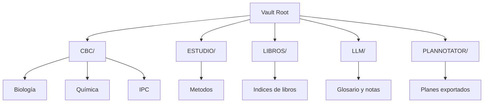

# Obsidian Vault - Agente

Este proyecto es un vault de Obsidian para gestión de conocimiento personal.

---

## Estructura del Vault

| Carpeta | Propósito |
|---------|-----------|
| `CBC/` | Apuntes del CBC - Biología, Química e IPC |
| `ESTUDIO/` | Métodos y estrategias de aprendizaje |
| `LIBROS/` | Notas de libros leídos |
| `LLM/` | Glosario y notas sobre IA |
| `PLANNOTATOR/` | Planes exportados desde Plannotator |



---

## Estructura Obligatoria de Notas

### 1. Frontmatter YAML

**SIEMPRE incluir al inicio:**

```yaml
---
title: "Título de la nota"
type: note # note, resource, reference, person, location
status: draft # draft, active, complete, archived
tags:
  - categoria
  - subcategoria
aliases:
  - Nombre alternativo
created: YYYY-MM-DD
updated: YYYY-MM-DD
source: fuente (opcional)
---
```

**Reglas:**
- `title`: Obligatorio, primera letra mayúscula
- `type`: Tipo de nota (note, resource, reference, etc.)
- `status`: Estado actual (draft, active, etc.)
- `tags`: Array YAML, mínimo 1 tag
- `aliases`: Array YAML, nombres alternativos para búsqueda
- `created`: Fecha de creación
- `updated`: Fecha de última modificación
- `source`: Solo si aplica (ej: "youtube", "libro", "documentación oficial")

---

### 2. Título H1

**SIEMPRE después del frontmatter:**

```markdown
# Título de la Nota
```

---

### 3. Bloque de Fuente (si aplica)

```markdown
> [!INFO] Fuente
> Basado en: [Nombre](url) y apuntes personales.
```

---

### 4. Cuerpo Estructurado

**Usar jerarquía clara:**

```markdown
## Sección Principal

### Subsección

Contenido...

#### Detalle (usar con moderación)
```

---

### 5. Callouts Disponibles

| Tipo | Uso |
|------|-----|
| `[!INFO]` | Información general, fuentes |
| `[!TIP]` | Consejos, recomendaciones |
| `[!NOTE]` | Notas importantes |
| `[!WARNING]` | Advertencias |
| `[!DANGER]` | Peligro, crítico |
| `[!EXAMPLE]` | Ejemplos |
| `[!QUOTE]` | Citas textuales |
| `[!DEFINITION]` | Definiciones |
| `[!IMPORTANT]` | Puntos clave |
| `[!SUCCESS]` | Resultados positivos |
| `[!QUESTION]` | Preguntas guía |

---

### 6. Wikilinks

**SIEMPRE usar doble corchete:**

```markdown
[[Nombre de nota]]
[[Nombre de nota#Sección]]
[[Nombre de nota|Texto visible]]
```

---

### 7. Sección Final: Ver también

**SIEMPRE terminar con (excepto transcripciones auto-importadas):**

```markdown
---

## Ver también

- [[Nota relacionada 1]]
- [[Nota relacionada 2]]
```

> [!NOTE] Excepción
> Las transcripciones de YouTube (`TRANSCRIPCIONES/`) son auto-importadas y se usan como material de referencia desde las notas de estudio. No requieren sección "Ver también".

---

## Plantillas Disponibles

| Tipo | Ubicación |
|------|-----------|
| General | `.obsidian/templates/Nota General.md` |
| Libro | `.obsidian/templates/Libro.md` |
| Plan | `.obsidian/templates/Plan.md` |
| Glosario | `.obsidian/templates/Glosario.md` |
| CBC Biología | `.obsidian/templates/CBC Biologia.md` |
| CBC General | `.obsidian/templates/CBC General.md` |
| Método de Estudio | `.obsidian/templates/Metodo de Estudio.md` |

> [!TIP] Uso
> En Obsidian, crear una nota desde plantilla: `Cmd/Ctrl + P` → "Templates: Insert template" y seleccionar la plantilla deseada.

### Indices principales recomendados

- `Inicio.md`
- `CBC/00 - INDICE.md`
- `ESTUDIO/00 - INDICE.md`
- `LIBROS/00 - INDICE.md`
- `LLM/00 - INDICE.md`

---

## Tipos de Notas y Sus Tags

| Tipo | Tags Obligatorios |
|------|-------------------|
| Libro | `libros`, `[tema]`, `[autor]` |
| Apuntes | `[materia]`, `apuntes`, `[sesion]` |
| Plan | `planificacion`, `[categoria]` |
| Glosario | `glosario`, `[area]` |
| Proyecto | `proyecto`, `[nombre]` |

---

## Ejemplo Completo

```yaml
---
title: "Introducción a la Programación"
type: note
status: active
tags:
  - programacion
  - conceptos
  - basics
aliases:
  - Fundamentos de Programación
created: 2026-02-17
updated: 2026-02-17
---

# Introducción a la Programación

> [!INFO] Fuente
> Basado en curso de [Platzi](https://platzi.com) y documentación oficial.

---

## ¿Qué es la Programación?

La programación es el proceso de crear instrucciones para que una computadora ejecute tareas.

> [!DEFINITION] Definición
> **Programar** = Escribir código que una máquina puede entender y ejecutar.

---

## Conceptos Fundamentales

| Concepto | Descripción |
|----------|-------------|
| Variable | Contenedor de datos |
| Función | Bloque de código reutilizable |
| Loop | Repetición de instrucciones |

---

## Ver también

- [[Variables]]
- [[Funciones]]
- [[Control de Flujo]]
```

---

## Reglas de Oro

1. **SIEMPRE** frontmatter YAML completo
2. **SIEMPRE** título H1 después del frontmatter
3. **SIEMPRE** al menos 1 tag
4. **SIEMPRE** sección "Ver también" al final
5. **USAR** wikilinks para conectar notas
6. **USAR** callouts para resaltar información
7. **EVITAR** más de 3 niveles de headings (H4+)
8. **EVITAR** bloques de código vacíos
9. **MERMAID**: Usar comillas para texto con símbolos: `A["Texto (con signos)"]`
