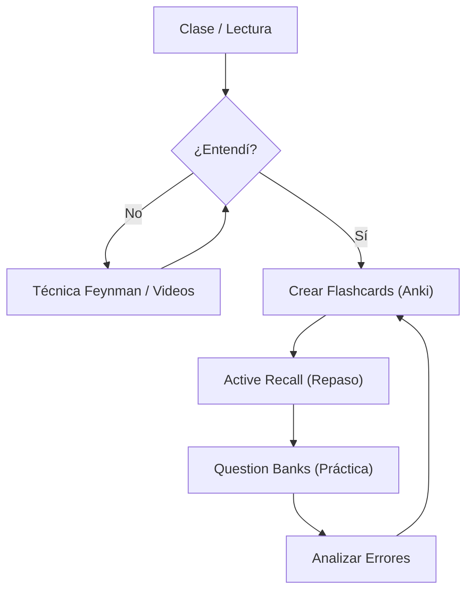

# Técnicas de Estudio para Medicina

> [!INFO] Objetivo
> Maximizar la retención a largo plazo y la comprensión profunda con el menor tiempo de estudio posible ("High Yield").

La medicina requiere manejar volúmenes masivos de información. El estudio pasivo (leer y subrayar) es **ineficiente**. Debes moverte hacia el **Aprendizaje Activo**.

---

## 🧠 Los 3 Pilares del Estudio Médico

| Pilar | Técnica Principal | Herramienta Sugerida |
|-------|-------------------|----------------------|
| **Entender** | [[Técnica Feynman]] | Pizarrón / Obsidian |
| **Retener** | [[Active Recall]] + [[Spaced Repetition]] | Anki / Flashcards |
| **Aplicar** | [[Question Banks]] | UWorld / Casos Clínicos |

---

## Métodos Específicos

### Para Memorización Pura (Fármacos, Anatomía)
- [[Spaced Repetition]]: El "patrón oro" para no olvidar.
- [[Active Recall]]: Forzar al cerebro a recuperar la información.
- **Mnemonics (Mnemotecnia)**: Palacios de memoria para listas largas.

### Para Procesos y Conceptos (Fisiología, Patología)
- [[Técnica Feynman]]: Explicarlo como si fuera para un niño de 5 años.
- [[Método de la Hoja en Blanco]]: Dibujar diagramas de memoria.

---

## Flujo de Estudio Recomendado

---

## Ver también

- [[Gestión del Tiempo]]
- [[Anki para Medicina]]
