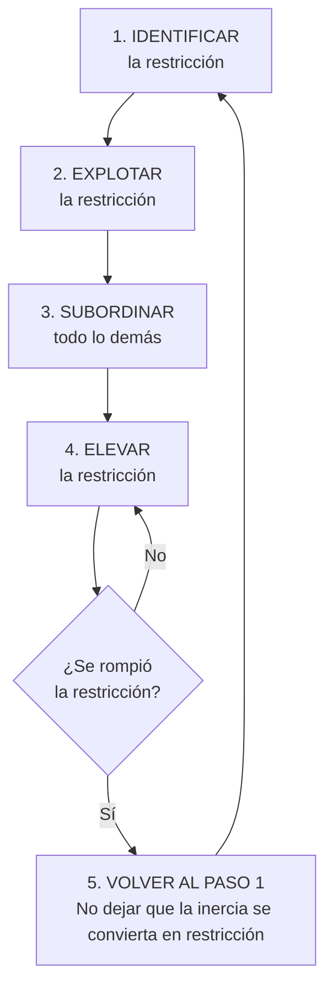

# Los 5 Pasos de la Teoría de Restricciones

[[LIBROS/LA META/00 - INDICE|← Volver al índice]]

---

## El Proceso de Mejora Continua

Goldratt propone un **proceso focalizado de cinco pasos** para gestionar restricciones de forma sistemática.

---

---

## Paso 1: IDENTIFICAR la Restricción

> [!QUESTION] Pregunta Clave
> ¿Qué está limitando el rendimiento del sistema?

**Acciones:**
- Buscar donde se acumula el trabajo
- Identificar recursos con mayor utilización
- Revisar cuellos de botella en el flujo de valor

> [!EXAMPLE] En la fábrica de Alex Rogo
> La máquina NCX-10 era el cuello de botella: trabajaba al máximo pero no alcanzaba a satisfacer la demanda.

---

## Paso 2: EXPLOTAR la Restricción

> [!QUESTION] Pregunta Clave
> ¿Cómo sacar el máximo provecho de la restricción sin inversión adicional?

**Acciones:**
- Eliminar tiempos muertos del cuello
- Priorizar trabajos de mayor valor
- Asegurar que nunca falte trabajo al cuello

> [!TIP] Principio
> Un minuto perdido en el cuello es un minuto perdido en TODO el sistema.

---

## Paso 3: SUBORDINAR todo lo demás

> [!QUESTION] Pregunta Clave
> ¿Cómo debe operar el resto del sistema para apoyar a la restricción?

**Acciones:**
- Los recursos no-cuello NO deben producir al máximo
- Sincronizar todo según el ritmo del cuello
- Eliminar inventario excesivo antes del cuello

> [!WARNING] Contra-intuitivo
> Los recursos sin restricción deben tener **tiempo ocioso**. Esto no es ineficiencia, es sincronización.

---

## Paso 4: ELEVAR la Restricción

> [!QUESTION] Pregunta Clave
> ¿Necesitamos invertir para aumentar la capacidad de la restricción?

**Acciones:**
- Comprar más equipos
- Contratar más personal
- Subcontratar parte del trabajo
- Mejorar tecnología

> [!CAUTION] Importante
> Solo después de explotar y subordinar. No invertir antes de optimizar lo existente.

---

## Paso 5: VOLVER al Paso 1

> [!QUESTION] Pregunta Clave
> ¿La restricción cambió? ¿Hay una nueva?

**Acciones:**
- Si la restricción se rompió, buscar la nueva
- No dejar que la inercia se convierta en restricción
- Reiniciar el ciclo de mejora continua

> [!IMPORTANT] Inercia Organizacional
> El mayor enemigo es creer que "ya está hecho". La mejora es **continua**, nunca termina.

---

## Resumen Visual

| Paso | Acción | Foco |
|------|--------|------|
| 1 | Identificar | ¿Dónde está el límite? |
| 2 | Explotar | Maximizar sin invertir |
| 3 | Subordinar | El resto se adapta |
| 4 | Elevar | Invertir si es necesario |
| 5 | Volver | Mejora continua |

---

## Ver también

- [[01 - Conceptos Fundamentales|Conceptos Fundamentales]]
- [[04 - Aplicaciones Prácticas|Aplicaciones Prácticas]]
