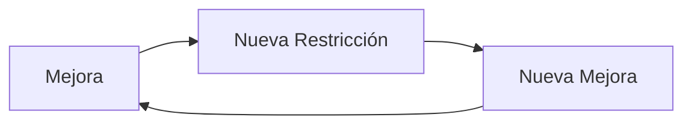

# Lecciones Clave

[[LIBROS/LA META/00 - INDICE|← Volver al índice]]

---

## Lección 1: La Meta es Clara y Única

> [!IMPORTANT] Principio Fundamental
> **"La meta es ganar dinero ahora y en el futuro."**

Todo lo demás es medio, no fin. Eficiencia, calidad, productividad son herramientas, no objetivos.

---

## Lección 2: El Sistema es tan Fuerte como su Restricción

**No importa cuán eficientes sean los demás recursos.** El cuello de botella determina el rendimiento total.

| Situación | Error Común | Solución TOC |
|-----------|-------------|--------------|
| Demasiado inventario | Más almacenamiento | Reducir producción antes del cuello |
| Entregas tardías | Más presión | Optimizar el cuello |
| Costos altos | Recortar gastos | Aumentar throughput |

---

## Lección 3: Eficiencia Local ≠ Eficiencia Global

> [!DANGER] El Error más Caro
> Optimizar cada área por separado **empeora** el sistema.

**Ejemplo del libro:**
- Robots comprados para "aumentar eficiencia"
- Resultado: más inventario, más costos, mismos ingresos
- La eficiencia local aumentó, pero el throughput no

---

## Lección 4: Inventario es Deuda, no Activo

| Visión Tradicional | Visión TOC |
|-------------------|------------|
| Inventario = Activo | Inventario = Dinero atrapado |
| Producir para almacenar | Producir para vender |
| Mientras más, mejor | Mientras menos, mejor |

> [!TIP] Pregunta Correcta
> **"¿Cuánto tiempo tarda ese inventario en convertirse en dinero?"**

---

## Lección 5: Las Mediciones Tradicionales Engañan

### Mediciones Contables vs. TOC

| Tradicional | TOC |
|-------------|-----|
| Costo unitario | Throughput por unidad |
| Utilización de recursos | Contribución al flujo |
| Eficiencia local | Eficiencia del sistema |

> [!EXAMPLE] El Costo Unitario es una Trampa
> Un producto puede tener "bajo costo unitario" pero generar inventario que nunca se vende.

---

## Lección 6: Preguntar "¿Por Qué?" es la Ciencia

Goldratt enfatiza el **método científico** en la gestión:

1. **Observar** el fenómeno
2. **Formular** hipótesis sobre la causa
3. **Predecir** qué pasará si se cambia algo
4. **Experimentar** y validar
5. **Refinar** la teoría

> [!QUOTE] Del Libro
> "La ciencia es simplemente el método que empleamos para encontrar y defender un conjunto mínimo de hipótesis que pueden explicar muchos fenómenos."

---

## Lección 7: El Cambio Requiere Desaprender

Alex Rogo tuvo que desaprender:
- ❌ "Siempre producir al máximo"
- ❌ "El costo unitario lo es todo"
- ❌ "La eficiencia local importa"
- ❌ "Más inventario es seguridad"

> [!TIP] La Inercia es el Enemigo
> Después de resolver una restricción, la inercia organizacional puede crear nuevas restricciones si no se adapta el sistema.

---

## Lección 8: Comunicación y Colaboración

El libro muestra cómo:
- Los departamentos compiten entre sí (silos)
- Cada uno optimiza su área sin ver el todo
- La solución requiere **visión sistémica**

> [!IMPORTANT] Trabajo en Equipo
> El protagonista logra resultados cuando alinea a todo el equipo hacia la meta común, no cuando cada uno "hace lo mejor que puede".

---

## Lección 9: La Mejora es Continua

**El proceso nunca termina.**

Resolver un cuello de botella revela el siguiente. Esto es bueno: significa progreso.

---

## Lección 10: El Mercado puede ser la Restricción

La restricción no siempre es interna:
- Si puedes producir más de lo que vendes → el mercado es el cuello
- Solución: Marketing, ventas, nuevos productos

> [!NOTE] Importante
> TOC aplica tanto a restricciones internas como externas.

---

## Ver también

- [[01 - Conceptos Fundamentales|Conceptos Fundamentales]]
- [[02 - Los 5 Pasos TOC|Los 5 Pasos de la Teoría de Restricciones]]
- [[04 - Aplicaciones Prácticas|Aplicaciones Prácticas]]
