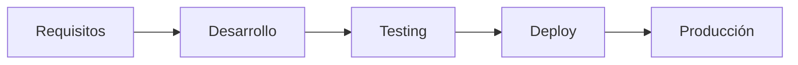

# Aplicaciones Prácticas

[[LIBROS/LA META/00 - INDICE|← Volver al índice]]

---

## Aplicación en Manufactura

### Problemas Típicos

| Problema | Síntoma | Causa TOC |
|----------|---------|-----------|
| Entregas tardías | Clientes insatisfechos | Cuello de botella no gestionado |
| Inventario alto | Almacenes llenos | Producción sin sincronizar |
| Urgencias constantes | Estrés, errores | Flujo desbalanceado |

### Solución TOC

1. **Identificar** → ¿Dónde se acumula el trabajo?
2. **Explotar** → Eliminar paradas del cuello
3. **Subordinar** → El resto produce al ritmo del cuello
4. **Elevar** → Invertir si es necesario

---

## Aplicación en Gestión de Proyectos

### Cadena Crítica (CCPM)

Extensión de TOC para proyectos:

| Método Tradicional | Cadena Crítica |
|-------------------|----------------|
| Múltiples holguras por tarea | Una sola holgura del proyecto |
| Cada quien protege su tarea | Protección compartida |
| Fechas fijas por tarea | Fechas flexibles, hitos fijos |

> [!TIP] Principio
> Proteger el proyecto completo, no cada tarea individual.

---

## Aplicación en Desarrollo de Software

### TOC en DevOps

**Restricciones comunes:**
- QA/Testing (cuello típico)
- Code Review
- Deploy manual

**Aplicación:**
1. Identificar qué etapa tiene más trabajo acumulado
2. Optimizar ese paso primero
3. Ajustar velocidad de etapas anteriores

---

## Aplicación Personal

### Tu Vida como Sistema

| Área | Posible Restricción | Acción |
|------|--------------------| -------|
| Tiempo | Compromisos excesivos | Eliminar, delegar |
| Energía | Sueño, ejercicio | Priorizar recuperación |
| Conocimiento | Habilidad faltante | Aprender, pedir ayuda |
| Dinero | Ingresos limitados | Aumentar fuentes |

> [!EXAMPLE] Ejemplo Personal
> Si tu restricción es energía, "explotar" significa optimizar sueño y ejercicio antes de intentar ser más productivo con menos energía.

---

## Ejemplo: Una Panadería

### Situación
- 3 etapas: Amasado → Horneado → Decoración
- Horneado: 100 panes/hora
- Amasado: 150 panes/hora
- Decoración: 80 panes/hora

**¿Dónde está la restricción?**

> [!SUCCESS] Respuesta
> **Decoración (80 panes/hora)**
> 
> - Amasado tiene exceso de capacidad
> - Horneado tiene exceso de capacidad
> - Decoración limita el throughput total

**Solución TOC:**
1. Identificar: Decoración
2. Explotar: Capacitar más decoradores, simplificar diseños
3. Subordinar: Amasado y horneado producen solo 80/hora
4. Elevar: Contratar más decoradores si hay demanda

---

## Preguntas para Identificar Restricciones

### En tu Equipo/Empresa

> [!QUESTION] Checklist de Diagnóstico
> - [ ] ¿Dónde se acumula el trabajo?
> - [ ] ¿Qué recurso siempre está saturado?
> - [ ] ¿Cuál es el paso más lento del proceso?
> - [ ] ¿Qué frenaría todo si falla?
> - [ ] ¿Dónde hay más "urgencias"?

---

## Errores Comunes al Aplicar TOC

| Error | Consecuencia | Solución |
|-------|--------------|----------|
| Optimizar todo por igual | Desperdicio de recursos | Focalizar en la restricción |
| Ignorar el paso 3 | Inventario antes del cuello | Subordinar todo al cuello |
| Invertir antes de explotar | Gasto innecesario | Maximizar lo existente primero |
| Dejar de iterar | Nueva restricción ignorada | Volver al paso 1 |

---

## Ver también

- [[01 - Conceptos Fundamentales|Conceptos Fundamentales]]
- [[02 - Los 5 Pasos TOC|Los 5 Pasos de la Teoría de Restricciones]]
- [[03 - Lecciones Clave|Lecciones Clave]]
