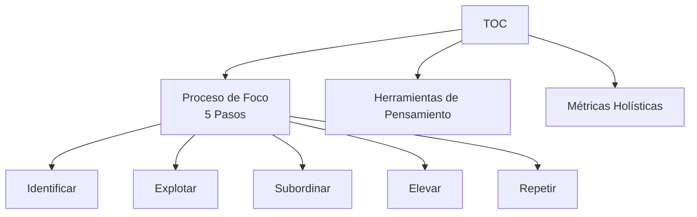

# Teoría de Restricciones (TOC)

---

## ¿Qué es TOC?

La **Teoría de Restricciones** (Theory of Constraints, TOC) es una metodología de gestión desarrollada por [[LIBROS/LA META/00 - INDICE|Eliyahu Goldratt]] que propone:

> [!DEFINITION] Principio Central
> **Todo sistema tiene al menos una restricción que limita su rendimiento.** Identificar y gestionar esa restricción es la clave para mejorar.

---

## Premisas Fundamentales

### 1. Los Sistemas son Simples

> [!NOTE] Contraintuitivo
> Aunque parecen complejos, los sistemas tienen **pocas restricciones** que los limitan.

### 2. Toda Mejora es un Cambio

Pero no todo cambio es una mejora. La pregunta correcta:
- ❌ "¿Qué cambiar?"
- ✅ "¿Qué cambiar? ¿A qué cambiar? ¿Cómo causar el cambio?"

### 3. El Lenguaje del Sistema son sus Mediciones

| Medición | Pregunta |
|----------|----------|
| Throughput | ¿Avanzamos hacia la meta? |
| Inventario | ¿Cuánto tenemos invertido? |
| Gastos Operativos | ¿Cuánto gastamos para avanzar? |

---

## Los 3 Pilares de TOC

---

## Herramientas de Pensamiento TOC

Goldratt desarrolló procesos de pensamiento para analizar problemas complejos:

| Herramienta | Propósito |
|-------------|-----------|
| **Árbol de Realidad Actual** | Identificar causa raíz |
| **Árbol de Realidad Futura** | Diseñar solución |
| **Árbol de Prerrequisitos** | Planificar obstáculos |
| **Árbol de Transición** | Detallar acciones |
| **Nube de Conflicto** | Resolver dilemas |

---

## Comparación con Otras Metodologías

| Aspecto | TOC | Lean | Six Sigma |
|---------|-----|------|-----------|
| **Foco** | Restricción | Desperdicio | Variación |
| **Enfoque** | Puntos específicos | Todo el flujo | Datos estadísticos |
| **Mejora** | Por pasos grandes | Continua, pequeña | Proyectos definidos |
| **Medición** | Throughput | Fluidez | Capacidad (sigma) |

> [!TIP] Sinergia
> TOC puede combinarse con Lean y Six Sigma para mayor impacto.

---

## Aplicaciones de TOC

### Por Industria

| Industria | Aplicación TOC |
|-----------|----------------|
| **Manufactura** | Drum-Buffer-Rope (DBR) |
| **Proyectos** | Cadena Crítica (CCPM) |
| **Supply Chain** | Replenishment |
| **Servicios** | Gestión de colas |
| **Ventas** | Proceso de compra del cliente |

---

## Fuentes y Recursos

- [[LIBROS/LA META/00 - INDICE|La Meta - Eliyahu Goldratt]] (libro base)
- Video resumen: [YouTube](https://www.youtube.com/watch?v=O9hXULjphMU)

---

## Ver también

- [[01 - Conceptos Fundamentales]]
- [[02 - Los 5 Pasos TOC]]
- [[03 - Lecciones Clave]]
