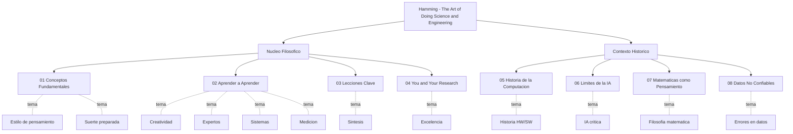

# The Art of Doing Science and Engineering - Learning to Learn

> [!INFO] Ficha del Libro
> - **Autor:** Richard W. Hamming
> - **Año:** 2020 (Stripe Press), basado en curso de 1995
> - **Editorial:** Stripe Press
> - **Género:** Ciencia, Ingeniería, Filosofía del pensamiento
> - **Páginas:** 30 capítulos + prefacio e introducción
> - **ISBN:** 9781732265172

---

## Sobre el Libro

Un tratado revolucionario de uno de los grandes matemáticos de nuestro tiempo. Hamming argumenta que el **pensamiento altamente efectivo puede aprenderse**. El libro nace de un curso de posgrado que Hamming impartió en la U.S. Naval Postgraduate School en Monterey, California.

> [!QUOTE] Cita Central
> "The purpose of this course is to prepare you for your technical future. There is really no technical content in the course. **Style of thinking is the center of the course.**"

---

## Sobre el Autor

**Richard Wesley Hamming (1915-1998)** trabajó 30 años en Bell Telephone Laboratories. Creó los **códigos de corrección de errores Hamming**, contribuyó al Proyecto Manhattan, y compartió oficina con Claude Shannon. Ganó la Turing Award en 1968.

> [!TIP] Filosofía de Hamming
> "Luck favors the prepared mind." (Pasteur, citado constantemente por Hamming)
>
> No se trata de suerte sino de **preparación deliberada** para reconocer y aprovechar las oportunidades.

---

## Estructura del Libro (30 Capítulos)

### Parte I: Fundamentos Técnicos (Cap. 1-8)

| Cap. | Título | Notas |
|------|--------|-------|
| 1 | Orientation | [[01 - Conceptos Fundamentales]] |
| 2 | Foundations of the Digital Revolution | [[05 - Historia de la Computación]] |
| 3 | History of Computers — Hardware | [[05 - Historia de la Computación]] |
| 4 | History of Computers — Software | [[05 - Historia de la Computación]] |
| 5 | History of Computer Applications | [[05 - Historia de la Computación]] |
| 6-8 | Limits of Computer Applications — AI (I, II, III) | [[06 - Límites de la IA]] |

### Parte II: Teoría y Herramientas (Cap. 9-21)

| Cap. | Título | Notas |
|------|--------|-------|
| 9 | n-Dimensional Space | _No resumido (técnico)_ |
| 10-11 | Coding Theory (I, II) | _No resumido (técnico)_ |
| 12 | Error-Correcting Codes | _No resumido (técnico)_ |
| 13 | Information Theory | _No resumido (técnico)_ |
| 14-17 | Digital Filters (I-IV) | _No resumido (técnico)_ |
| 18-20 | Simulation (I-III) | _No resumido (técnico)_ |
| 21 | Fiber Optics | _No resumido (técnico)_ |

> [!NOTE] Sobre los Capítulos 9-21
> Estos capítulos son los más **densos técnicamente** del libro (matemáticas de codificación, filtros digitales, simulación, óptica). Hamming los incluyó para dar **fundamento técnico** a las lecciones filosóficas, pero no son necesarios para captar las ideas centrales.
>
> Si te interesan, [[07 - Matemáticas como Pensamiento]] captura la **actitud** de Hamming hacia estas herramientas.

### Parte III: Pensamiento y Sabiduría (Cap. 22-30)

| Cap. | Título | Notas |
|------|--------|-------|
| 22 | Computer-Aided Instruction (CAI) | _No resumido_ |
| 23 | Mathematics | [[07 - Matemáticas como Pensamiento]] |
| 24 | Quantum Mechanics | _No resumido (técnico)_ |
| 25 | Creativity | [[02 - Aprender a Aprender]] |
| 26 | Experts | [[02 - Aprender a Aprender]] |
| 27 | Unreliable Data | [[08 - Datos No Confiables]] |
| 28 | Systems Engineering | [[02 - Aprender a Aprender]] |
| 29 | You Get What You Measure | [[02 - Aprender a Aprender]] |
| 30 | You and Your Research | [[04 - You and Your Research]] |

---

## Índice de Contenido (Notas)

### Núcleo Filosófico

1. [[01 - Conceptos Fundamentales]] — Cap. 1, Prefacio, Introducción
2. [[02 - Aprender a Aprender]] — Cap. 25, 26, 28, 29
3. [[03 - Lecciones Clave]] — Síntesis transversal
4. [[04 - You and Your Research]] — Cap. 30 (la charla de 1986)

### Contexto Histórico y Técnico

5. [[05 - Historia de la Computación]] — Cap. 2-5
6. [[06 - Límites de la IA]] — Cap. 6-8
7. [[07 - Matemáticas como Pensamiento]] — Cap. 23
8. [[08 - Datos No Confiables]] — Cap. 27

---

## Mapa de Temas

---

## Orden de Lectura Recomendado

> [!TIP] Si es tu primera vez
> 1. [[01 - Conceptos Fundamentales]] — Para entender la tesis central
> 2. [[04 - You and Your Research]] — La charla más influyente (Cap. 30)
> 3. [[02 - Aprender a Aprender]] — Las herramientas de meta-aprendizaje
> 4. [[03 - Lecciones Clave]] — Síntesis
> 5. [[08 - Datos No Confiables]] — Pensamiento crítico sobre evidencia
>
> Si te interesa el contexto histórico: [[05 - Historia de la Computación]], [[06 - Límites de la IA]] y [[07 - Matemáticas como Pensamiento]].

---

## Cobertura Actual

| Parte del Libro | Cobertura | Notas Cubiertas |
|-----------------|-----------|-----------------|
| Parte I: Fundamentos | ~75% | 1, 2-5, 6-8 |
| Parte II: Teoría | 0% | _Técnico, no esencial_ |
| Parte III: Pensamiento | ~80% | 23, 25, 26, 27, 28, 29, 30 |
| **Total** | **~55%** | (Sin contar Parte II) |

> [!NOTE] Decisión de Cobertura
> Se priorizaron los capítulos con **lecciones duraderas y generalizables**. La Parte II es densa en matemáticas y refleja la **actitud** de Hamming (capturada en [[07 - Matemáticas como Pensamiento]]), pero sus contenidos técnicos específicos no son las "lecciones importantes" del libro.

---

## Ver también

- [[LIBROS/LA META/00 - INDICE|LA META - Goldratt]]
- [[LIBROS/El Libro de los Cinco Anillos/00 - INDICE|El Libro de los Cinco Anillos]]
- [[LIBROS/00 - INDICE|Índice de Libros]]
- [[ESTUDIO/00 - INDICE|Métodos de Estudio]]
