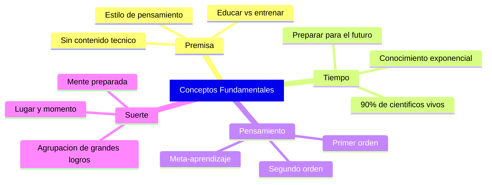

# Conceptos Fundamentales

> [!INFO] Fuente
> Basado en: *The Art of Doing Science and Engineering* de Richard W. Hamming (Stripe Press, 2020). Prefacio, Introducción y Capítulo 1 (Orientation).

---

## La Premisa Central del Libro

El curso (y por extensión el libro) **no enseña contenido técnico**. Enseña **estilo de pensamiento**. Hamming es explícito desde la primera página:

> [!QUOTE] Hamming
> "The purpose of this course is to prepare you for your technical future. There is really no technical content in the course. **Style of thinking is the center of the course.**"

Esta premisa es revolucionaria. Hamming argumenta que:

- Los **hechos** que enseñas hoy estarán **obsoletos** en 10-20 años
- El **método** con que abordas problemas nuevos es lo que sobrevive
- Por eso el libro evita la trampa de "enseñar lo que yo sé" y se enfoca en "cómo pensar lo que aún no se sabe"

---

## Educación vs. Entrenamiento

Hamming abre con una distinción que atraviesa todo el libro:

| Concepto | Orientación | Resultado |
|----------|-------------|-----------|
| **Entrenamiento** | Pasado → respuestas conocidas para situaciones conocidas | Técnico competente en problemas viejos |
| **Educación** | Futuro → preparación para situaciones nuevas e imprevistas | Profesional adaptable a problemas nuevos |

> [!IMPORTANT] Distinción Clave
> "I am concerned with **educating** and not **training** you."
>
> El entrenamiento mira al pasado. La educación mira al futuro.

### Por qué importa

La mayoría de cursos universitarios son entrenamiento disfrazado de educación. Hamming señala que:

- Resolver los problemas del libro de texto no te prepara para los problemas del mundo real
- Los problemas del mundo real son **ambiguos, mal definidos y cambian** mientras los resuelves
- Necesitas un **estilo** de pensamiento, no un conjunto de **recetas**

> [!EXAMPLE] Ejemplo de Hamming
> Un curso que te enseña a usar Fortran te entrena. Un curso que te enseña a decidir **cuándo** una simulación es preferible a un análisis teórico te educa.

---

## Estilo vs. Contenido

Hamming reconoce que el "estilo" no puede enseñarse con palabras, de la misma forma que no se puede enseñar a ser un gran pintor con instrucciones escritas. Se aprende por:

1. **Exposición a ejemplos** concretos y reales (no abstractos)
2. **Historias** que muestran el proceso de descubrimiento (no el resultado pulido)
3. **Repetición** desde distintos ángulos (cada capítulo regresa a los mismos temas)
4. **Experiencia personal** (no teoría abstracta)

> [!TIP] Método de Enseñanza
> Hamming copió los métodos de enseñanza de las artes: dejar al estudiante avanzado pintar, y luego hacer sugerencias. **No dar reglas, sino mostrar caminos.**

### Implicación práctica

No leas este libro buscando "técnicas". Léelo buscando **modelos de pensamiento** que puedas reconocer cuando aparezcan en tu trabajo. La repetición es deliberada: las mismas ideas vuelven capítulo tras capítulo desde distintos ángulos, hasta que se vuelven parte de tu forma de pensar.

---

## La Suerte y la Mente Preparada

> [!QUOTE] Pasteur (lema de Hamming)
> "Luck favors the prepared mind."

Hamming repite esta idea como **hilo conductor** del libro entero. Es la tesis central de "You and Your Research" (Cap. 30).

### El argumento

Los grandes resultados en ciencia e ingeniería están **agrupados** en las mismas personas con demasiada frecuencia para ser solo suerte:

- **Claude Shannon** (oficina contigua a Hamming) creó la teoría de la información
- **Hamming** creó los códigos de corrección de errores
- **Ambos** trabajaban en Bell Labs, ambos tuvieron resultados importantes
- ¿Casualidad? Hamming dice que no

> [!EXAMPLE] El Test de Hamming
> Si un científico tiene **una** contribución importante, podría ser suerte. Si tiene **varias** contribuciones importantes a lo largo de su carrera, no es suerte: es **preparación + elección deliberada de problemas**.

### Las tres componentes

Hamming descompone "suerte" en tres factores que puedes controlar:

| Factor | Descripción | Controlable |
|--------|-------------|-------------|
| **Estar en el lugar correcto** | Trabajar en un entorno con problemas importantes | Sí |
| **En el momento correcto** | Reconocer oportunidades cuando aparecen | Parcialmente |
| **Con la preparación correcta** | Tener el conocimiento para actuar | Sí |

Solo el factor "momento exacto" es genuinamente incontrolable. Los otros dos se pueden cultivar deliberadamente.

---

## Preparar para el Futuro, no para el Pasado

> [!WARNING] Error Común de los Profesores
> "Teachers should prepare the student for the **student's future**, not for the **teacher's past**."

Hamming critica que la mayoría de profesores:

- Nunca discuten el **futuro** de su campo
- Se excusan diciendo "nadie puede conocer el futuro"
- Pero eso no los absuelve de **intentar seriamente** preparar al estudiante
- Repiten lo que a ellos les funcionó hace 30 años

### El desafío que Hamming plantea

Si tuvieras que pronosticar los problemas importantes de tu campo en los próximos 20 años, ¿podrías? Si la respuesta es no, estás en la misma situación que los profesores que Hamming critica. La solución no es evitar la pregunta, es **hacerla constantemente** y ajustar tu preparación.

---

## El Crecimiento Exponencial del Conocimiento

Un tema recurrente en todo el libro:

- El conocimiento crece **exponencialmente**, no linealmente
- En ~15 años se duplica (aproximadamente)
- Esto significa que el **90% de los científicos** que han existido **están vivos hoy**
- La **especialización** es la respuesta natural, pero tiene costos severos

> [!DEFINITION] Definición de Hamming
> **"An expert is one who knows everything about nothing; a generalist knows nothing about everything."**

### Las paradojas de la especialización

| Beneficio | Costo |
|-----------|-------|
| Dominio profundo en un área | Incapacidad de ver conexiones entre áreas |
| Trabajo importante en nicho | Trabajo ignorado por otros campos |
| Carrera clara y publicable | Vulnerabilidad cuando el campo se agota |

> [!WARNING] Trampa
> La especialización temprana te hace **insustituible en lo estrecho** y **irrelevante en lo amplio**. Hamming prefiere científicos que mantienen amplitud mientras profundizan.

---

## Pensamiento de Primer Orden vs. Segundo Orden

Hamming diferencia entre tres niveles de pensamiento:

| Nivel | Enfoque | Ejemplo |
|-------|---------|---------|
| **Primer orden** | Resolver el problema que tienes | Escribir código para un caso específico |
| **Segundo orden** | Pensar sobre cómo piensas | Preguntarte por qué elegiste ese enfoque |
| **Tercer orden (meta)** | Aprender a aprender | Desarrollar el estilo de pensamiento |

### La mayoría se queda en el primer nivel

> [!TIP] El Salto
> El salto de primer a segundo orden es donde ocurre el crecimiento real. La mayoría de profesionales brillantes lo hacen ocasionalmente. Los grandes lo hacen **constantemente**.

Hamming nota que el segundo orden es lo que diferencia a:
- Un **programador** de un **arquitecto de software**
- Un **técnico** de un **ingeniero**
- Un **investigador** de un **líder de investigación**

---

## La Naturaleza del Curso Original

Hamming impartió este curso en la **U.S. Naval Postgraduate School** en Monterey, California. El formato era:

- Estudiantes de posgrado en ciencias e ingeniería
- 30 sesiones (una por capítulo)
- Evaluación: **un proyecto de investigación original** del estudiante
- Sin examen final: el examen era ver si el estudiante podía **hacer trabajo original**

> [!QUOTE] Hamming
> "The examination is whether you can do **original** work, not whether you can repeat what I have said."

Esta filosofía impregna todo el libro: no se trata de recordar, se trata de **hacer**.

---

## Síntesis Visual

---

## Ver también

- [[02 - Aprender a Aprender]]
- [[03 - Lecciones Clave]]
- [[04 - You and Your Research]]
- [[05 - Historia de la Computación]]
- [[08 - Datos No Confiables]]
- [[LIBROS/The Art of Doing Science and Engineering/00 - INDICE|Índice del Libro]]
