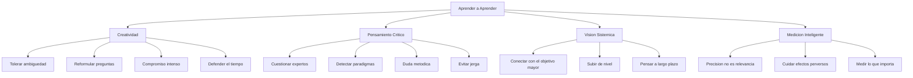

# Aprender a Aprender

> [!INFO] Fuente
> Basado en: *The Art of Doing Science and Engineering* de Richard W. Hamming (Stripe Press, 2020). Capítulos 25 (Creativity), 26 (Experts), 27 (Unreliable Data), 28 (Systems Engineering) y 29 (You Get What You Measure).

---

## Creatividad: Qué Es y Qué No Es

Hamming dedica un capítulo entero (Cap. 25) a desmontar mitos sobre la creatividad. La palabra "creatividad" se ha vuelto tan inflada que significa casi nada. Hamming propone una definición precisa.

### Originalidad vs. Creatividad vs. Novedad

| Concepto | Definición de Hamming | Ejemplo |
|----------|-----------------------|---------|
| **Novedad** | Algo que no se ha hecho antes (insuficiente por sí solo) | Multiplicar dos números aleatorios grandes |
| **Originalidad** | Novedad + esfuerzo notable o coincidencia remarcable | Encontrar el mayor número primo conocido |
| **Creatividad** | Originalidad + **valor** para alguien | Una nueva teoría que resuelve un problema importante |

> [!EXAMPLE] Ejemplo Ilustrativo
> Multiplicar dos números aleatorios de 10 dígitos produce un resultado que probablemente nadie hizo antes. Pero eso no es "original" ni "creativo". La diferencia crucial: **el valor percibido por otros**.

### Las condiciones para la creatividad

Hamming identifica patrones en personas creativas que estudió durante décadas en Bell Labs:

1. **Tolerancia a la ambigüedad** — Mantener ideas contradictorias simultáneamente sin resolver la tensión prematuramente
2. **Compromiso con el problema** — Dedicación intensa y sostenida durante años
3. **Subconsciente preparado** — Alimentar la mente con el problema y dejar que trabaje en segundo plano
4. **Voluntad de abandonar enfoques fallidos** — No caer en la **falacia del costo hundido**
5. **Reformulación constante** — Cambiar la pregunta cuando la respuesta no aparece
6. **Contacto con el mundo real** — Los problemas "de papel" no producen creatividad real

> [!QUOTE] Hamming sobre la soledad del creativo
> "The creative person is in a state of **uncomfortable tension** with the current state of knowledge. They are problem-oriented, not solution-oriented."

### El "síndrome del ego drive"

Hamming nota que las personas creativas tienen un rasgo común que no es técnico: **una ambición emocional** de hacer trabajo que importe. No es ambición de dinero ni de fama: es la necesidad interna de que su trabajo cambie algo.

> [!WARNING] Anti-patrón
> En sociedades primitivas y en muchas organizaciones grandes, la creatividad **no es apreciada**: hacer lo que los ancestros/jefes hicieron es "lo correcto". La creatividad se castiga socialmente.

### La historia personal de Hamming

Hamming fue investigador senior en Bell Labs. En un momento de su carrera, lo ascendieron a jefe de departamento. Él sabía que eso acabaría con su tiempo para investigar. Cuenta que rechazó el ascenso **varias veces** antes de aceptarlo, y que pasó años resentido por la pérdida de tiempo creativo. La moraleja:

> [!TIP] Lección
> Las responsabilidades administrativas **matan** la creatividad. Si quieres hacer trabajo creativo, **defiende tu tiempo** agresivamente. La mayoría de las obligaciones no son tan urgentes como parecen.

### El "foso" (moat) del especialista

Hamming acuña un término memorable: el **foso** alrededor de tu campo. Cuando te especializas, cavas un foso alrededor tuyo:

- Te protege de competidores superficiales
- Pero también te **atrapa** dentro
- Sales poco, ves poco, te vuelves irrelevante para campos vecinos

La salida: **mantener la puerta abierta** (que se desarrolla en [[04 - You and Your Research]]).

---

## El Problema de los Expertos

### Paradigmas y Revoluciones Científicas (Kuhn)

Hamming usa a **Thomas Kuhn** (*The Structure of Scientific Revolutions*) como marco para explicar cómo los expertos bloquean el progreso:

1. La ciencia normal opera dentro de un **paradigma** aceptado por la comunidad
2. Se ignoran las contradicciones que no encajan (anomalías)
3. Cuando las anomalías se acumulan, surge un **cambio de paradigma**
4. El establishment **resiste** el cambio (tienen demasiado invertido en lo viejo)
5. Los viejos paradigmas mueren con sus defensores, no por persuasión

> [!QUOTE] Planck (citado por Hamming)
> "Science advances funeral by funeral." — Los viejos paradigmas mueren con sus defensores, no por persuasión.

### Cómo los expertos bloquean el progreso

Hamming identifica tácticas que vio repetidas veces:

- Usan **jerga ininteligible** para ganar argumentos sin convencer
- Citan **resultados irrelevantes** de su especialidad para confundir
- Atacan al mensajero en vez de al mensaje
- **El que cree entender el problema y no lo entiende** es peor que el que sabe que no entiende — porque actúa con falsa confianza

> [!TIP] Lección Práctica
> "You must be **your own expert** in many areas." No puedes depender de que los expertos vean más allá de su campo. Mantén un **escepticismo distribuido**: confía, pero verifica constantemente, y en temas críticos, aprende a ver por ti mismo.

### La falsa confianza del especialista

Hamming distingue tres tipos de persona frente a un problema que no entiende:

| Tipo | Comportamiento | Peligro |
|------|----------------|---------|
| Sabe que no sabe | Pregunta, investiga, espera | Bajo |
| Sabe que sabe | Actúa con confianza | Variable |
| **No sabe que no sabe** | **Actúa con falsa confianza** | **Muy alto** |

> [!DANGER] La Trampa
> El tercer caso es el más peligroso y el más común entre expertos. La solución es cultivar la **duda metódica**: la disposición a cuestionar tus propios marcos.

---

## Ingeniería de Sistemas: La Visión Global

### La Parábola de la Catedral

Hamming cuenta la historia de un hombre que visitó la construcción de una catedral gótica:

- El **albañil** dijo: "Estoy haciendo piedras"
- El **tallador** dijo: "Estoy tallando una gárgola"
- El **carpintero** dijo: "Estoy cortando madera"
- Una **anciana que barría** el suelo dijo: **"Estoy ayudando a construir una catedral"**

> [!IMPORTANT] Lección
> La mayoría de las personas están inmersas en los detalles de su parte y **nunca conectan** su trabajo con el objetivo mayor. Esto es la característica principal de un burócrata.

### Niveles de Perspectiva (La Escalera de Hamming)

Hamming cuenta cómo evolucionó su propia comprensión cuando tuvo acceso a una computadora en Los Álamos:

| Nivel | Perspectiva | Pregunta guía |
|-------|-------------|---------------|
| 1 | Maximizar operaciones aritméticas por día | ¿Cómo hago más? |
| 2 | Maximizar **computación importante**, no volumen bruto | ¿Hago lo correcto? |
| 3 | Computación para todo el departamento, no solo el suyo | ¿Optimizo mi equipo? |
| 4 | Computación para toda la división de investigación | ¿Optimizo la división? |
| 5 | Computación para todos los Bell Labs | ¿Impacto en la organización? |
| 6 | Impacto en AT&T, la comunidad científica y el mundo | ¿Impacto en el mundo? |

> [!TIP] Aplicación
> En cualquier momento puedes estar en un nivel u otro. **Subir de nivel** no requiere cambiar de trabajo: requiere **preguntas más amplias** sobre el propósito de lo que haces.

### El sesgo del especialista

Hamming advierte: si solo te enfocas en tu nivel, no solo pierdes la visión, sino que **malinterpretas** lo que haces. Un albañil que nunca ve la catedral nunca entiende por qué le piden piedras de cierto tamaño. Las decisiones de diseño que le parecen arbitrarias cobran sentido solo cuando ves el sistema completo.

### La diferencia entre técnico y líder

> [!QUOTE] Hamming
> "The technician sees the stones. The leader sees the cathedral. **The bureaucrat sees the broom.**"

Los tres trabajan en la misma organización, pero la calidad de su trabajo depende radicalmente de su nivel de perspectiva.

---

## Mides lo que Obtienes (Goodhart avant la lettre)

### El Principio

> [!DEFINITION] Definición de Hamming
> **"You get what you measure"** — La forma en que eliges medir las cosas **controla** en gran medida lo que sucede.

Esta es una de las leyes más citadas del libro, y anticipa lo que luego se llamaría **Ley de Goodhart**: "Cuando una medida se convierte en un objetivo, deja de ser una buena medida."

### La Parábola del Pescador (Eddington)

Un naturalista del siglo XX estudió el mar. Unos pescadores usaban una red con mallas de un tamaño mínimo. El naturalista concluyó que no existían peces más pequeños que el tamaño de la malla. Lo que realmente pasaba: **el instrumento determinaba lo que se podía observar**.

> [!WARNING] Lección
> Tus herramientas de medición **definen** lo que puedes ver. Si no tienes herramientas para algo, ese algo **no existe** para ti, aunque exista en la realidad.

### Ejemplos Concretos de Efectos Perversos

| Medición | Efecto Perverso |
|----------|-----------------|
| Ganancia trimestral (bottom line) | Empresa enfocada en corto plazo, ignora largo plazo |
| Rating inicial del 95% | Personal conservador (mucho que perder, poco que ganar) |
| Rating inicial del 20% | Personal arriesgado (poco que perder, mucho que ganar) |
| Exámenes de entrenamiento | Se mide lo fácil (training), se ignora lo difícil (education) |
| IQ | Confunde velocidad con profundidad de pensamiento |
| Líneas de código | Programadores inflan el código con verbosidad |
| Horas trabajadas | Presencia en la oficina, no productividad real |
| Papers publicados | Volumen de publicación, no impacto real |

> [!DANGER] Trampa de Medición
> **La precisión de una medición se confunde con su relevancia.** Que algo sea fácil de medir, preciso y reproducible **no significa** que deba medirse. Una medición pobre pero más relevante a tus objetivos puede ser muy preferible.

### La ilusión de la cuantificación

Hamming advierte contra la tentación moderna de cuantificarlo todo:

> [!QUOTE] Hamming
> "There are things that are **important** that are not measurable, and there are things that are measurable that are not important. The danger is to confuse the two."

El IQ mide velocidad de respuesta a problemas específicos, no profundidad de pensamiento. Las ganancias trimestrales miden beneficio a corto plazo, no salud de la empresa. La métrica precisa se convierte en sustituto del objetivo real, y el objetivo real se pierde de vista.

---

## Síntesis: Cómo Aprender a Aprender

---

## Ver también

- [[01 - Conceptos Fundamentales]]
- [[03 - Lecciones Clave]]
- [[04 - You and Your Research]]
- [[08 - Datos No Confiables]]
- [[LIBROS/The Art of Doing Science and Engineering/00 - INDICE|Índice del Libro]]
