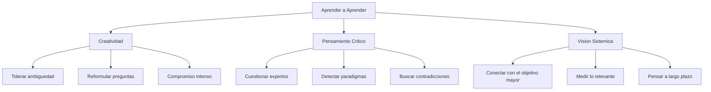

# Aprender a Aprender

> [!INFO] Fuente
> Basado en: *The Art of Doing Science and Engineering* de Richard W. Hamming (Stripe Press, 2020). Capítulos 25 (Creativity), 26 (Experts), 28 (Systems Engineering) y 29 (You Get What You Measure).

---

## Creatividad: Qué Es y Qué No Es

Hamming dedica un capítulo entero a desmontar mitos sobre la creatividad.

### Originalidad vs. Creatividad vs. Novedad

| Concepto | Definición de Hamming |
|----------|-----------------------|
| **Novedad** | Algo que no se ha hecho antes (insuficiente por sí solo) |
| **Originalidad** | Novedad + esfuerzo notable o coincidencia remarcable |
| **Creatividad** | Originalidad + **valor** para alguien |

> [!EXAMPLE] Ejemplo Ilustrativo
> Multiplicar dos números aleatorios de 10 dígitos produce un resultado que probablemente nadie hizo antes. Pero eso no es "original" ni "creativo". Encontrar el mayor número primo conocido sí entraría en un libro de récords. La diferencia: **el valor percibido**.

### Condiciones para la Creatividad

Hamming identifica patrones en personas creativas:

1. **Tolerancia a la ambigüedad** — Mantener ideas contradictorias simultáneamente
2. **Compromiso con el problema** — Dedicación intensa y sostenida
3. **Subconsciente preparado** — Alimentar la mente con el problema y dejar que trabaje
4. **Voluntad de abandonar enfoques fallidos** — No aferrarse a lo invertido
5. **Reformulación constante** — Cambiar la pregunta cuando la respuesta no aparece

> [!WARNING] Anti-patrón
> En sociedades primitivas y en muchas organizaciones grandes, la creatividad **no es apreciada**: hacer lo que los ancestros/jefes hicieron es "lo correcto".

---

## El Problema de los Expertos

### Paradigmas y Revoluciones Científicas

Hamming usa a **Thomas Kuhn** (*The Structure of Scientific Revolutions*) para explicar:

1. La ciencia normal opera dentro de un **paradigma** aceptado
2. Se ignoran las contradicciones que no encajan
3. Cuando las contradicciones se acumulan, surge un **cambio de paradigma**
4. El establishment **resiste** el cambio (tienen demasiado invertido en lo viejo)

> [!QUOTE] Planck (citado por Hamming)
> "Science advances funeral by funeral." — Los viejos paradigmas mueren con sus defensores, no por persuasión.

### Cómo los Expertos Bloquean el Progreso

- Usan **jerga ininteligible** para ganar argumentos
- Citan **resultados irrelevantes** de su especialidad
- **El que cree entender el problema y no lo entiende** es peor que el que sabe que no entiende

> [!TIP] Lección Práctica
> "You must be **your own expert** in many areas." No puedes depender de que los expertos vean más allá de su campo.

---

## Ingeniería de Sistemas: La Visión Global

### La Parábola de la Catedral

Un hombre visitó la construcción de una catedral:
- El albañil dijo: "Estoy haciendo piedras"
- El tallador dijo: "Estoy tallando una gárgola"
- Una anciana que barría dijo: **"Estoy ayudando a construir una catedral"**

> [!IMPORTANT] Lección
> La mayoría de las personas están inmersas en los detalles de su parte y **nunca conectan** su trabajo con el objetivo mayor. Esto es la característica principal de un burócrata.

### Niveles de Perspectiva

Hamming cuenta cómo su comprensión evolucionó cuando tuvo una computadora:

| Nivel | Perspectiva |
|-------|-------------|
| 1 | Maximizar operaciones aritméticas por día |
| 2 | Maximizar **computación importante**, no volumen bruto |
| 3 | Computación para todo el departamento, no solo el suyo |
| 4 | Computación para toda la división de investigación |
| 5 | Computación para todos los Bell Labs |
| 6 | Impacto en AT&T, la comunidad científica y el mundo |

---

## Mides lo que Obtienes

### El Principio

> [!DEFINITION] Definición
> **"You get what you measure"** — La forma en que eliges medir las cosas **controla** en gran medida lo que sucede.

### La Parábola del Pescador (Eddington)

Unos pescadores usaron una red y concluyeron que había un tamaño mínimo de peces en el mar. El instrumento que usas **afecta** lo que ves.

### Ejemplos Concretos

| Medición | Efecto Perverso |
|----------|-----------------|
| Ganancia trimestral (bottom line) | Empresa enfocada en corto plazo, ignora largo plazo |
| Rating inicial del 95% | Personal conservador (mucho que perder, poco que ganar) |
| Rating inicial del 20% | Personal arriesgado (poco que perder, mucho que ganar) |
| Exámenes de entrenamiento | Se mide lo fácil (training), se ignora lo difícil (education) |
| IQ | Confunde velocidad con profundidad de pensamiento |

> [!WARNING] Trampa de Medición
> **La precisión de una medición se confunde con su relevancia.** Que algo sea fácil de medir, preciso y reproducible **no significa** que deba medirse. Una medición pobre pero más relevante a tus objetivos puede ser muy preferible.

---

## Síntesis: Cómo Aprender a Aprender

---

## Ver también

- [[01 - Conceptos Fundamentales]]
- [[03 - Lecciones Clave]]
- [[04 - You and Your Research]]
- [[LIBROS/The Art of Doing Science and Engineering/00 - INDICE|Índice del Libro]]
