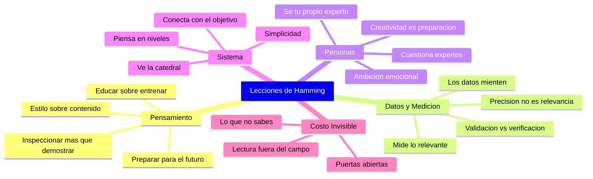

# Lecciones Clave

> [!INFO] Fuente
> Basado en: *The Art of Doing Science and Engineering* de Richard W. Hamming (Stripe Press, 2020). Síntesis transversal de los 30 capítulos con énfasis en las ideas filosóficas centrales.

---

## 1. El Estilo de Pensamiento Importa Más que el Contenido

> [!QUOTE] Hamming
> "Style of thinking is the center of the course."

Lo que sabes cambia constantemente. **Cómo piensas** es lo que determina tu impacto a largo plazo. Esta es la tesis fundacional del libro entero.

> [!TIP] Aplicación
> Cuando evalúes qué estudiar, prioriza métodos y marcos sobre hechos. Los hechos caducan; los marcos duran toda la carrera.

---

## 2. Prepárate para lo que Viene, no para lo que Fue

- El conocimiento se duplica cada ~15 años
- El **90% de lo que usarás** en tu carrera **aún no existe**
- La educación te prepara para lo desconocido; el entrenamiento, para lo conocido

> [!WARNING] La Paradoja del Profesor
> Los profesores enseñan lo que les funcionó a ellos hace 20-30 años. El estudiante de hoy necesita lo que le funcionará en 20-30 años. Son cosas distintas. La solución: convertirte en **estudiante permanente** de tu propio campo.

---

## 3. Los Datos son Menos Confiables de lo que Crees

Hamming dedica un capítulo entero (Cap. 27) a demostrar que los datos son sistemáticamente menos precisos de lo que se anuncia. Detalle completo en [[08 - Datos No Confiables]].

| Tipo de Error | Ejemplo |
|---------------|---------|
| **Error del instrumento** | Equipo de prueba tan poco confiable como lo que se prueba |
| **Error de definición** | ¿Qué cuenta como "fallo"? La definición cambia el resultado |
| **Error de selección** | Datos publicados tienen sesgo de supervivencia |
| **Error de interpolación** | Asumir continuidad donde hay discontinuidades |
| **Error humano** | Transcripción, redondeo, omisión selectiva |

> [!WARNING] Principio de Hamming sobre Datos
> "It has been my experience that data is generally **much less accurate** than it is advertised to be."
>
> Siempre pregúntate: ¿Por qué creo que el equipo de medición es más confiable que lo que se mide?

---

## 4. La Ingeniería de Sistemas Requiere Visión Global

No basta con hacer bien tu parte. Necesitas entender **cómo tu parte encaja en el todo**.

> [!IMPORTANT] Regla de Hamming
> La diferencia entre un técnico y un líder es que el técnico ve las piedras y el líder ve la catedral.

Preguntas que debes hacerte constantemente:

1. ¿Cuál es el **verdadero objetivo** de lo que hago?
2. ¿Estoy optimizando **lo correcto** o solo lo medible?
3. ¿Qué pasaría si hiciera **lo contrario** de lo que hago?
4. ¿Quién se beneficia de que yo haga esto? ¿Y quién se perjudica?
5. ¿Cuál es el **costo de oportunidad** de mi tiempo?

---

## 5. Mide lo que Importa, No lo que es Fácil

> [!DANGER] Ley de Hamming
> "You get what you measure." — Lo que eliges medir **controla** lo que sucede.

Aplicaciones prácticas:

- Si mides líneas de código, obtendrás **mucho código** (no necesariamente bueno)
- Si mides horas trabajadas, obtendrás **presencia** (no necesariamente productividad)
- Si mides papers publicados, obtendrás **volumen** (no necesariamente impacto)

La métrica se convierte en el objetivo. Lo que se ignora se atrofia. **Diseña tus métricas con el mismo cuidado con que diseñas tu código.**

---

## 6. Cuestiona a los Expertos (Incluyéndote a Ti Mismo)

Los expertos son necesarios pero peligrosos porque:

- Confunden su **modelo** del mundo con **el mundo**
- Tienen demasiado invertido en el paradigma actual
- Usan jerga para ganar argumentos, no para comunicar
- Desarrollan "ceguera paradigmática" a las anomalías

> [!QUOTE] Planck (vía Hamming)
> "Science advances funeral by funeral."

> [!TIP] Defensa Práctica
> Cultiva **un sano cinismo técnico**: cuestiona las afirmaciones, pide evidencia, busca contraejemplos. La mayoría de las "verdades aceptadas" tienen más grietas de las que parecen.

---

## 7. La Creatividad Requiere Preparación y Coraje

No es magia ni suerte pura. La creatividad emerge de:

1. **Inmersión profunda** en el problema (años, no semanas)
2. **Conocimiento amplio** más allá de tu campo
3. **Disposición a estar equivocado** públicamente
4. **Persistencia** cuando todos dicen que es imposible
5. **Reformulación** — cambiar la pregunta es a veces más importante que buscar la respuesta
6. **Defensa del tiempo creativo** contra las obligaciones administrativas

---

## 8. Las Grandes Contribuciones se Agrupan en las Mismas Personas

Esto no es casualidad. Las personas que hacen trabajo de primera clase:

- Trabajan en **problemas importantes** (la "pregunta de Hamming")
- Mantienen la **puerta abierta** (exposición a ideas nuevas)
- Cultivan **ambición emocional** (quieren que su trabajo importe)
- Aceptan **imperfección** para avanzar más rápido
- Desarrollan **estilo propio** en vez de copiar el de otros

---

## 9. La Inspección Reemplaza a la Deducción

Hamming toma prestada una idea de Polya: en problemas difíciles, **inspecciona** la solución tentativa, no la demuestres.

- Verifica **casos extremos** y **límites**
- Compara con **soluciones conocidas** en casos simples
- Pregunta: **¿tiene sentido físico?** (o dominio)
- Si una simulación da 42, **no es respuesta**: es punto de partida para investigar

> [!QUOTE] Hamming
> "When faced with a hard problem, **inspect** the proposed solution. Do not **prove** it. Proof is for the pure mathematician. The scientist or engineer must verify the answer makes sense in the world."

---

## 10. La Simulación No es la Realidad

Hamming introduce el concepto de "validación":

> [!DEFINITION] Validación vs. Verificación
> - **Verificación**: ¿El programa hace lo que le pedí? (pruebas de software)
> - **Validación**: ¿El programa hace lo que **necesito**? (sentido físico, dominio)

La mayoría de los proyectos fallan no porque el código esté mal, sino porque **modelan mal la realidad**. La simulación es un mapa, no el territorio.

---

## 11. La Simplicidad es una Virtud Difícil

Hamming admira a los grandes matemáticos e ingenieros por su **economía**:

> [!QUOTE] Hamming
> "The purpose of mathematics is to do things with **economy**, not to prove theorems."

Una solución elegante:

- Hace más con menos
- Es más fácil de verificar
- Es más fácil de modificar
- Es más fácil de enseñar

La complejidad innecesaria no es sofisticación: es **incapacidad de pensar claro**.

---

## 12. El Costo de la Ignorancia es Invisible

La lección más sutil del libro: lo que no sabes que no sabes **no te afecta directamente**, pero **limita tus opciones** sin que lo sepas.

- No sabes que existe una técnica mejor → no la usas
- No sabes que existe un campo relacionado → no conectas ideas
- No sabes que estás midiendo mal → confías en datos malos

> [!TIP] Defensa
> Lee fuera de tu campo. Habla con gente de otras disciplinas. Asiste a charlas que no son de tu área. **Paga el costo de la ignorancia** antes de que te pase factura.

---

## 13. La Computación es una Lente, No una Respuesta

Hamming advierte contra la arrogancia computacional:

> [!QUOTE] Hamming
> "The purpose of computing is **insight**, not numbers."

Una simulación que produce números no es conocimiento. Es **materia prima** para pensar. Si no entiendes qué significan los números, no has ganado nada al ejecutar la simulación.

---

## Resumen Visual

---

## Las 5 Preguntas que Hamming te haría

Si Hamming estuviera vivo y pudiera hacerte una pregunta, sería alguna de estas:

1. **¿Estás trabajando en un problema importante? Si no, ¿por qué no?**
2. **¿Tu trabajo de los últimos 5 años cambió algo para alguien?**
3. **¿Qué has hecho para preparar tu mente para los próximos 10 años?**
4. **¿Cuántas horas a la semana dedicas a pensar profundamente, sin interrupciones?**
5. **¿Qué verdad aceptada en tu campo sospechas que es falsa?**

> [!QUOTE] Hamming
> "The best scientists I have known are those who **do not** accept the current paradigm as the final truth, but rather are always **looking for the cracks** in it."

---

## Ver también

- [[01 - Conceptos Fundamentales]]
- [[02 - Aprender a Aprender]]
- [[04 - You and Your Research]]
- [[05 - Historia de la Computación]]
- [[06 - Límites de la IA]]
- [[07 - Matemáticas como Pensamiento]]
- [[08 - Datos No Confiables]]
- [[LIBROS/The Art of Doing Science and Engineering/00 - INDICE|Índice del Libro]]
