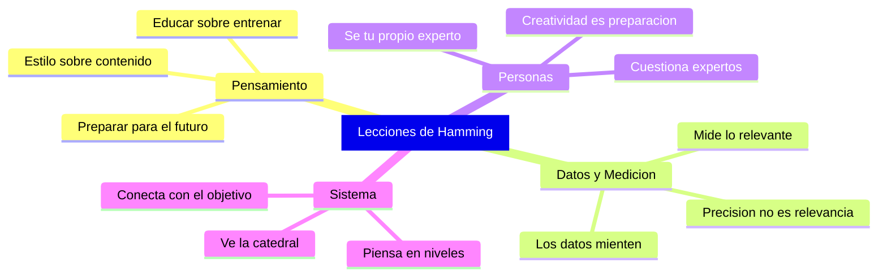

# Lecciones Clave

> [!INFO] Fuente
> Basado en: *The Art of Doing Science and Engineering* de Richard W. Hamming (Stripe Press, 2020). Síntesis transversal de los 30 capítulos.

---

## 1. El Estilo de Pensamiento Importa Más que el Contenido

> [!QUOTE] Hamming
> "Style of thinking is the center of the course."

Lo que sabes cambia constantemente. **Cómo piensas** es lo que determina tu impacto a largo plazo.

---

## 2. Prepárate para lo que Viene, no para lo que Fue

- El conocimiento se duplica cada ~15 años
- El 90% de lo que usarás en tu carrera **aún no existe**
- La educación te prepara para lo desconocido; el entrenamiento, para lo conocido

> [!TIP] Aplicación
> Invierte más tiempo en aprender **cómo aprender** que en memorizar hechos específicos. Los hechos caducan; las habilidades meta-cognitivas no.

---

## 3. Los Datos son Menos Confiables de lo que Crees

Hamming dedica un capítulo entero (Cap. 27) a demostrar que los datos son sistemáticamente menos precisos de lo que se anuncia:

| Tipo de Error | Ejemplo |
|---------------|---------|
| **Error del instrumento** | Equipo de prueba tan poco confiable como lo que se prueba |
| **Error de definición** | ¿Qué cuenta como "fallo"? La definición cambia el resultado |
| **Error de selección** | Datos publicados tienen sesgo de supervivencia |
| **Error de interpolación** | Asumir continuidad donde hay discontinuidades |
| **Error humano** | Transcripción, redondeo, omisión selectiva |

> [!WARNING] Principio de Hamming sobre Datos
> "It has been my experience that data is generally **much less accurate** than it is advertised to be."
>
> Siempre pregúntate: ¿Por qué creo que el equipo de medición es más confiable que lo que se mide?

---

## 4. La Ingeniería de Sistemas Requiere Visión Global

No basta con hacer bien tu parte. Necesitas entender **cómo tu parte encaja en el todo**.

> [!IMPORTANT] Regla de Hamming
> La diferencia entre un técnico y un líder es que el técnico ve las piedras y el líder ve la catedral.

Preguntas que debes hacerte constantemente:

1. ¿Cuál es el **verdadero objetivo** de lo que hago?
2. ¿Estoy optimizando **lo correcto** o solo lo medible?
3. ¿Qué pasaría si hiciera **lo contrario** de lo que hago?

---

## 5. Mide lo que Importa, No lo que es Fácil

> [!DANGER] Ley de Hamming
> "You get what you measure." — Lo que eliges medir **controla** lo que sucede.

Aplicaciones prácticas:

- Si mides líneas de código, obtendrás **mucho código** (no necesariamente bueno)
- Si mides horas trabajadas, obtendrás **presencia** (no necesariamente productividad)
- Si mides papers publicados, obtendrás **volumen** (no necesariamente impacto)

---

## 6. Cuestiona a los Expertos (Incluyéndote a Ti Mismo)

Los expertos son necesarios pero peligrosos porque:

- Confunden su **modelo** del mundo con **el mundo**
- Tienen demasiado invertido en el paradigma actual
- Usan jerga para ganar argumentos, no para comunicar

> [!QUOTE] Planck (vía Hamming)
> "Science advances funeral by funeral."

---

## 7. La Creatividad Requiere Preparación y Coraje

No es magia ni suerte pura. La creatividad emerge de:

1. **Inmersión profunda** en el problema
2. **Conocimiento amplio** más allá de tu campo
3. **Disposición a estar equivocado** públicamente
4. **Persistencia** cuando todos dicen que es imposible
5. **Reformulación** — cambiar la pregunta es a veces más importante que buscar la respuesta

---

## 8. Las Grandes Contribuciones se Agrupan en las Mismas Personas

Esto no es casualidad. Las personas que hacen trabajo de primera clase:

- Trabajan en **problemas importantes**
- Mantienen la **puerta abierta** (metafóricamente) a nuevas ideas
- Cultivan **ambición emocional** (quieren que su trabajo importe)
- Aceptan **imperfección** para avanzar más rápido

---

## Resumen Visual

---

## Ver también

- [[01 - Conceptos Fundamentales]]
- [[02 - Aprender a Aprender]]
- [[04 - You and Your Research]]
- [[LIBROS/The Art of Doing Science and Engineering/00 - INDICE|Índice del Libro]]
