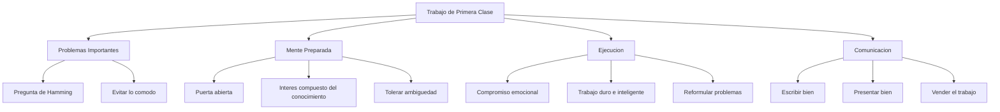

# You and Your Research

> [!INFO] Fuente
> Basado en: *The Art of Doing Science and Engineering* de Richard W. Hamming (Stripe Press, 2020). Capítulo 30, basado en su famosa charla de 1986 en Bell Labs.

---

## Por Qué Este Capítulo Importa

> [!QUOTE] Hamming
> "Each of you has but one life to lead, and it seems to me it is better to do significant things than to just get along through life to its end."

Este capítulo es el resumen de los 29 anteriores. Hamming lo dio originalmente como charla titulada "You and Your Research" en 1986, y se convirtió en una de las charlas más influyentes en la historia de la ciencia y la ingeniería.

---

## La Suerte No Explica Todo

El argumento principal contra esforzarse por la grandeza es: "Todo es cuestión de suerte."

Hamming responde:

- **Sí**, hay un elemento de suerte
- **Pero** la suerte favorece a la mente preparada (Pasteur)
- Si fuera solo suerte, los grandes logros **no se agruparían** en las mismas personas
- Shannon hizo muchas cosas importantes, no solo una
- Einstein, Newton, Darwin — todos produjeron **múltiples** contribuciones mayores

> [!IMPORTANT] Conclusión
> "You prepare yourself to succeed or not, as you choose, from moment to moment by the way you live your life."

---

## Las Condiciones para Hacer Trabajo de Primera Clase

### 1. Trabaja en Problemas Importantes

> [!QUOTE] La Pregunta de Hamming
> "What are the important problems in your field? Are you working on one of them? **Why not?**"

Hamming cuenta que hacía esta pregunta en los almuerzos de Bell Labs. La gente dejó de sentarse con él. Pero la pregunta sigue siendo devastadoramente importante.

| Trampa | Descripción |
|--------|-------------|
| Problemas cómodos | Trabajar en lo que sabes en vez de lo que importa |
| Falsa importancia | Convencerte de que tu problema trivial es "fundamental" |
| Perfeccionismo | Esperar condiciones perfectas para empezar |

### 2. Mantén la Puerta Abierta

Metáfora literal de Bell Labs:

- **Puerta cerrada** = Más productivo hoy, pero desconectado del futuro
- **Puerta abierta** = Más interrupciones, pero expuesto a problemas e ideas nuevas

> [!TIP] Aplicación Moderna
> "Puerta abierta" hoy significa: leer fuera de tu campo, hablar con gente de otras disciplinas, asistir a charlas que no son de tu área.

### 3. Cultiva la Ambición Emocional

No basta con ser inteligente. Necesitas:

- **Deseo ardiente** de que tu trabajo importe
- **Compromiso emocional** con el problema
- **Insatisfacción constructiva** con el estado actual

> [!WARNING] La Trampa del Talento Desperdiciado
> Hamming conoció a muchos científicos brillantes en Bell Labs que nunca hicieron trabajo significativo. Tenían talento pero les faltaba **dirección y compromiso**.

### 4. Trabaja Duro e Inteligentemente

> [!QUOTE] Hamming
> "Knowledge and productivity are like compound interest."

- El esfuerzo se **acumula** como interés compuesto
- Una hora extra al día de pensamiento enfocado produce resultados desproporcionados
- Pero trabajar duro en lo incorrecto es peor que no trabajar

### 5. Tolera la Ambigüedad

Debes poder mantener simultáneamente:

- **Confianza** en que puedes resolver el problema
- **Duda** sobre si tu enfoque actual es correcto

> [!DEFINITION] Balance Esencial
> Demasiada confianza = ignoras señales de error.
> Demasiada duda = nunca empiezas.
> El sweet spot es **creer firmemente pero verificar constantemente**.

### 6. Vende tu Trabajo

> [!WARNING] Realidad Incómoda
> "It is not sufficient to do a job; you must also **sell it**."

Hamming aprendió que:

- Los grandes trabajos ignorados son como si no existieran
- Necesitas comunicar **claramente** por qué tu trabajo importa
- Escribir bien y presentar bien **no son opcionales**
- "El empaquetado es tan importante como el producto"

---

## Los Defectos que Bloquean la Grandeza

| Defecto | Efecto |
|---------|--------|
| **Rabia contra el sistema** | Gastas energía peleando en vez de creando |
| **Trabajar con la puerta cerrada** | Te aíslas de las oportunidades |
| **No trabajar en problemas importantes** | Desperdicias tu potencial |
| **No vender tu trabajo** | Nadie sabe lo que hiciste |
| **Culpar a la suerte** | Te absuelves de responsabilidad |
| **Quejarte de las condiciones** | Las condiciones nunca serán perfectas |

> [!QUOTE] Hamming sobre las Condiciones
> "What most people think are the best working conditions, clearly are not... **The appearance of work is not the same as working on the right problem.**"

---

## El Precio de la Excelencia

Hamming es honesto sobre los costos:

- **Sacrificios personales** — Menos tiempo para ocio y relaciones
- **Conflicto con el establishment** — Los que innovan incomodan
- **Soledad intelectual** — Pocos entienden lo que haces antes de que funcione
- **Riesgo de fracaso** — La mayoría de los intentos ambiciosos fallan

> [!NOTE] Pregunta Final
> "Is the effort to do first-class work worth it?" Hamming dice que sí, pero reconoce que cada persona debe decidir por sí misma.

---

## Resumen: El Marco de Hamming para la Excelencia

---

## Ver también

- [[01 - Conceptos Fundamentales]]
- [[02 - Aprender a Aprender]]
- [[03 - Lecciones Clave]]
- [[LIBROS/The Art of Doing Science and Engineering/00 - INDICE|Índice del Libro]]
