# You and Your Research

> [!INFO] Fuente
> Basado en: *The Art of Doing Science and Engineering* de Richard W. Hamming (Stripe Press, 2020). Capítulo 30, basado en su famosa charla de 1986 en Bell Labs ("You and Your Research").

---

## Por Qué Este Capítulo Importa

> [!QUOTE] Hamming (apertura de la charla)
> "Each of you has but one life to lead, and it seems to me it is better to do significant things than to just get along through life to its end."

Este capítulo es **el resumen** de los 29 anteriores. Hamming lo dio originalmente como charla titulada "You and Your Research" el 6 de marzo de 1986 en Bell Labs, y se convirtió en una de las charlas más influyentes en la historia de la ciencia y la ingeniería moderna. Se transcribió, se distribuyó, y eventualmente se publicó como capítulo final del libro.

> [!NOTE] Contexto histórico
> Hamming tenía 71 años cuando dio la charla. Acababa de jubilarse de Bell Labs tras 30 años. Era presidente de la sección de análisis numérico de la ACM y ganador de la Turing Award. Tenía la autoridad moral de hablar sin filtros. La charla es **franca, provocadora, y políticamente incorrecta** para la academia — y por eso sigue vigente.

---

## La Suerte No Explica Todo

El argumento principal contra esforzarse por la grandeza es: "Todo es cuestión de suerte."

Hamming responde con un test empírico:

- **Sí**, hay un elemento de suerte
- **Pero** la suerte favorece a la mente preparada (Pasteur)
- Si fuera solo suerte, los grandes logros **no se agruparían** en las mismas personas

Las personas con **múltiples** contribuciones importantes:

| Persona | Contribuciones |
|---------|----------------|
| **Shannon** | Teoría de la información, criptografía, juego de ajedrez computerizado |
| **Einstein** | Relatividad especial, relatividad general, efecto fotoeléctrico, movimiento browniano |
| **Newton** | Cálculo, mecánica, óptica, gravitación |
| **Darwin** | Selección natural, teoría de la evolución, estudio de los percebes |
| **von Neumann** | Arquitectura de computadoras, teoría de juegos, álgebra de operadores, mecánica cuántica |

> [!IMPORTANT] Conclusión
> "You prepare yourself to succeed or not, as you choose, from moment to moment by the way you live your life."

La "suerte" no es un evento aleatorio: es el **resultado acumulado** de miles de pequeñas decisiones tomadas durante años.

---

## La Edad y la Pregunta Incómoda

Hamming introduce una pregunta que se hizo a sí mismo y a sus colegas:

> [!QUESTION] La Pregunta
> "What are the important problems in your field? If you are not working on one of them, **why not**?"

La mayoría de las personas no pueden responder con claridad. Algunos motivos que dio:

- "No sé cuáles son los problemas importantes" (es decir, no leen lo suficiente)
- "Mi jefe me lo asignó" (es decir, no tienen autonomía)
- "Es muy difícil" (es decir, prefieren lo fácil)
- "No me pagan para eso" (es decir, no tienen ambición)

> [!TIP] Ejercicio de Hamming
> Hamming cuenta que hacía esta pregunta en los almuerzos de Bell Labs. La gente dejó de sentarse con él. Pero la pregunta sigue siendo devastadoramente importante: si no sabes cuáles son los problemas importantes, **no puedes elegirlos deliberadamente**.

### La "Edad de los 30"

Hamming también preguntó a sus colegas: **"¿Cuáles son los problemas importantes en tu campo a los que te gustaría dedicar los próximos 10 años?"** La mayoría no podía responder.

> [!QUOTE] Hamming
> "If you do not **know** what the important problems are, then you cannot **choose** to work on them. You are at the mercy of whoever assigns you work."

La edad de 30 es significativa: ya tienes experiencia, aún tienes energía, y todavía tienes tiempo para hacer contribuciones importantes en los siguientes 30-40 años.

---

## Las Condiciones para Hacer Trabajo de Primera Clase

Hamming identificó **siete hábitos** que comparten las personas que hacen trabajo de primera clase.

### 1. Trabaja en Problemas Importantes

> [!QUOTE] La Pregunta de Hamming (variante)
> "If your work is not **important**, you are not going to do important work, no matter how hard you work."

| Trampa | Descripción |
|--------|-------------|
| Problemas cómodos | Trabajar en lo que sabes en vez de lo que importa |
| Falsa importancia | Convencerte de que tu problema trivial es "fundamental" |
| Perfeccionismo | Esperar condiciones perfectas para empezar |
| Presión del entorno | Hacer lo que tu jefe te dice en vez de lo que importa |

> [!WARNING] La Honestidad Necesaria
> La mayoría de nosotros trabajamos en problemas que **no son importantes**. Reconocerlo es el primer paso para cambiarlo.

### 2. Mantén la Puerta Abierta

Hamming cuenta que en Bell Labs, los investigadores con más éxito tenían **la puerta de su oficina abierta**. La metáfora es literal y profunda:

- **Puerta cerrada** = Más productivo hoy, pero desconectado del futuro
- **Puerta abierta** = Más interrupciones, pero expuesto a problemas e ideas nuevas

> [!EXAMPLE] Lo que significaba la puerta abierta
> Cuando alguien pasaba y veía un problema interesante en tu pizarra, entraba a preguntar. Esas interrupciones generaban **colisiones de ideas** que ningún trabajo solitario podía producir. Los descubrimientos importantes en Bell Labs no sucedían en oficinas cerradas: sucedían en los pasillos y en los escritorios con la puerta abierta.

> [!TIP] Aplicación Moderna
> "Puerta abierta" hoy significa: leer fuera de tu campo, hablar con gente de otras disciplinas, asistir a charlas que no son de tu área, tener **presencia digital** que invite a la conexión (blog, GitHub, papers accesibles).

### 3. Cultiva la Ambición Emocional

No basta con ser inteligente. Necesitas:

- **Deseo ardiente** de que tu trabajo importe
- **Compromiso emocional** con el problema
- **Insatisfacción constructiva** con el estado actual
- **Resistencia** a la mediocridad

> [!WARNING] La Trampa del Talento Desperdiciado
> Hamming conoció a muchos científicos brillantes en Bell Labs que **nunca** hicieron trabajo significativo. Tenían talento pero les faltaba **dirección y compromiso**. La inteligencia sin ambición es talento desperdiciado.

> [!QUOTE] Hamming
> "I noticed that the **majority** of the famous scientists I knew had, at the beginning of their careers, an almost **obsessive** drive to do important work."

### 4. Trabaja Duro e Inteligentemente

> [!QUOTE] Hamming
> "Knowledge and productivity are like compound interest."

- El esfuerzo se **acumula** como interés compuesto
- Una hora extra al día de pensamiento enfocado produce resultados desproporcionados
- Pero trabajar duro en lo incorrecto es **peor** que no trabajar

> [!TIP] La Regla del 10%
> Hamming sugiere dedicar al menos el 10% de tu tiempo semanal a **pensar profundamente** sobre tu campo, sin interrupciones. No tareas, no email, no reuniones: pensar. Esta es la inversión con mayor retorno a largo plazo.

### 5. Tolera la Ambigüedad

Debes poder mantener simultáneamente:

- **Confianza** en que puedes resolver el problema
- **Duda** sobre si tu enfoque actual es correcto

> [!DEFINITION] Balance Esencial
> Demasiada confianza = ignoras señales de error.
> Demasiada duda = nunca empiezas.
> El sweet spot es **creer firmemente pero verificar constantemente**.

Esta es una de las habilidades más difíciles de cultivar. Hamming admite que él mismo luchó con ella toda su carrera.

### 6. Vende tu Trabajo

> [!WARNING] Realidad Incómoda
> "It is not sufficient to do a job; you must also **sell it**."

Hamming aprendió esta lección por las malas:

- Los grandes trabajos ignorados son como si no existieran
- Necesitas comunicar **claramente** por qué tu trabajo importa
- Escribir bien y presentar bien **no son opcionales**
- "El empaquetado es tan importante como el producto"

> [!EXAMPLE] El Científico vs. El Líder
> El científico que descubre algo importante y no lo comunica ha desperdiciado el 50% de su impacto. El líder que comunica algo mediocre de forma brillante ha multiplicado su impacto. Ambos extremos son problemáticos, pero la **comunicación efectiva** es la habilidad que los técnicos típicamente descuidan.

### 7. Sé tu Propio Experto en Muchas Áreas

Desarrollado en [[02 - Aprender a Aprender]]. En resumen: no puedes depender de que los expertos vean más allá de su campo. Necesitas un **saber distribuido** que te permita cuestionar y conectar.

---

## Los Defectos que Bloquean la Grandeza

Hamming fue brutalmente honesto sobre lo que vio en colegas que **no** lograron grandeza:

| Defecto | Efecto | Solución |
|---------|--------|----------|
| **Rabia contra el sistema** | Gastas energía peleando en vez de creando | Acepta el sistema, trabaja dentro o fuera de él |
| **Trabajar con la puerta cerrada** | Te aíslas de las oportunidades | Mantén presencia y conexiones |
| **No trabajar en problemas importantes** | Desperdicias tu potencial | Pregúntate constantemente |
| **No vender tu trabajo** | Nadie sabe lo que hiciste | Comunica con claridad |
| **Culpar a la suerte** | Te absuelves de responsabilidad | Asume ownership de tus resultados |
| **Quejarte de las condiciones** | Las condiciones nunca serán perfectas | Trabaja con lo que tienes |
| **Miedo a estar equivocado** | No publicas, no arriesgas | Acepta el riesgo calculado |
| **Burocratizarse** | Te vuelves gestor, no creador | Defiende tu tiempo creativo |

> [!QUOTE] Hamming sobre las Condiciones
> "What most people think are the best working conditions, clearly are not... **The appearance of work is not the same as working on the right problem.**"

### El caso del científico que odia su entorno

Hamming cuenta que uno de los físicos más brillantes que conoció trabajó toda su carrera frustrado por la "burocracia" de Bell Labs. Pero cuando se jubiló y se fue a una universidad donde tenía "libertad total", **dejó de publicar trabajos importantes**. ¿Por qué?

> [!TIP] Lección
> A veces el "sistema" que odiamos nos **protegía** de nuestra propia inercia. La estructura que critica nuestra libertad a veces es la estructura que nos hace productivos. El truco no es eliminar la estructura, sino elegir la que **te empuje** a hacer trabajo importante.

---

## El Precio de la Excelencia

Hamming es honesto sobre los costos:

- **Sacrificios personales** — Menos tiempo para ocio y relaciones
- **Conflicto con el establishment** — Los que innovan incomodan
- **Soledad intelectual** — Pocos entienden lo que haces antes de que funcione
- **Riesgo de fracaso** — La mayoría de los intentos ambiciosos fallan
- **Estrés crónico** — La presión de hacer trabajo importante no se apaga

> [!NOTE] Pregunta Final
> "Is the effort to do first-class work worth it?" Hamming dice que **sí**, pero reconoce que cada persona debe decidir por sí misma. No es una elección universalmente correcta.

### La alternativa

Hamming no condena a quien elige no perseguir la grandeza. Hay vidas valiosas en el "trabajo decente" y en el equilibrio personal. Lo que condena es la **autoengaño**: pretender que quieres grandeza mientras haces trabajo mediocre por miedo a intentarlo.

> [!QUOTE] Hamming
> "I am **not** saying that everyone should try to do first-class work. I am saying that if you **want** to do first-class work, here is what it takes."

---

## El Caso Especial: La Culpa de Sobrevivir

Hamming introdujo una reflexión que muchos lectores encuentran inquietante: el **sesgo del superviviente**.

- Solo vemos a los que **lograron** grandeza
- Los que no lo lograron, no aparecen en los libros
- Los que **murieron** en el intento, tampoco

> [!WARNING] La Trampa
> Cuando lees biografías de genios, ves solo el resultado. No ves los **miles** que persiguieron el mismo objetivo y fallaron. Hamming insiste: la grandeza tiene una **probabilidad baja** de éxito, incluso con talento y trabajo duro.

Esto no es un argumento para no intentarlo. Es un argumento para **no personalizar el fracaso**: si trabajas duro en problemas importantes y no lo logras, **no significa que estuvieras equivocado**. Significa que la grandeza siempre fue un juego de probabilidades.

---

## La Defensa Final: Por qué Vale la Pena

Hamming termina la charla con un argumento personal:

> [!QUOTE] Hamming (cierre)
> "I think that if you **don't** aim to do first-class work, you are selling yourself short. You may not succeed, but at least you have **tried**. And that's a great deal more than most people do."

> [!TIP] El Legado Personal
> La medida de una carrera no es solo lo que lograste, sino **en qué te convertiste** en el proceso. Perseguir la grandeza con honestidad produce una persona distinta a la que se conforma. Ese cambio es valioso **incluso si el resultado externo no llega**.

---

## Resumen: El Marco de Hamming para la Excelencia

```mermaid
graph TD
    A["Trabajo de Primera Clase"] --> B["Problemas Importantes"]
    A --> C["Mente Preparada"]
    A --> D["Ejecucion"]
    A --> E["Comunicacion"]
    A --> F["Actitud Correcta"]
    
    B --> B1["Pregunta de Hamming"]
    B --> B2["Evitar lo comodo"]
    B --> B3["Asumir el costo"]
    
    C --> C1["Puerta abierta"]
    C --> C2["Interes compuesto del conocimiento"]
    C --> C3["Tolerar ambiguedad"]
    C --> C4["Lectura fuera del campo"]
    
    D --> D1["Compromiso emocional"]
    D --> D2["Trabajo duro e inteligente"]
    D --> D3["Reformular problemas"]
    D --> D4["Defender tiempo creativo"]
    
    E --> E1["Escribir bien"]
    E --> E2["Presentar bien"]
    E --> E3["Vender el trabajo"]
    
    F --> F1["Ownership del resultado"]
    F --> F2["Asumir riesgo calculado"]
    F --> F3["Honestidad sobre el precio"]
```

---

## Las Citas Memorables del Capítulo

> [!QUOTE] Colección de frases célebres
> - "Why are you not working on the important problems of your field?"
> - "Luck favors the prepared mind."
> - "The appearance of work is not the same as working on the right problem."
> - "If you don't aim to do first-class work, you are selling yourself short."
> - "Knowledge and productivity are like compound interest."
> - "You must sell your work — it is not sufficient to do it."
> - "Science advances funeral by funeral."

---

## Ver también

- [[01 - Conceptos Fundamentales]]
- [[02 - Aprender a Aprender]]
- [[03 - Lecciones Clave]]
- [[LIBROS/The Art of Doing Science and Engineering/00 - INDICE|Índice del Libro]]
