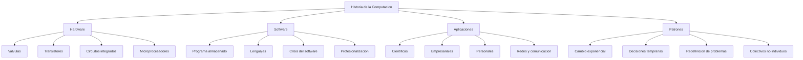

# Historia de la Computación

> [!INFO] Fuente
> Basado en: *The Art of Doing Science and Engineering* de Richard W. Hamming (Stripe Press, 2020). Capítulos 2 (Foundations of the Digital Revolution), 3 (History of Computers — Hardware), 4 (History of Computers — Software) y 5 (History of Computer Applications).

---

## Por Qué Estos Capítulos Importan

Hamming dedicó los primeros capítulos del libro (después de la introducción) a contar **la historia** de la computación. ¿Por qué? Porque las lecciones sobre estilo de pensamiento se entienden mejor cuando se ven **en contexto**: cómo surgieron las ideas, qué alternativas se consideraron, qué errores se cometieron.

> [!QUOTE] Hamming
> "You cannot understand the current state of computing without understanding **how we got here**."

La historia no es anecdotaria: cada decisión técnica importante refleja una **decisión filosófica** sobre cómo pensar el problema.

---

## La Revolución Digital: Cap. 2

### El cambio de paradigma: analógico → digital

Antes de la computación digital, la computación era **analógica** y **mecánica**:

- **Regla de cálculo** (usada por ingenieros hasta los años 70)
- **Computadoras analógicas** (resolvían ecuaciones diferenciales con circuitos eléctricos)
- **Máquinas mecánicas** (Pascal, Leibniz, Babbage)

> [!IMPORTANT] Por qué digital ganó
> La computación digital ganó por tres razones técnicas:
> 1. **Precisión**: las señales digitales son robustas al ruido
> 2. **Almacenamiento**: la información se guarda y replica sin degradación
> 3. **Universalidad**: la misma máquina puede resolver problemas muy distintos

### La paradoja inicial

A pesar de estas ventajas, las primeras computadoras digitales eran **carísimas, lentas, y poco confiables**. ¿Por qué triunfaron? Porque las alternativas eran **peores**, y porque el costo caía exponencialmente (Ley de Moore).

### Las dos grandes arquitecturas

| Arquitectura | Representante | Filosofía |
|--------------|---------------|-----------|
| **Decimal** | ENIAC (1946) | Computar como humanos, dígito a dígito |
| **Binaria** | EDVAC, IAS Machine | Computar como transistores, bit a bit |

> [!TIP] Lección
> La decisión "decimal vs. binaria" no era técnica: era **filosófica**. Los ingenieros querían pensar como humanos; los matemáticos querían pensar como la física. Los matemáticos ganaron. ¿Por qué? Porque la física del transistor **es** binaria, y alinearse con la realidad es más eficiente que alinearse con la intuición humana.

---

## Historia del Hardware: Cap. 3

### Las generaciones de hardware

Hamming divide la historia del hardware en **cuatro generaciones** que conviene recordar:

| Generación | Época | Tecnología | Figuras clave |
|------------|-------|------------|---------------|
| **1ª** | 1940s-50s | Válvulas de vacío | ENIAC, EDVAC, UNIVAC |
| **2ª** | 1950s-60s | Transistores | TX-0, IBM 1401 |
| **3ª** | 1960s-70s | Circuitos integrados | IBM 360, PDP-8 |
| **4ª** | 1970s+ | Microprocesadores | Intel 4004, Altair 8800, Apple II |

### La transición clave: válvulas → transistores

Hamming vivió esta transición en Bell Labs. La pasó de presenciar:

> [!EXAMPLE] La Anécdota de Hamming
> Hamming cuenta que en 1947 vio a Bardeen, Brattain y Shockley **inventar el transistor** en el laboratorio contiguo al suyo. Los colegas científicos no le dieron importancia: "¿Para qué queremos un dispositivo más pequeño y caro que la válvula?" La historia demostró que la pregunta estaba **completamente equivocada**: el transistor ganó por **costo a escala, confiabilidad, y miniaturización**, no por reemplazar una válvula.

> [!TIP] Lección sobre las predicciones tecnológicas
> Las predicciones sobre tecnologías nuevas son casi siempre **conservadoras en el corto plazo y revolucionarias en el largo plazo**. Quienes apostaron al transistor en 1947 parecían ridículos; quienes no apostaron se quedaron fuera de la revolución digital.

### El papel de los mainframes

Durante los 50s-60s, las computadoras eran **mainframes** centralizados:

- Costo: millones de dólares
- Tamaño: una habitación
- Usuarios: un departamento a la vez (procesamiento por lotes)
- Programación: en lenguaje de máquina o ensamblador

> [!QUOTE] Hamming sobre los mainframes
> "The computer was **too important** to leave to programmers, so management kept it locked in a special room with specially trained operators."

Esta frase captura una ironía histórica: el activo más valioso de una organización quedaba **bajo llave**, accesible solo a especialistas. La democratización tardó 30 años en llegar.

### El costo por operación: la métrica olvidada

Una de las observaciones más útiles de Hamming: en 1950, una operación aritmética costaba **un dólar**. En 1970, costaba **un centavo**. En 1990, costaba **una milésima de centavo**. Esta caída exponencial es lo que hace posible la computación moderna.

> [!WARNING] Implicación
> Cuando un recurso cae de precio exponencialmente, **los problemas que parecían imposibles se vuelven triviales**, y **problemas nuevos se vuelven posibles**. Si tu estrategia de 1990 no contemplaba que la computación sería 1000x más barata en 2010, tu estrategia está obsoleta.

---

## Historia del Software: Cap. 4

### La invención que cambió todo: el programa almacenado

Antes de 1945, las computadoras se **programaban reconectando cables** o ajustando interruptores. La gran innovación fue la **arquitectura de programa almacenado**:

- Las **instrucciones** se guardan en la misma memoria que los **datos**
- La misma máquina puede ejecutar programas muy distintos sin reconfiguración
- Idea atribuida a **von Neumann** (aunque vino de varios lugares, incluido el propio Hamming que contribuyó a refinarla)

> [!IMPORTANT] Por qué fue tan importante
> El programa almacenado es la base de la **flexibilidad computacional**. Sin él, cada computadora era una máquina especial. Con él, una máquina física se convierte en **cualquier máquina lógica**.

### Lenguajes de programación: la torre de Babel

Hamming cuenta la explosión de lenguajes de las décadas 50-70:

- **Lenguaje de máquina** (1940s): binario puro
- **Ensamblador** (1950): mnemónicos
- **Fortran** (1957): matemático
- **Lisp** (1958): funcional
- **COBOL** (1959): negocios
- **Algol** (1960): estructurado
- **Basic** (1964): principiantes
- **C** (1972): sistemas
- **Pascal** (1970): educación
- **Smalltalk** (1972): orientado a objetos

> [!TIP] Lección
> La proliferación de lenguajes refleja que **no hay un lenguaje universal** para todos los problemas. Cada lenguaje codifica una forma de pensar. Aprender varios lenguajes es aprender **varias formas de pensar**.

### El problema del software

Hamming fue uno de los primeros en señalar lo que hoy llamamos **crisis del software**:

> [!QUOTE] Hamming
> "The major problem of computing is **not** the hardware. It is the **software**. The hardware has become so reliable that the failures are almost always in the programs."

En 1969, Hamming predijo:

- La programación se volvería más difícil a medida que los sistemas crecieran
- Los "programadores" se dividirían en **especialistas** (como en otras ingenierías)
- La **complejidad** sería el problema central, no la velocidad

> [!EXAMPLE] El problema de la complejidad
> Un sistema con N componentes tiene O(N²) interacciones. Un sistema moderno tiene millones de componentes. **Ninguna persona** puede entenderlo entero. Esta es la razón por la que el software moderno falla de formas que los ingenieros individuales no pueden predecir.

### La profesión de "programador"

Hamming también fue pionero al afirmar que la programación es una **profesión**, no un oficio menor. Argumentó que los programadores necesitan:

- Formación matemática seria
- Conocimiento del dominio donde aplican
- Sentido de la **estética** del código
- **Responsabilidad** por el resultado

Esta visión era radical en 1970. Es la norma hoy.

---

## Historia de las Aplicaciones: Cap. 5

### Aplicaciones pioneras

Hamming describe las primeras aplicaciones "reales" de la computación:

| Aplicación | Época | Impacto |
|------------|-------|---------|
| **Cálculo balístico** | 1940s | Tablas de tiro de artillería (V-2) |
| **Pronóstico del tiempo** | 1950s | Primer modelo numérico viable |
| **Diseño de reactores** | 1950s | Cálculos que tomaban meses a mano |
| **Criptografía** | 1960s | Factorización y criptoanálisis |
| **Simulación científica** | 1960s | Física, química, biología |
| **Bases de datos** | 1960s | Gestión de información empresarial |
| **CAD/CAM** | 1970s | Diseño y manufactura asistidos |

### El cambio en la naturaleza del trabajo

> [!QUOTE] Hamming
> "The computer has **changed** the nature of scientific work, not just the speed at which we do it."

Antes: el científico hacía experimentos y calculaba a mano. Después: el científico **escribe simulaciones** y los resultados emergen del cómputo. Esto cambia **qué preguntas** se pueden hacer.

> [!EXAMPLE] Ejemplo de Hamming
> En 1950, predecir el clima a 5 días era imposible por poder de cómputo. En 1970, era difícil pero empezaba a ser viable. En 1990, era rutina. En 2020, era un problema de **calidad del modelo**, no de cómputo. **La pregunta misma cambió**.

### Las aplicaciones que Hamming NO anticipó

Hamming fue honesto sobre sus propios puntos ciegos. En la década de 1970, no anticipó:

- La **computación personal** como fenómeno masivo
- **Internet** como infraestructura global
- La **World Wide Web** (esto fue un invento de los 90s, pero Hamming notó las redes)
- Los **videojuegos** como industria
- Las **redes sociales** (obviamente)
- La **IA moderna** (aunque Cap. 6-8 sí aborda las expectativas de IA de los 70s)

> [!TIP] Lección
> Las **aplicaciones sociales** de la computación (redes, comunicación, entretenimiento) resultaron más transformadoras que las científicas. Esto sugiere que **subestimamos sistemáticamente** las aplicaciones que afectan la vida cotidiana, y **sobreestimamos** las que parecen "elevadas".

---

## Lecciones de la Historia Computacional

### 1. La ley del cambio exponencial

> [!IMPORTANT] Patrón histórico
> Casi toda métrica relevante (costo por operación, memoria, velocidad, número de usuarios) ha seguido una **curva exponencial** durante 80 años. Lo que parece "imposible hoy" suele ser **rutinario en 10-15 años**.

### 2. Las decisiones tempranas son las que más cuestan

La elección de **binario vs. decimal**, **arquitectura von Neumann vs. Harvard**, **programa almacenado vs. cableado** se tomó en los años 40-50 y **define la computación actual**. Las decisiones filosóficas tomadas en los primeros años son las más difíciles de revertir.

### 3. Los nombres importan menos que los contextos

Hamming enfatiza que los "inventores" son casi siempre **colectivos**, no individuos. La historia de la computación es:

- **Babbage** concibió la máquina analítica, pero no la construyó
- **Turing** concibió la máquina universal, pero la limitó a lo abstracto
- **von Neumann** popularizó el programa almacenado, pero la idea era del momento
- **Shannon** sentó las bases teóricas, pero la computación vino de muchos

> [!WARNING] El "Gran Hombre" como distorsión
> Atribuir los inventos a individuos es **necesario narrativamente** pero **engañoso históricamente**. Casi todos los avances importantes surgen de **múltiples contribuciones concurrentes** en el momento adecuado.

### 4. Los problemas se redefinen, no se resuelven

Hamming insiste en una observación crucial: cuando resolvemos un problema, no obtenemos la respuesta y terminamos. **Redefinimos qué es el problema**.

- Las primeras computadoras resolvían **cálculo numérico**
- Después resolvieron **procesamiento de datos**
- Luego **comunicación**
- Luego **conocimiento**
- Ahora **cognición**

Cada redefinición abre problemas nuevos que antes no imaginábamos.

---

## Síntesis Visual

---

## Ver también

- [[01 - Conceptos Fundamentales]]
- [[06 - Límites de la IA]]
- [[07 - Matemáticas como Pensamiento]]
- [[LIBROS/The Art of Doing Science and Engineering/00 - INDICE|Índice del Libro]]
