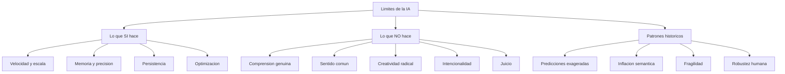

# Límites de la Inteligencia Artificial

> [!INFO] Fuente
> Basado en: *The Art of Doing Science and Engineering* de Richard W. Hamming (Stripe Press, 2020). Capítulos 6, 7 y 8: "Limits of Computer Applications — AI" (Partes I, II y III).

---

## Por Qué Estos Capítulos Son Remarkables

Hamming escribió estos capítulos en **1995**. La IA de entonces era simbólica, basada en reglas y árboles de búsqueda. Los LLMs y el deep learning **no existían**. Y sin embargo, la mayor parte de su análisis sigue siendo **válida y provocadora** en 2026.

> [!NOTE] Contexto histórico
> Cuando Hamming escribió esto, la IA acababa de pasar por su **segundo invierno** (1987-1993). Los sistemas expertos comerciales no habían cumplido las promesas. La financiación se había reducido. Hamming aprovecha este momento de sobriedad para hacer un análisis crítico **frío y honesto** de lo que la computación puede y no puede hacer.

---

## La Pregunta Fundamental

Hamming abre con la pregunta que estructura los tres capítulos:

> [!QUESTION] La Pregunta de Hamming
> ¿Cuáles son los **límites fundamentales** de lo que las computadoras pueden hacer? Y específicamente, ¿pueden las computadoras **pensar**?

Esta pregunta no es nueva. Turing la formuló en 1950. Pero Hamming la aborda con un enfoque **pragmático**: no le interesa la metafísica, le interesa **qué se puede construir y qué no**.

---

## Lo que las Computadoras Hacen Bien (y los Humanos No)

Antes de hablar de límites, Hamming lista lo que la computación hace **mejor** que los humanos. Es una lista sorprendentemente larga:

| Capacidad | Computadora | Humano |
|-----------|-------------|--------|
| **Velocidad** | 10⁹ operaciones/segundo | 10 operaciones/segundo (en el mejor caso) |
| **Memoria** | Terabytes exactos | 7±2 items en memoria de trabajo |
| **Precisión** | 15+ dígitos sin error | Errores frecuentes |
| **Repetitividad** | Idéntico siempre | Variable |
| **Persistencia** | No se cansa ni aburre | Se fatiga y distrae |
| **Alcance** | Procesa petabytes | Limitado a lo percibido |
| **Costo marginal** | Cercano a cero | Alto y creciente |

> [!TIP] Implicación
> La computación gana en **escala, velocidad, y consistencia**. Pierde en **comprensión, creatividad genuina, y sentido común**. Esta asimetría es estructural, no accidental.

---

## Lo que las Computadoras NO Pueden Hacer (Argumentos de Hamming)

### Argumento 1: El problema de la comprensión

> [!QUOTE] Hamming
> "The computer manipulates **symbols**. It does not understand what they **mean**."

Para Hamming, hay una diferencia ontológica entre:

- **Manipular símbolos** (sintaxis) — lo que hacen las computadoras
- **Comprender significados** (semántica) — lo que hacen los humanos

> [!EXAMPLE] El Test Chino de Searle (mencionado por Hamming)
> Un humano en una habitación sigue reglas en chino para responder preguntas. Desde afuera, parece que entiende chino. **No entiende nada**. Las computadoras actuales son como ese humano: manipulan símbolos sin comprensión.

### Argumento 2: El problema del sentido común

> [!QUOTE] Hamming
> "Common sense is the **accumulated wisdom** of millions of years of evolution. We do not know how to write it down."

Los humanos tenemos **sentido común** — un modelo del mundo implícito, refinado por millones de años de evolución. Este modelo:

- No es articulable (no podemos escribirlo)
- No es formalizable (no tiene axiomas)
- Es **contextual** (varía con la situación)
- Es **flexible** (se adapta a lo nuevo)

> [!WARNING] Por qué es difícil
> Los intentos de capturar sentido común en reglas (proyectos como Cyc) han fracasado. No porque falte capacidad de cómputo, sino porque **el sentido común no es reducible a reglas**. Es un tipo de conocimiento distinto.

### Argumento 3: El problema de la creatividad genuina

Hamming distingue entre:

- **Creatividad combinatoria**: recombinar elementos conocidos (las IA ya lo hacen)
- **Creatividad genuina**: introducir conceptos **verdaderamente nuevos**

> [!QUESTION] La Pregunta Incómoda
> ¿Puede una IA inventar una nueva **forma de pensar**, no solo recombinar las existentes? Hamming era escéptico.

> [!TIP] Nota moderna
> Los modelos generativos actuales (LLMs, generadores de imágenes) son **increíblemente buenos en combinatoria**. Si la creatividad humana es combinatoria, ya la superaron. Si la creatividad humana es algo más (intuición, insight, reformulación genuina), el debate sigue abierto.

### Argumento 4: El problema de la intencionalidad

> [!QUOTE] Hamming
> "The computer has no **goals of its own**. It is a tool. It does what we tell it to do, for better or worse."

Las computadoras no tienen:

- **Deseos** propios
- **Curiosidad** genuina
- **Motivación** intrínseca
- **Voluntad**

Esto las hace **poderosas como herramientas** y **limitadas como agentes**.

### Argumento 5: El problema de la dependencia de datos

Hamming fue pionero al notar que la IA depende de **datos históricos**:

- Si los datos tienen sesgos, la IA los reproduce
- Si los datos son incompletos, la IA no sabe lo que no sabe
- Si el mundo cambia, la IA queda obsoleta

> [!WARNING] La Trampa
> Una IA entrenada con datos del pasado **no puede escapar del pasado**. Los humanos podemos imaginar futuros radicalmente distintos; las IA no (a menos que se les entrene explícitamente para eso, lo cual es circular).

---

## La Trampa de la Confusión Comportamental

Hamming señala un error frecuente en la evaluación de la IA:

> [!DANGER] La Trampa
> Si una IA **se comporta** como si entendiera, eso **no significa** que entiende. Comportamiento similar puede emerger de procesos completamente distintos.

Esto es lo que hoy llamaríamos el problema del "comportamiento competente sin comprensión". Los LLMs producen texto indistinguible del humano, pero:

- No verifican hechos
- No comprenden consecuencias
- No distinguen verdad de plausibilidad
- No pueden explicar su propio razonamiento

> [!EXAMPLE] El Test de Hamming
> ¿Una IA que aprueba un examen de medicina es un médico? **No**. Es un sistema que responde preguntas. La diferencia importa cuando las consecuencias son reales.

---

## Las Predicciones Incumplidas (Hamming vs. la IA de los 60s-70s)

Hamming critica las **predicciones exageradas** de la IA temprana que él presenció:

| Predicción | Promesa | Resultado real (1995) |
|------------|---------|----------------------|
| Traducción automática | "En 10 años eliminaremos la barrera del idioma" | 50 años después, la traducción aún requiere post-edición humana |
| Conducción autónoma | "En 20 años los autos se manejarán solos" | Tomó **60 años** y aún tiene L5 pendiente |
| Reconocimiento de voz | "En 5 años我们会..." | Tomó 30 años y sigue con errores |
| Sistemas expertos médicos | "MYCIN reemplazará a los médicos" | MYCIN se archivó; los sistemas expertos no escalaron |
| Juego de ajedrez | "Las máquinas superarán a los humanos en 10 años" | Tomó 40 años (1997, Deep Blue) |

> [!TIP] Patrón Histórico
> Casi todas las predicciones de IA **subestiman el tiempo** por un factor de 3-5. Esta es una de las regularidades más confiables de la historia de la tecnología. **La próxima vez que alguien prometa que la IA revolucionará X en 5 años, multiplica por 5.**

---

## La Visión de Hamming: IA como Herramienta Aumentativa

Hamming no era **anti-IA**. Al contrario, era entusiasta de las aplicaciones prácticas. Pero rechazaba la idea de que la IA reemplazaría la inteligencia humana:

> [!QUOTE] Hamming
> "The computer is a **bicycle for the mind**. It amplifies what you can do. It does not replace the rider."

> [!IMPORTANT] La Metáfora del "Amplificador"
> La IA no piensa por nosotros. **Amplifica** nuestro pensamiento. Un mal investigador con IA sigue siendo mal investigador (solo que más rápido). Un buen investigador con IA es **dramáticamente más efectivo**.

### Las aplicaciones que Hamming SÍ vio

Hamming predijo correctamente que la IA sería útil en:

- **Cálculo numérico** (ya realidad en 1995)
- **Búsqueda en grandes bases de datos** (hoy: Google)
- **Reconocimiento de patrones** (hoy: visión por computadora, voz)
- **Optimización combinatoria** (hoy: logística, scheduling)
- **Simulación** (hoy:天气预报, dinámica molecular)

### Las aplicaciones que Hamming NO vio

Hamming subestimó:

- La **IA generativa** (LLMs, generadores de imágenes)
- El **impacto social** de la IA (redes sociales, recomendación de contenido)
- La **IA como commodity** (en su tiempo era un proyecto especial)
- Los **riesgos existenciales** de la IA avanzada (no consideró escenarios de superinteligencia)

> [!WARNING] Lección sobre las predicciones
> Incluso alguien tan inteligente como Hamming **no pudo ver** el impacto social y generativo de la IA. Esto refuerza la regla: las predicciones tecnológicas son **especular con los ojos vendados**.

---

## La Defensa de Hamming: Por Qué Ser Escéptico

Hamming ofrece razones para mantener el escepticismo **incluso cuando la IA impresiona**:

### 1. La inflación del vocabulario

Palabras como "inteligencia", "aprendizaje", "comprensión" se aplican a las máquinas con significados **drásticamente debilitados**:

- "Aprendizaje" en ML ≠ aprendizaje humano
- "Inteligencia" en IA ≠ inteligencia humana
- "Comprensión" en chatbots ≠ comprensión humana

> [!DANGER] La Trampa Semántica
> Cuando le dices a un gerente que "la IA aprende", el gerente piensa que aprende como un humano. Esto genera **expectativas falsas** y **desilusiones futuras**. La solución: usar vocabulario preciso, aunque sea menos llamativo.

### 2. El problema de la robustez

> [!QUOTE] Hamming
> "The computer is **brittle**. It works in the conditions it was designed for, and fails catastrophically outside them."

Los humanos somos **robustos**: funcionamos razonablemente bien en situaciones nuevas. Las IAs son **frágiles**: funcionan en su dominio entrenado y fallan fuera de él.

> [!EXAMPLE] Ejemplo de Hamming (1995)
> Un sistema experto entrenado para diagnosticar gripe **no diagnostica neumonía**, aunque comparte síntomas. Un médico humano **transfiere conocimiento** entre casos similares. La IA, no.

### 3. La ausencia de juicio

> [!TIP] El Juicio Humano
> La habilidad de **decidir qué problema vale la pena resolver** es humana. Las IAs optimizan funciones objetivo que **nosotros** definimos. Si definimos mal la función, la IA optimiza lo incorrecto con entusiasmo.

> [!EXAMPLE] El Ejemplo del Rey Midas
> Si le pides a una IA "maximiza la producción de oro", podría convertir todo en oro, incluido el aire y la comida. **La IA no tiene sentido común para notar que eso es absurdo**. Esta historia se ha hecho famosa como el "problema del alineamiento" o "paperclip maximizer".

---

## Las Lecciones Filosóficas

### 1. La tecnología no es neutra

> [!QUOTE] Hamming
> "Any sufficiently powerful tool **changes** the society that uses it. The computer is no exception."

La IA cambia:

- Qué trabajos existen
- Qué habilidades son valiosas
- Cómo se distribuye el poder
- Qué significa "ser humano"

> [!WARNING] Pregunta Difícil
> ¿Quién decide cómo se usa la IA? Si la respuesta es "las empresas que la desarrollan", tenemos un problema de **concentración de poder** sin precedentes. Si la respuesta es "los gobiernos", tenemos otro problema distinto.

### 2. La elegancia matemática no garantiza la implementación

Hamming nota que muchas ideas elegantes de IA son **irrealizables** en la práctica:

- La búsqueda exhaustiva funciona en espacios pequeños, **explota** en espacios grandes
- La representación simbólica del conocimiento es **incompleta y contradictoria**
- Los sistemas expertos **no escalan** más allá de dominios estrechos

> [!TIP] Lección para Científicos
> No te enamores de una idea elegante si no puedes **demostrar su viabilidad** con un experimento. La elegancia matemática es necesaria pero **no suficiente**.

### 3. La humildad epistémica

> [!QUOTE] Hamming
> "I do not know what intelligence is. **Neither do you.** Anyone who claims to know is selling something."

Hamming insiste en la **humildad**: no sabemos qué es la inteligencia, no sabemos qué es la consciencia, no sabemos qué es la comprensión. Cualquiera que afirme lo contrario con certeza está **confundiendo su modelo con la realidad**.

---

## La Visión de Hamming Sigue Vigente

En 2026, la situación es:

- ✅ Hamming tenía razón sobre la **inflación del vocabulario** ("AGI" es el último ejemplo)
- ✅ Hamming tenía razón sobre la **fragilidad** (los LLMs alucinan, fallan en casos raros)
- ✅ Hamming tenía razón sobre la **dependencia de datos** (sesgos sistemáticos en modelos)
- ❌ Hamming subestimó la **IA generativa** (los LLMs son más capaces de lo previsto)
- ❌ Hamming subestimó el **impacto social** (chatbots, deepfakes, desinformación)
- ❓ Hamming acertó al señalar que **el problema de la comprensión** sigue abierto

> [!TIP] Lección Metodológica
> Las predicciones específicas de Hamming fueron **mixtas** (acertó en algunas, falló en otras). Pero su **marco de análisis** — distinguir comportamiento de comprensión, evaluar robustez, notar la fragilidad, exigir humildad — **sigue siendo la mejor guía** para evaluar las IAs actuales.

---

## Síntesis Visual

---

## Ver también

- [[01 - Conceptos Fundamentales]]
- [[05 - Historia de la Computación]]
- [[08 - Datos No Confiables]]
- [[03 - Lecciones Clave]]
- [[LIBROS/The Art of Doing Science and Engineering/00 - INDICE|Índice del Libro]]
