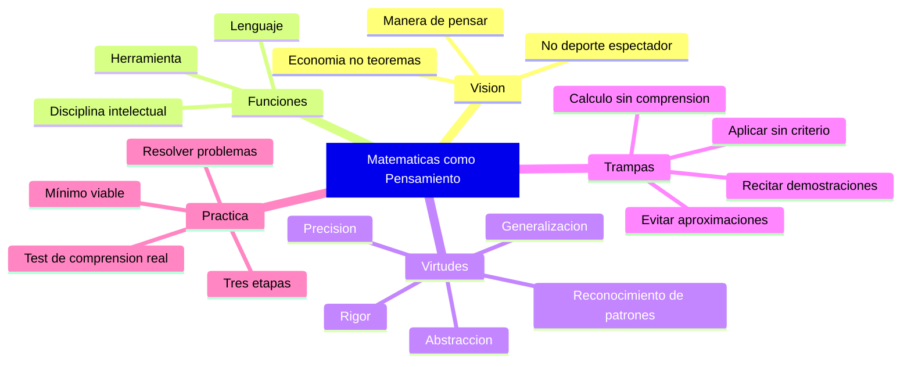

# Matemáticas como Pensamiento

> [!INFO] Fuente
> Basado en: *The Art of Doing Science and Engineering* de Richard W. Hamming (Stripe Press, 2020). Capítulo 23: "Mathematics".

---

## La Tesis Central

Hamming, matemático de formación, dedica un capítulo a defender una visión **provocadora** de las matemáticas:

> [!QUOTE] Hamming
> "The purpose of mathematics is to do things with **economy**, not to prove theorems. Mathematics is a **way of thinking**, not a collection of results to memorize."

Esta visión contrasta con la enseñanza típica de las matemáticas en la universidad, que enfatiza:

- Memorización de teoremas
- Demostraciones formales
- Cálculo algorítmico
- Ejercicios cerrados

Hamming argumenta que esto es **entrenamiento**, no **educación**, y reproduce la crítica que hace a la enseñanza de la ciencia en general.

---

## Las Tres Funciones de las Matemáticas

Hamming distingue tres funciones distintas que las matemáticas cumplen:

| Función | Descripción | Audiencia |
|---------|-------------|-----------|
| **Lenguaje** | Notación precisa para comunicar ideas | Científicos e ingenieros |
| **Herramienta** | Métodos para resolver problemas | Profesionales aplicados |
| **Disciplina intelectual** | Forma de pensar rigurosa | Cualquier pensador serio |

> [!WARNING] Confusión Frecuente
> La mayoría de cursos universitarios se enfocan en la función de **herramienta** y olvidan las otras dos. Esto produce profesionales que **aplican** matemáticas pero no **piensan** matemáticamente.

---

## El Error del "Deportista Espectador"

Hamming toma prestada una analogía deportiva:

> [!QUOTE] Hamming
> "Mathematics is not a **spectator sport**. You cannot learn mathematics by watching someone else do it. You must **do** it yourself, struggling with the problems, making mistakes, and gradually building intuition."

Esto es aplicable a cualquier disciplina, pero las matemáticas son el caso extremo:

- No hay atajos para la intuición matemática
- La "comprensión pasiva" no existe en matemáticas
- Cada problema resuelto construye el aparato mental para el siguiente

> [!TIP] Aplicación
> Si quieres aprender matemáticas (o cualquier cosa), **resuelve problemas**. No leas soluciones. No veas videos pasivamente. **Haz**. La lucha con el problema es donde ocurre el aprendizaje.

---

## La Economía del Pensamiento Matemático

Hamming insiste en que la **virtud suprema** de las matemáticas es la **economía**:

> [!QUOTE] Hamming
> "The goal of mathematics is to do things with **economy**, not to prove theorems."

Esto tiene varias dimensiones:

### Economía de notación

| Notación | Valor |
|----------|-------|
| Buena | Comunica la esencia en un vistazo |
| Regular | Comunica con esfuerzo |
| Mala | Oculta la esencia bajo el formalismo |

> [!EXAMPLE] Ejemplo de Hamming
> La notación d²y/dx² es **densa y poderosa**. Comunica simultáneamente que estamos hablando de una segunda derivada, su dirección, y su variable independiente. Una explicación en palabras tomaría 10 veces más espacio y sería más ambigua.

### Economía de razonamiento

Una demostración elegante:

- Hace más con menos
- Es más fácil de verificar
- Generaliza a otros casos
- Enseña **técnica**, no solo resultado

> [!TIP] El Estándar
> Cuando resuelvas un problema, pregúntate: ¿hay una forma más corta? Si la respuesta es sí y aún no la encuentras, sigue buscando. La solución corta es casi siempre **más correcta** y **más profunda**.

### Economía de conceptos

> [!QUOTE] Hamming
> "The great mathematicians create **few** new ideas and use them **many** times. The bad mathematicians create **many** new ideas and use each one **once**."

La profundidad conceptual es más valiosa que la amplitud. Un matemático que tiene **una** idea poderosa y la aplica en 10 problemas hace más que uno que tiene 10 ideas y aplica cada una una vez.

---

## La Trampa de la Rigidez Formal

Hamming critica la enseñanza que enfatiza **demostración formal** sobre **comprensión**:

> [!WARNING] La Trampa
> Una demostración correcta **no implica comprensión**. Puedes demostrar un teorema paso a paso, sin tener la menor idea de **por qué** es cierto o **para qué** sirve.

### El test de Hamming

> [!QUESTION] Test de comprensión real
> Si te doy un teorema, ¿puedes:
> 1. **Explicarlo** en una frase a un no-matemático?
> 2. Dar un **ejemplo** donde se aplica?
> 3. Decir **cuándo falla** o es aproximado?
> 4. Conectar con **otros teoremas** conocidos?
>
> Si la respuesta a alguna es no, **no lo entiendes**. Solo lo memorizaste.

### Las tres etapas de comprensión

Hamming describe cómo se aprende un concepto matemático:

| Etapa | Descripción | Reconocer |
|-------|-------------|-----------|
| **1. Familiaridad** | Puedes seguir la demostración | "Sí, eso tiene sentido" |
| **2. Operacional** | Puedes aplicarlo a problemas | "Puedo resolver esto" |
| **3. Intuición profunda** | Sabes cuándo se aplica y cuándo no, y puedes modificarlo | "Esto es como X, pero con Y de diferencia" |

> [!TIP] Lección
> La mayoría de nosotros nos quedamos en la etapa 1. Los profesionales competentes llegan a la 2. Los **expertos reales** están en la 3. La etapa 3 requiere años de lucha, no horas de clase.

---

## La Distinción Entre Matemáticas "Puras" y "Aplicadas"

Hamming, formado como matemático puro pero trabajando en problemas aplicados toda su vida, tiene una opinión matizada:

> [!QUOTE] Hamming
> "There is a tendency to look down on **applied** mathematics as somehow inferior to **pure** mathematics. This is a mistake. The hardest applied problems require the **deepest** mathematics, and the deepest pure mathematics usually has **surprising** applications."

| Tipo | Fortaleza | Debilidad |
|------|-----------|-----------|
| **Matemáticas puras** | Profundidad, rigor, generalidad | A veces irrelevante para problemas reales |
| **Matemáticas aplicadas** | Relevancia, utilidad, impacto | A veces falta rigor |

> [!TIP] La Síntesis
> Las mejores matemáticas son **ambas**: profundas **y** relevantes. Los grandes matemáticos del siglo XX (von Neumann, Shannon, Turing) trabajaron en la frontera entre la teoría y la aplicación. La separación entre "puro" y "aplicado" es **falsa y contraproducente**.

---

## Los Errores Comunes al Aprender Matemáticas

Hamming identifica errores que vio en décadas de enseñanza:

### Error 1: Confundir cálculo con comprensión

> [!EXAMPLE] Ejemplo
> Un estudiante puede integrar ∫x² dx y obtener x³/3 + C, pero **no entender** qué es una integral ni por qué funciona. La habilidad mecánica no es comprensión.

### Error 2: Recitar demostraciones

> [!EXAMPLE] Ejemplo
> Un estudiante puede recitar la demostración del Teorema Fundamental del Cálculo, pero **no saber cuándo aplicarlo** ni qué nos dice sobre la relación entre diferenciación e integración. La recitación no es comprensión.

### Error 3: Aplicar fórmulas sin criterio

> [!EXAMPLE] Ejemplo
> Un ingeniero usa la fórmula de área de un círculo (πr²) para calcular áreas que no son circulares, porque "se parece". El **juicio** sobre cuándo una fórmula aplica es más importante que la fórmula misma.

### Error 4: Evitar las aproximaciones

> [!EXAMPLE] Ejemplo
> Un físico insiste en mantener todos los términos de una serie infinita, cuando los primeros 3 términos ya dan 15 dígitos de precisión. La **sabiduría de saber cuándo parar** es más valiosa que la **virtud del rigor formal**.

> [!QUOTE] Hamming
> "The purpose of computing is **insight**, not numbers. The purpose of mathematics is **understanding**, not proofs."

---

## El Análogo Numérico: "Mathematics is the Junkyard of Mathematics"

Hamming es famoso por haber llamado al **análisis numérico** "el cementerio de las matemáticas":

> [!QUOTE] Hamming
> "Numerical analysis is the **junkyard** of mathematics. The pure mathematicians ignore it, the applied mathematicians despise it, and the engineers use it without understanding it."

Esta frase es provocadora pero captura una realidad: el análisis numérico es **desagradable** porque:

- Requiere conocimiento de teoría matemática
- Requiere conocimiento de errores de redondeo
- Requiere conocimiento de la aplicación específica
- Casi nunca tiene **soluciones exactas** bellas

> [!TIP] Defensa
> El análisis numérico es donde las matemáticas **tocan la realidad**. Los problemas del mundo real son casi siempre numéricos, no simbólicos. Si quieres hacer trabajo importante, **no huyas** del análisis numérico: es donde se hace el trabajo real.

---

## La Matemática como Herramienta de Pensamiento Crítico

Hamming enumera **virtudes mentales** que las matemáticas enseñan (cuando se enseñan bien):

1. **Precisión** — Distinguir entre afirmaciones casi-idénticas pero crucialmente diferentes
2. **Rigor** — No aceptar argumentos por intuición, exigir demostración
3. **Generalización** — Ver el caso particular como ejemplo de un patrón
4. **Abstracción** — Eliminar detalles irrelevantes para enfocarse en la estructura
5. **Pensamiento condicional** — Razonar sobre "qué pasa si..."
6. **Pensamiento contrafactual** — Imaginar escenarios alternativos
7. **Reconocimiento de patrones** — Ver lo común en lo diferente

> [!IMPORTANT] Transferencia
> Estas virtudes **no son exclusivas de las matemáticas**. Pero las matemáticas son el **mejor gimnasio** para desarrollarlas, porque sus problemas son **bien definidos** y la **realimentación** es inmediata (o funciona o no).

---

## Las Matemáticas que Hamming Recomendaba

Hamming sugiere que todo ingeniero/científico debería dominar:

| Área | Razón |
|------|-------|
| **Cálculo (una variable)** | Base del modelado continuo |
| **Cálculo multivariable** | Base de la física y optimización |
| **Álgebra lineal** | Base de machine learning, computación gráfica, mecánica cuántica |
| **Probabilidad y estadística** | Base de la toma de decisiones bajo incertidumbre |
| **Análisis numérico** | Base de la computación científica |
| **Lógica y conjuntos** | Base del razonamiento formal |
| **Ecuaciones diferenciales** | Base del modelado dinámico |

> [!TIP] El Mínimo Viable
> Si tuvieras que elegir **tres** cursos de matemáticas para un ingeniero moderno, Hamming elegiría: **álgebra lineal, probabilidad, y análisis numérico**. El resto se puede aprender sobre la marcha.

---

## La Paradoja de la Belleza Matemática

Hamming reconoce que hay algo **misterioso** en la matemática:

- Las ideas que son **bellas** matemáticamente suelen ser **útiles** físicamente
- Las mismas ecuaciones aparecen en campos que no tienen relación obvia
- Hay una "irrazonable efectividad" de las matemáticas (en palabras de Wigner)

> [!QUOTE] Hamming
> "I do not know why the correspondence between mathematical beauty and physical truth is so close. But it is, and we must use it."

> [!WARNING] Lección
> La elegancia matemática es una **heurística**, no una garantía. Pero es una heurística **extraordinariamente poderosa**. Si una teoría es fea y compleja, sospecha. Si es elegante y simple, vale la pena verificar.

---

## Síntesis Visual

---

## Citas Memorables del Capítulo

> [!QUOTE] Colección
> - "Mathematics is not a spectator sport."
> - "The purpose of mathematics is to do things with economy, not to prove theorems."
> - "The purpose of computing is insight, not numbers."
> - "The goal of mathematics is to do things with economy, not to prove theorems."
> - "Numerical analysis is the junkyard of mathematics."
> - "There is a tendency to look down on applied mathematics as somehow inferior. This is a mistake."

---

## Ver también

- [[01 - Conceptos Fundamentales]]
- [[02 - Aprender a Aprender]]
- [[08 - Datos No Confiables]]
- [[LIBROS/The Art of Doing Science and Engineering/00 - INDICE|Índice del Libro]]
