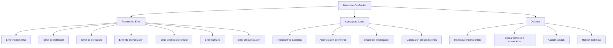

# Datos No Confiables

> [!INFO] Fuente
> Basado en: *The Art of Doing Science and Engineering* de Richard W. Hamming (Stripe Press, 2020). Capítulo 27: "Unreliable Data".

---

## La Tesis Central

Hamming dedica un capítulo entero a una verdad incómoda:

> [!QUOTE] Hamming
> "It has been my experience that data is generally **much less accurate** than it is advertised to be."

Esta afirmación, aparentemente simple, tiene implicaciones profundas:

- La mayoría de las conclusiones científicas se construyen sobre datos **menos precisos** de lo que se reconoce
- El "margen de error" reportado suele ser **optimismo**, no verdad
- Los errores se **acumulan** y **correlacionan** de formas que los análisis estadísticos ingenuos ignoran
- Un ingeniero o científico competente debe **desconfiar sistemáticamente** de los datos que recibe

> [!IMPORTANT] Por qué importa
> Casi todas las decisiones técnicas importantes (diseño, política, inversión) se basan en datos. Si los datos son menos precisos de lo que se cree, las decisiones son **menos racionales** de lo que parecen. La honestidad sobre los datos es, por tanto, una cuestión **ética**, no solo técnica.

---

## Las Siete Fuentes de Error en los Datos

Hamming identifica **siete** fuentes principales de error que raramente se reportan completamente:

### 1. Error del Instrumento

> [!DEFINITION] Error Instrumental
> El dispositivo de medición tiene su propio error, que se suma al de la medición.

> [!EXAMPLE] Ejemplo
> Para medir la precisión de un reloj, necesitas otro reloj **más preciso**. Pero ¿cómo sabes que ese otro es más preciso? La cadena de calibración siempre termina en algún estándar primario. **En el fondo, la precisión es una cuestión de consenso, no de verdad absoluta**.

> [!WARNING] La Pregunta Incómoda
> ¿Por qué crees que tu instrumento es **más preciso** que lo que estás midiendo? Si no tienes respuesta, tu medición es **circular**.

### 2. Error de Definición

> [!EXAMPLE] Ejemplo clásico de Hamming
> ¿Qué cuenta como "fallo" de un transistor? ¿Cuándo deja de funcionar? ¿Cuándo funciona el 99% del tiempo? ¿Cuándo degrada un 10%? **La definición cambia el resultado**.

Este tipo de error es **invisible** en los reportes: los datos se publican como "fallos" sin especificar la definición.

> [!TIP] Defensa
> Cuando leas datos, **siempre pregunta por la definición operacional**. ¿Cómo se midió exactamente? ¿Qué criterios se usaron? Los datos sin definición son **casi inútiles**.

### 3. Error de Selección

> [!DEFINITION] Sesgo de Selección
> Los datos disponibles **no son aleatorios** respecto al fenómeno que estudias. Reflejan el proceso que los produjo.

> [!EXAMPLE] Ejemplos de Hamming
> - Los **papers publicados** son los que tuvieron resultados positivos. Los negativos se quedan en cajones. **El conocimiento publicado está sesgado hacia lo confirmatorio**.
> - Los **médicos que ven pacientes** ven solo a los que van al médico, no a los que se curan solos. **Las estadísticas clínicas están sesgadas hacia los casos graves**.
> - Las **encuestas de opinión** tienen sesgo de no-respuesta: los que contestan no son representativos.

> [!DANGER] Trampa Moderna
> El sesgo de selección es la **trampa favorita de los LLMs** y los datasets de entrenamiento. Los datos de internet reflejan lo que la gente **publica**, no lo que **es verdad**. Esto produce modelos con sesgos sistemáticos hacia la confirmación y la popularidad.

### 4. Error de Interpolación/Extrapolación

> [!DEFINITION] El Problema
> Asumir continuidad donde hay discontinuidades. Los datos muestran puntos; el modelo asume una curva suave entre ellos.

> [!EXAMPLE] Ejemplo
> Los datos muestran 5 puntos en una línea. Asumes que los intermedios están en la misma línea. **Pero la realidad puede tener un pico, un valle, una discontinuidad** entre los puntos medidos.

> [!WARNING] La Trampa
> La interpolación es **necesaria** en la práctica, pero **peligrosa** cuando se hace automáticamente. La pregunta crucial: ¿es la función suave entre los puntos? Sin razón para creerlo, no asumas.

### 5. Error de Medición Inicial

> [!EXAMPLE] Ejemplo
> El primer físico que midió la carga del electrón obtuvo un valor **1.5 veces** el real. La medición "mejoró" con el tiempo, pero las primeras mediciones **circulan** en libros de texto y referencias obsoletas. ¿Cuántas conclusiones se basan en mediciones antiguas **antes** de que la técnica mejorara?

> [!TIP] Defensa
> Cuando uses un dato histórico, verifica **cuándo y cómo** se midió. Los datos no mejoran con el tiempo por sí solos: hay que **rastrear la genealogía** de la medición.

### 6. Error Humano (Transcripción, Redondeo, Omisión)

> [!EXAMPLE] Ejemplos cotidianos
> - Una persona **transcribe** mal un número
> - Se hace **redondeo** agresivo y se pierden decimales significativos
> - Se **omiten** los outliers "porque显然是错误"
> - Se "limpian" los datos eliminando los puntos que no encajan

> [!DANGER] La Trampa del Data Cleaning
> El "data cleaning" moderno elimina automáticamente outliers. Si los outliers son **señales** de un fenómeno real (no errores), los estás borrando del dataset. El data cleaning es **opinión disfrazada de técnica**.

### 7. Error de Publicación y Reproducibilidad

> [!EXAMPLE] Problema actual
> Muchos resultados publicados **no se reproducen**. Esto no significa que sean falsos, pero significa que la **incertidumbre reportada** es menor que la real.

> [!QUOTE] Hamming
> "When you read a paper, assume the **errors are at least twice** what is reported. You will often be right."

---

## La Distinción Crucial: Precisión vs. Exactitud

Hamming insiste en una distinción que la gente confunde constantemente:

| Concepto | Definición | Ejemplo |
|----------|------------|---------|
| **Precisión** (precision) | Consistencia de mediciones repetidas | Mido 5 veces y obtengo 1.234, 1.233, 1.235, 1.234, 1.234 |
| **Exactitud** (accuracy) | Cercanía al valor verdadero | El valor verdadero es 1.0, así que estoy **sesgado** |

> [!EXAMPLE] La Diana
> Tiro al blanco:
> - **Alta precisión, baja exactitud**: todas las balas juntas pero lejos del centro
> - **Alta exactitud, baja precisión**: balas dispersas pero centradas en el blanco
> - **Alta precisión, alta exactitud**: balas agrupadas en el centro (ideal)
> - **Baja precisión, baja exactitud**: balas dispersas y lejos del centro (desastre)

> [!DANGER] Trampa Moderna
> En la era del big data y los LLMs, los sistemas son **muy precisos** (producen el mismo output consistentemente) pero **pueden ser inexactos** (sesgados sistemáticamente respecto a la realidad). Un LLM que consistentemente da respuestas sesgadas tiene "alta precisión, baja exactitud".

---

## La Paradoja de la Calibración

Hamming señala que la mayoría de los instrumentos **no se calibran correctamente**:

- Se calibran en **condiciones de laboratorio** (ideales)
- Se usan en **condiciones reales** (distintas)
- El sesgo de calibración es **sistemático** y **no se reporta**

> [!EXAMPLE] Ejemplo
> Un sensor de temperatura calibrado a 20°C en el laboratorio se usa a -10°C en el campo. La calibración puede no aplicar. La medición se reporta con la **misma incertidumbre** que en el laboratorio, aunque las condiciones son distintas.

> [!TIP] Regla de Hamming
> Si tu instrumento no se ha calibrado en **condiciones similares** a las de uso, **multiplica la incertidumbre reportada por 3-5**. Es una heurística, pero suele ser correcta.

---

## La Acumulación de Errores

Uno de los análisis más poderosos de Hamming es sobre la **acumulación**:

> [!QUOTE] Hamming
> "Errors **add**, they do not average out. And worse, they often **correlate** in the direction of the result you wanted."

### Reglas de propagación

| Operación | Error propagado |
|-----------|-----------------|
| Suma/Resta | Suma de errores absolutos |
| Multiplicación/División | Suma de errores relativos |
| Exponencial | Error multiplicado por el exponente |
| Función arbitraria | Aproximación lineal (primer orden) |

> [!EXAMPLE] Ejemplo devastador
> Si tu instrumento tiene 5% de error y la cadena de medición tiene 4 pasos, el error total puede ser **20% o más**. Si los errores se correlacionan (todos en la misma dirección), pueden ser **40%**. Esto significa que un resultado reportado con "±5%" puede tener incertidumbre real de **±20%**.

---

## El Sesgo de Confirmación en los Datos

Hamming introduce un punto sutil pero crucial:

> [!WARNING] El Sesgo del Investigador
> Los datos no son "lo que pasó". Son **lo que el investigador decidió medir, cómo decidió medirlo, y qué decidió reportar**. El observador está siempre presente en los datos.

Esto se manifiesta en:

- **Qué se mide** (variables elegidas por el investigador)
- **Cómo se mide** (instrumento y protocolo elegidos)
- **Qué se publica** (sesgo hacia resultados positivos)
- **Cómo se interpreta** (sesgo de confirmación)

> [!TIP] Defensa
> Sé tu **propio crítico**. Cuando presentes datos, **busca activamente** la interpretación opuesta. Si solo encuentras evidencia a favor de tu hipótesis, sospecha: probablemente estás filtrando.

---

## La Honestidad Como Deber Profesional

Hamming termina el capítulo con un argumento ético:

> [!QUOTE] Hamming
> "It is a **professional obligation** to report the **true** uncertainty of your measurements, not the **advertised** uncertainty. Anything less is a form of intellectual dishonesty."

La **incertidumbre reportada** es siempre **demasiado pequeña** porque:

- Los autores quieren que sus resultados parezcan **significativos**
- Los journals quieren resultados **claros**, no ambiguos
- Los revisores no castigan la subestimación de incertidumbre
- Los lectores no saben pedir más precisión

> [!DANGER] La Consecuencia
> Si todos los campos reportan incertidumbres subestimadas, las **decisiones acumuladas** se basan en **incertidumbre acumulada**, que puede ser **masiva**. Esto explica por qué tantas decisiones técnicas (climáticas, médicas, ingenieriles) fallan en la práctica.

---

## Aplicaciones Prácticas

### Para el Científico

1. **Reporta la incertidumbre completa** cuando publiques
2. **Estima** los errores de selección e instrumentación, no solo el estadístico
3. **Busca** activamente evidencia en contra de tu hipótesis
4. **Distingue** precisión de exactitud
5. **Verifica** la genealogía de los datos históricos

### Para el Ingeniero

1. **Multiplica** la incertidumbre reportada por 3-5 cuando uses datos de terceros
2. **Pregunta** por la definición operacional de las variables
3. **Verifica** la calibración en condiciones reales
4. **Diseña** con **márgenes** generosos
5. **Ten** un plan B para cuando los datos sean **peores** de lo prometido

### Para el Lector de Datos

1. **Desconfía** sistemáticamente
2. **Pregunta** por la incertidumbre completa
3. **Busca** la definición operacional
4. **Verifica** la fuente original
5. **Multiplica** la incertidumbre mentalmente

### Para el Modelador (LLMs, ML)

1. **Audita** los sesgos del dataset
2. **Reporta** los sesgos conocidos
3. **No** limpies outliers sin justificación teórica
4. **Mide** el rendimiento en datos **fuera de distribución**
5. **Sé honesto** sobre las limitaciones

---

## Síntesis Visual

---

## El Mandato de Hamming

> [!IMPORTANT] El Principio Ético
> "La **honestidad sobre los datos** no es opcional. Es una obligación profesional. La incertidumbre que reportas debe ser la incertidumbre **real**, no la que te conviene."

---

## Ver también

- [[01 - Conceptos Fundamentales]]
- [[02 - Aprender a Aprender]]
- [[03 - Lecciones Clave]]
- [[06 - Límites de la IA]]
- [[LIBROS/The Art of Doing Science and Engineering/00 - INDICE|Índice del Libro]]
