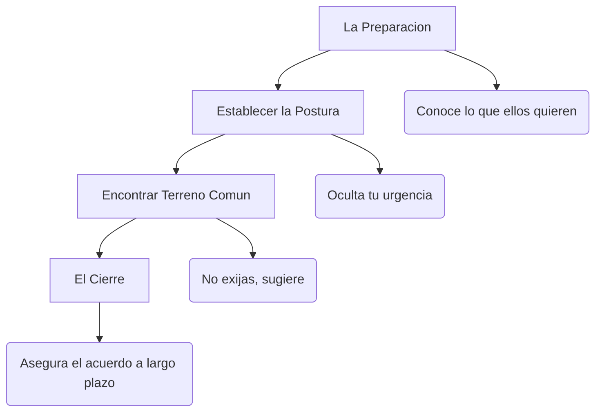

# Ventas y Negociación

> [!INFO] Fuente
> Basado en la Segunda Parte de: *What They Don't Teach You at Harvard Business School* de Mark H. McCormack.

---

## Las Reglas de Oro en las Ventas

McCormack, habiendo construido un imperio vendiendo a los atletas más famosos del mundo, resume el proceso de ventas en interacciones profundamente personales.

### 1. Saber cuándo Callarse

> [!IMPORTANT] Regla #1 de Ventas
> **"Cuando recibas el 'SÍ', cállate y vete."**
> 
> Muchos vendedores continúan hablando después de haber cerrado la venta y terminan "des-vendiendo" (convenciendo al cliente de echarse atrás al introducir dudas).

### 2. El Silencio como Herramienta

En las negociaciones, el silencio es oro. La gente odia los silencios incómodos y tienden a ceder o revelar información solo para llenar el vacío. Usa las pausas intencionalmente.

### 3. El Rechazo no es Personal

El rechazo a menudo no tiene nada que ver contigo o con el producto. Puede ser timing, presupuesto o problemas internos. Pregunta "¿Por qué?" para transformar un "No" en "Quizás después".

---

## Tácticas de Negociación Efectivas

### Principios Fundamentales

| Principio | Aplicación |
|-----------|------------|
| **Mantén tus opciones abiertas** | Nunca entres a una negociación necesitando el trato a toda costa. El que menos necesita el trato, tiene más poder. |
| **No muestres todas tus cartas** | Cede terreno lentamente. Si concedes muy rápido, la otra parte pensará que podría haber conseguido más. |
| **Gana en lo grande, cede en lo pequeño** | Deja que la contraparte gane en los detalles menores para que sientan que fue una dura negociación, mientras tú te quedas con lo esencial. |
| **Evita el ultimátum** | Salvo que estés dispuesto a levantarte e irte. Si pones un ultimátum y no lo cumples, pierdes toda credibilidad. |

---

## Construcción de Relaciones (Networking)

Los negocios se hacen entre amigos. Si todo lo demás es igual, la gente compra a sus amigos. Si todo lo demás *no* es igual, la gente todavía intenta comprar a sus amigos.

- **Mantente en contacto** sin pedir nada a cambio.
- Escribe notas y cartas personalizadas (hoy en día mensajes o emails), destacando detalles que recuerdes de su última conversación.
- Las mejores reuniones de negocios suelen ocurrir fuera de las oficinas (restaurantes, eventos deportivos).

---

## Ver también

- [[01 - Conceptos Fundamentales]]
- [[03 - Gestion y Liderazgo]]
- [[LIBROS/What They Dont Teach You at Harvard Business School/00 - INDICE|Índice del Libro]]
