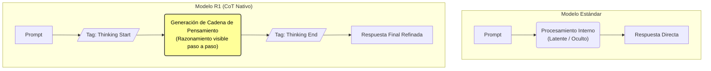

# Cadena de Pensamiento (Chain of Thought)

> [!INFO] Fuente
> Basado en documentación técnica de LLMs y apuntes personales.

La **Cadena de Pensamiento** (o *Chain of Thought - CoT*) se refiere a la capacidad de un modelo de lenguaje para descomponer problemas complejos en pasos intermedios de razonamiento lógico antes de dar una respuesta final.

## ¿La versión estándar tiene CoT?

> [!QUESTION] La respuesta corta: Sí y No
> Depende de si hablamos de **capacidad bruta** o de **comportamiento por defecto**.

### 1. Capacidad Inherente (Arquitectura)
Todos los [[Modelos Transformers|Transformers]] actuales (incluyendo la versión estándar) tienen la capacidad técnica de razonar internamente.
- **Potencial:** Pueden seguir pasos lógicos.
- **Activación:** Si usas [[Prompt Engineering]] explícito (ej: *"piensa paso a paso"*), el modelo estándar activará esta capacidad.

### 2. Diferencia de Comportamiento (Entrenamiento)

| Característica | Modelo Estándar (Generalista) | Modelo R1 (Reasoning / CoT) |
| :--- | :--- | :--- |
| **Enfoque** | Eficiencia y respuesta directa. | Profundidad y transparencia. |
| **Razonamiento** | Oculto (Caja negra). Tiende a saltar a la conclusión. | **Explícito**. Entrenado para "verbalizar" su pensamiento. |
| **Optimización** | Consultas generales y velocidad. | Problemas complejos de lógica, matemáticas o código. |
| **Origen** | Pre-entrenamiento estándar. | [[Fine-Tuning]] específico con ejemplos de razonamiento (RLHF). |

---

## 🧠 Flujo de Procesamiento

El modelo **R1** hace visible lo que el estándar hace "en silencio" o salta por eficiencia.

---

## Ver también

- [[Fine-Tuning]]
- [[Glosario LLM]]
