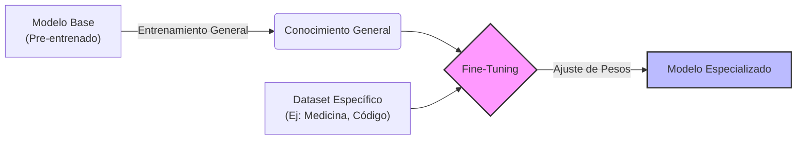

# Fine-Tuning (Ajuste Fino)

> [!INFO] Fuente
> Basado en conceptos de Machine Learning y documentación técnica.

El **Fine-Tuning** (o ajuste fino) es un proceso de [[Transfer Learning]] que consiste en tomar un modelo de Inteligencia Artificial pre-entrenado y someterlo a un entrenamiento adicional con un conjunto de datos más pequeño y específico.

## 🍳 La Analogía del Chef

> [!EXAMPLE] De Generalista a Especialista
> Imagina que tienes un **chef genérico** que sabe cocinar de todo un poco (este es tu [[Modelo Base]]). Sabe cortar, saltear y hornear, pero no destaca en nada.
> 
> El **Fine-tuning** es como enviar a ese chef a una escuela culinaria intensiva en Roma:
> 1. **Modelo Base:** Ya sabe cocinar (tiene conocimientos generales de lenguaje, gramática, razonamiento).
> 2. **Fine-tuning:** Recibe lecciones exclusivas de pasta y pizza (datos específicos).
> 3. **Resultado:** Ahora es un experto en cocina italiana.
> 
> *Es mucho más eficiente especializar al chef que enseñarle a cocinar desde cero (cómo agarrar el cuchillo, qué es una cebolla, etc.).*

## ⚙️ El Proceso Técnico

En términos de arquitectura, el proceso funciona así:

1. **Input:** Tomas un [[Modelo Fundacional]] (Pre-trained Model) que ya tiene sus "pesos" iniciales.
2. **Dataset:** Lo expones a ejemplos etiquetados de la tarea objetivo (por ejemplo, el modelo **R1** viendo miles de ejemplos de cadenas de razonamiento o *Chain of Thought*).
3. **Backpropagation:** Ajustas ligeramente los [[Pesos y Parámetros|pesos]] (parámetros) del modelo para minimizar el error en esa tarea específica.

### Flujo de Trabajo

---

## Ver también

- [[Chain of Thought]]
- [[Glosario LLM]]
