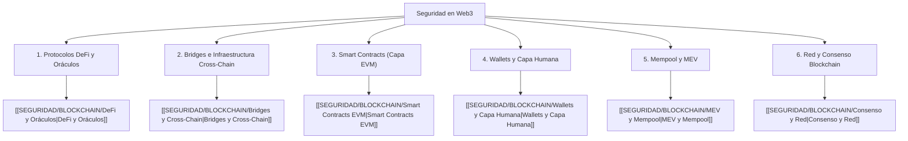

# 00 - Indice de Seguridad en Blockchain y Web3

> [!INFO] Fuente
> Módulo integral de seguridad en Web3, finanzas descentralizadas (DeFi), infraestructura cross-chain y smart contracts. Basado en reportes forenses de incidentes reales (The DAO, Ronin, Wormhole, Mango Markets, Liquid Network) y metodologías de auditoría de contratos inteligentes.

---

## Taxonomía General de Ataques en Web3

La seguridad en sistemas descentralizados se organiza en **6 capas fundamentales**:

> [!IMPORTANT] Distinción Central
> * **Ataques que rompen el código**: Errores en la implementación de Solidity/Rust (Reentrancy, Overflows, Access Control).
> * **Ataques que manipulan el mercado**: El código funciona según lo programado, pero la lógica económica o las fuentes de precios son vulnerables (Oracle Manipulation, Flash Loans, Share Inflation).
> * **Ataques que engañan a las personas**: La cadena y el código son seguros, pero se vulneran credenciales y autorizaciones (Signature Phishing, Permit Scams, Address Poisoning).

---

## Contenido del Módulo

| Nota | Áreas que cubre | Casos de Estudio Emblemáticos |
| :--- | :--- | :--- |
| [[SEGURIDAD/BLOCKCHAIN/DeFi y Oráculos]] | Manipulación spot vs TWAP, Flash Loans, Share Inflation (ERC-4626), Lógica económica. | Mango Markets ($114M), Euler Finance ($197M), Tectonic (TONIC), Platypus ($9M). |
| [[SEGURIDAD/BLOCKCHAIN/Bridges y Cross-Chain]] | Peg exploits, validadores multi-sig, falsificación de pruebas, contabilidad cross-chain. | Liquid Network ($320M - Sep 2026), Ronin ($624M), Wormhole ($320M), Nomad ($190M). |
| [[SEGURIDAD/BLOCKCHAIN/Smart Contracts EVM]] | Reentrancy (y Read-only), Access Control, Delegatecall Injection, Proxies no inicializados. | The DAO ($60M), Curve Pools Vyper ($70M), Parity Multisig ($30M + $150M congelados). |
| [[SEGURIDAD/BLOCKCHAIN/Wallets y Capa Humana]] | Approval scams, EIP-2612 `permit`, Permit2, Address Poisoning, Drenadores (Drainers). | BadgerDAO ($120M), Campañas Inferno/Pink Drainer ($100M+), Robo de Whale ($68M WBTC). |
| [[SEGURIDAD/BLOCKCHAIN/MEV y Mempool]] | Sandwich Attacks, Front-Running, Back-Running, Time-Bandit Attacks, Searchers. | Operaciones del bot `jaredfromsubway.eth`, liquidaciones públicas forzadas en mempool. |
| [[SEGURIDAD/BLOCKCHAIN/Consenso y Red]] | Ataques del 51%, Doble Gasto (Double Spend), Eclipse Attacks, Ataques de Censura/Liveness. | Ataques 51% a Ethereum Classic (2019/2020), Bitcoin Gold (BTG), Tornado Cash Governance. |

---

## Matriz Resumen de Mitigaciones

| Vector de Ataque | Capa | Mitigación Primaria | Dónde poner el foco |
| :--- | :--- | :--- | :--- |
| **Oracle Manipulation** | DeFi | Usar feeds Chainlink con fallback a TWAP de ventana amplia (>30 min). | Protocolos de préstamos que aceptan tokens de baja liquidez. |
| **Flash Loan Exploits** | DeFi | No depender de precios spot instantáneos de AMMs en la misma transacción. | Protocolos que calculan colaterales usando `reserves` de Uniswap. |
| **Reentrancy** | Smart Contracts | Aplicar estrictamente el patrón Checks-Effects-Interactions (CEI) y `ReentrancyGuard`. | Métodos que ejecutan `.call{value: ...}` o interactúan con tokens ERC-777. |
| **Read-Only Reentrancy** | Smart Contracts | No consultar funciones `view` de pools durante estados de balance alterados. | Protocolos que leen `get_virtual_price()` de Curve como oráculo. |
| **Peg / Bridge Exploit** | Cross-Chain | Implementar *rate limits* automáticos de retiro, timelocks y pruebas criptográficas zk/luz. | Sidechains federadas y puentes con más de $50M en custodia. |
| **Approval / Permit Scams** | Capa Humana | Simulación previa de transacciones (Rabby), revocar permisos ilimitados periódicamente. | DApps de airdrops/mints con firmas off-chain EIP-712 sin desglose. |
| **Sandwich Attacks** | Transacciones | Usar RPCs privados (Flashbots Protect, MEV Blocker) y fijar slippage estricto (< 0.5%). | Swaps en DEXs con pools de liquidez concentrada. |

---

## Herramientas de Auditoría y Detección

| Herramienta | Tipo | Uso Principal |
| :--- | :--- | :--- |
| **Slither** | Analizador Estático | Detección automática de reentrancy, shadowing y variables no inicializadas (Trail of Bits). |
| **Foundry (Forge)** | Suite de Testing | Fuzzing nativo, pruebas basadas en propiedades e invariantes en Solidity puro. |
| **Echidna** | Fuzzer EVM | Generación masiva de transacciones aleatorias para romper invariantes complejas. |
| **Certora Prover** | Verificación Formal | Demostración matemática formal de que el código satisface reglas de negocio invariables. |
| **Phalcon / Tenderly** | Simulación On-Chain | Decompilación y trazabilidad detallada de llamadas y transferencias durante incidentes. |
| **Immunefi** | Plataforma Bug Bounty | Reporte ético de vulnerabilidades críticas en protocolos Web3 con recompensas de hasta $10M. |

---

## Ver también

- [[SEGURIDAD/00 - INDICE]]
- [[SEGURIDAD/Vulnerabilidades Web]]
- [[SEGURIDAD/Race Conditions]]
- [[SEGURIDAD/Cloud Hacking]]
- [[SEGURIDAD/Reportes]]
