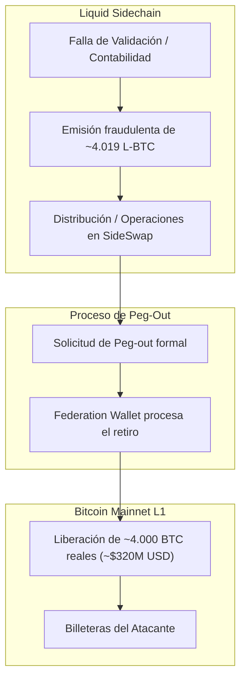

# Bridges y Seguridad Cross-Chain

> [!INFO] Fuente
> Estudio de la superficie de ataque en puentes cross-chain (*cross-chain bridges*) y mecanismos de paridad (*2-way pegs*), análisis de fallas en validadores, verificación de pruebas criptográficas y la autopsia del exploit a la Liquid Network de Bitcoin en septiembre de 2026.

---

## 1. Arquitectura de Bridges y Mecanismos de Peg

Los bridges permiten mover valor o datos entre blockchains independientes (ej. Bitcoin ↔ Liquid, Ethereum ↔ Solana, L1 ↔ Rollups L2).

```mermaid
graph LR
    subgraph Cadena Origen (L1)
        User["Usuario"] -->|1. Bloquea Activo Real| Vault["Contrato de Custodia / Multisig"]
    end
    subgraph Mecanismo de Relevo
        Vault -->|2. Evento / Mensaje| Relayer["Validadores / Oráculos / Relayers"]
    end
    subgraph Cadena Destino (L2 / Sidechain)
        Relayer -->|3. Prueba Criptográfica| Target["Bridge Contract"]
        Target -->|4. Acuña Token Representativo| Wrapped["Wrapped Token (ej. L-BTC, wETH)"]
    end
```

Al concentrar enormes volúmenes de activos nativos en un único punto de custodia, los bridges son el objetivo más lucrativo del ecosistema cripto.

---

## 2. Categorías de Vulnerabilidades Cross-Chain

| Vector | Descripción | Riesgo Central |
| :--- | :--- | :--- |
| **Asset Inflation / Peg Exploit** | Se acuñan tokens sintéticos en la sidechain sin respaldo real previo. Al solicitar el *peg-out*, se drena el activo nativo. | Vaciado total de la reserva de custodia. |
| **Compromiso de Validadores** | El atacante compromete la cantidad mínima necesaria de claves privadas de la multi-firma (threshold). | Retiros autorizados ilegítimamente por la propia federación. |
| **Falsificación de Pruebas** | Errores en la validación de firmas criptográficas o árboles Merkle en el contrato inteligente del puente. | Creación fraudulenta de mensajes válidos. |
| **Bugs de Inicialización / Configuración** | Actualizaciones de contratos que dejan variables de confianza en cero o sin protección. | Aprobación indiscriminada de cualquier retiro. |

---

## 3. Estudio de Caso en Profundidad: Exploit al Peg de Liquid Network (Septiembre 2026)

### Contexto y Modelo de Liquid
Liquid Network es una sidechain federada de Bitcoin desarrollada sobre Elements. Su activo nativo, **L-BTC**, mantiene una relación 1:1 con Bitcoin. La reserva de BTC está custodiada por una federación de miembros (*Functionaries*) mediante hardware especializado (HSMs):

```
       BITCOIN BASE LAYER (L1)
                 │
         Peg-in  │ BTC bloqueado en multisig de la Federation
                 ▼
       LIQUID FEDERATION (Custodia)
                 │
                 ▼ Emite representación 1:1
           L-BTC (Liquid Bitcoin)
```

Para retirar BTC de vuelta a la red principal, el usuario ejecuta un **Peg-out**: quema L-BTC en Liquid y la Federation autoriza la transacción de liberación de BTC en Bitcoin L1.

---

### Anatomía del Exploit



1. **Magnitud**: Drenaje de aproximadamente **4.000 BTC (~$320 millones de dólares)** de la billetera de la Liquid Federation (sobre un total custodiado de ~4.200 BTC).
2. **Clasificación Técnica**:
   * **Categoría principal**: *Cross-chain / Peg Security Exploit*.
   * **Subcategoría**: *Asset Inflation / Peg Accounting & Validation Exploit*.
   * Los atacantes lograron que la sidechain reconociera la creación de ~4.019 L-BTC no respaldados por depósitos previos en Bitcoin L1. Posteriormente, utilizaron el mecanismo legítimo de *peg-out* ante la Federación para canjearlos por BTC auténtico.
3. **¿Hubo compromiso de claves?**:
   * Declaraciones oficiales y análisis técnicos señalan que **las claves criptográficas de los miembros de la Federación no fueron robadas**. La Federación firmó las transacciones porque el protocolo de la sidechain le presentó órdenes de peg-out aparentemente válidas.
4. **La capa base de Bitcoin NO fue hackeada**:
   * El consenso de Bitcoin, su criptografía y su libro mayor operaron con total normalidad. El ataque ocurrió estrictamente en la lógica del peg de la sidechain. Liquid pausó la producción de bloques para contener el incidente.
5. **El mensaje on-chain ("We are whitehats")**:
   * Los atacantes incluyeron en una transacción el mensaje: `we are whitehats. contact us on chain`.
   * Blockstream respondió mediante transacción firmada indicando: `Please contact security@blockstream.com`.

---

### Comparativa: Peg Exploit (Liquid) vs Manipulación de Oráculo (TONIC / Mango)

| Dimensión | Peg Exploit (Caso Liquid) | Manipulación de Oráculo (Caso TONIC / Mango) |
| :--- | :--- | :--- |
| **Capa Vulnerada** | Infraestructura de Peg y contabilidad inter-cadena | Mecanismo de lectura y valoración de precios en AMMs |
| **Vector Central** | Emisión / Inflación de tokens sintéticos sin respaldo | Desbalanceo temporal de liquidez en un pool |
| **Dependencia de Precio** | **Independiente**: el valor de paridad 1:1 se asume estático | **Dependiente**: requiere forzar un precio artificial |
| **Mecanismo de Extracción** | Canje directo de L-BTC fabricado por BTC nativo | Préstamo sobrecolateralizado de activos estables |
| **Estado de la Cadena Base** | Bitcoin L1 inmutable y no afectado | Ethereum/Solana L1 inmutable y no afectado |

---

## Otros Casos Históricos de Bridges

### 1. Ronin Network ($624M — Marzo 2022)
* **Vector**: Compromiso de claves de validadores multi-sig.
* **Mecanismo**: El grupo Lazarus (Corea del Norte) utilizó ingeniería social dirigida (falsa oferta de trabajo vía PDF con malware) contra un ingeniero de Sky Mavis. Con acceso a su máquina, comprometieron 4 claves de Sky Mavis y una clave de Axie DAO (5 de 9 validadores requeridos), autorizando retiros ilegítimos de 173.600 ETH y 25.5M USDC.

### 2. Wormhole Bridge ($320M — Febrero 2022)
* **Vector**: Falsificación de firmas en la verificación de Solana.
* **Mecanismo**: El contrato del bridge en Solana utilizaba una función obsoleta para verificar el set de guardianes (`verify_signatures`). El atacante inyectó un programa de instrucciones falso que simuló la aprobación de los guardianes, acuñando 120.000 wETH en Solana sin depositar colateral en Ethereum, para luego canjearlos por ETH real en la mainnet.

### 3. Nomad Bridge ($190M — Agosto 2022)
* **Vector**: Error de inicialización en actualización de contrato.
* **Mecanismo**: Durante una actualización rutinaria, el valor por defecto de la raíz de mensajes confirmados (`confirmAt[root]`) se inicializó en `0x00`. Como los mensajes no procesados tenían raíz `0x00`, el contrato consideró que cualquier transacción ya había sido confirmada previamente. Decenas de usuarios y bots simplemente copiaron la transacción del atacante inicial cambiando la dirección de destino.

---

## ¿Dónde Podría Ocurrir Hoy? (Superficie de Ataque)

Al auditar puentes y sidechains, poner atención crítica en:

1. **Esquemas Multi-Sig pequeños o centralizados**:
   * Puentes con menos de 10 validadores, especialmente si varios nodos corren bajo la misma infraestructura en la nube o pertenecen a la misma entidad corporativa.
2. **Ausencia de Rate Limits y Circuit Breakers en Peg-outs**:
   * Todo sistema de custodia que permita retirar más del 5% del colateral total en una sola transacción o bloque sin requerir timelock de 24-48 horas es vulnerable a vaciado instantáneo.
3. **Desacoplamiento entre la emisión del wrapped token y la reserva nativa**:
   * Si la sidechain o L2 puede acuñar representaciones de valor sin una prueba criptográfica verificable de que el depósito en L1 se completó y confirmó.
4. **Verificación de firmas con librerías personalizadas**:
   * Implementaciones manuales de recuperación de firmas secp256k1 o ed25519 que no validen maleabilidad de firmas (ej. verificar $s$ en el rango inferior).

---

## Contramedidas

* **Límites de Retiro por Ventana de Tiempo (Rate-Limiting)**: Establecer topes porcentuales máximos de retiro por hora/día.
* **Timelocks para Retiros Masivos**: Cualquier peg-out superior a un umbral crítico debe entrar en un periodo de desafío (*challenge period*) antes de ejecutarse en L1.
* **Verificación Criptográfica Nativa (Zk-Light Clients)**: Reemplazar federaciones multi-sig por pruebas de validez de conocimiento cero (ZK-proofs) o clientes ligeros verificados por consenso.

---

## Ver también

- [[SEGURIDAD/BLOCKCHAIN/00 - INDICE]]
- [[SEGURIDAD/BLOCKCHAIN/DeFi y Oráculos]]
- [[SEGURIDAD/BLOCKCHAIN/Smart Contracts EVM]]
- [[SEGURIDAD/BLOCKCHAIN/Consenso y Red]]
