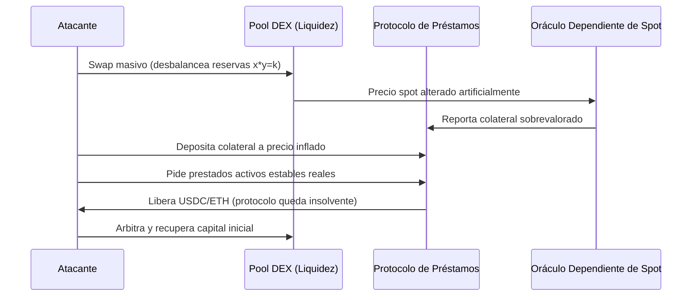
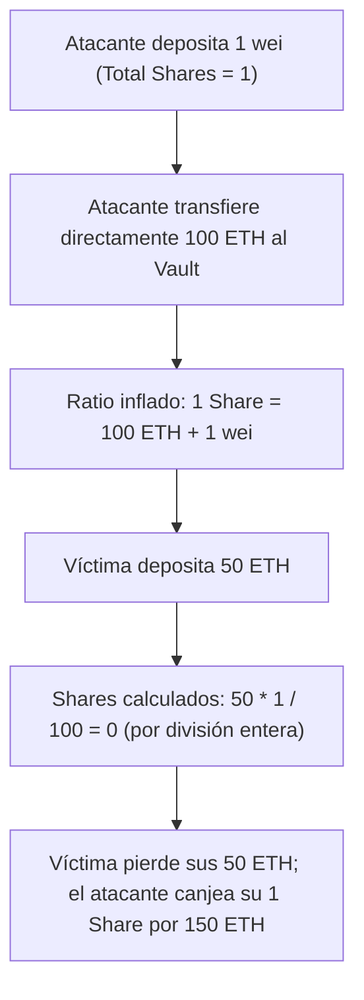

# DeFi y Manipulación de Oráculos

> [!INFO] Fuente
> Análisis de vulnerabilidades financieras en protocolos de finanzas descentralizadas (DeFi), mecanismos de manipulación de precios spot vs TWAP, vectores de apalancamiento mediante préstamos relámpago (*flash loans*) y fallas en modelos económicos de emisión y liquidación.

---

## 1. Manipulación de Oráculos (Oracle Manipulation)

Los protocolos de préstamos (*lending*), derivados y monedas estables sobrecolateralizadas necesitan conocer el precio de mercado de los activos para calcular colaterales, liquidaciones y capacidad de endeudamiento. 

Si el protocolo calcula el precio consultando las reservas directas de un pool AMM descentralizado (como Uniswap v2 o v3) en lugar de utilizar un oráculo descentralizado externo o un promedio ponderado en el tiempo (TWAP), el atacante puede alterar ese precio dentro de una única transacción.



> [!DEFINITION] Precio Spot vs TWAP
> * **Precio Spot**: El cociente instantáneo entre las reservas de un pool ($y / x$). Puede ser manipulado temporalmente con un solo intercambio masivo sin costo significativo de arbitraje antes de finalizar el bloque.
> * **TWAP (Time-Weighted Average Price)**: Promedio geométrico del precio acumulado a lo largo de múltiples bloques o minutos. Requiere mantener el precio desbalanceado durante varios bloques consecutivos, exponiendo al atacante al arbitraje de terceros en el mercado abierto.

---

## 2. Flash Loans como Herramienta de Ataque

Un **Flash Loan** (préstamo relámpago) permite solicitar préstamos de decenas o cientos de millones de dólares en tokens ERC-20 sin aportar colateral previo.

```
Transacción Atómica Inicia
  │
  ├── 1. Préstamo de $50M desde Aave / Balancer
  ├── 2. Ejecutar swap desestabilizador en Pool DEX
  ├── 3. Explotar protocolo de préstamo víctima
  ├── 4. Extraer ganancias en activo limpio
  ├── 5. Devolver los $50M iniciales + 0.09% de comisión
  │
Transacción Confirma (si falla cualquier paso, todo se revierte a costo de gas)
```

> [!NOTE] Flash Loan: Herramienta vs Vulnerabilidad
> El Flash Loan por sí mismo **no es una vulnerabilidad ni un bug**. Es una herramienta financiera legítima para arbitraje y refinanciación que, en manos de un atacante, actúa como un **multiplicador de capital** para ejecutar manipulaciones de mercado que de otro modo requerirían capital colosal.

---

## 3. First Depositor Bug / Inflación de Shares (ERC-4626)

En vaults de rendimiento estándar (como los basados en ERC-4626), los usuarios depositan activos base y reciben *shares* (participaciones) proporcionales:

$$	ext{Shares Emitidos} = rac{	ext{Assets Depositados} 	imes 	ext{Total Shares}}{	ext{Total Assets}}$$



---

## Casos Reales Donde Ocurrió

### 1. Mango Markets ($114M — Octubre 2022)
* **Vector**: Manipulación de oráculo spot en Solana.
* **Mecanismo**: El atacante financió dos cuentas con USDC y tomó posiciones largas y cortas opuestas en futuros perpetuos del token MNGO. Luego realizó compras agresivas en el libro de órdenes spot de MNGO, inflando el precio de $0.038 a $0.91 (+2400%). El oráculo de Mango actualizó el precio, lo que infló el valor de su posición a más de $400M, permitiéndole retirar $114M en USDC, SOL y BTC como préstamo contra su "garantía".
* **Desenlace**: El atacante (Avraham Eisenberg) negoció públicamente llamándolo una "estrategia de trading altamente rentable", pero fue arrestado y procesado por fraude y manipulación de mercado.

### 2. Euler Finance ($197M — Marzo 2023)
* **Vector**: Interacción imprevista entre función de donación (`donateToReserves`) y liquidación flash loan.
* **Mecanismo**: El atacante depositó DAI mediante flash loan y acuñó eDAI con apalancamiento 10x (creando dDAI como deuda). Luego invocó `donateToReserves()`, donando sus eDAI a la reserva del protocolo. Esto provocó que su cuenta quedara instantáneamente infra-colateralizada, pero la función de donación **no verificó el estado de liquidez de la cuenta donante**. Posteriormente, el atacante activó la autoliquidación con otra cuenta bajo su control, comprando el colateral con descuento garantizado y embolsándose $197M.
* **Desenlace**: Tras negociaciones on-chain, el atacante devolvió la totalidad de los fondos robados.

### 3. Tectonic / Mimas Finance (Caso TONIC)
* **Vector**: Manipulación de colateral con tokens de baja liquidez.
* **Mecanismo**: Tokens de reciente lanzamiento con capitalización inflada pero liquidez real mínima en pools fueron depositados como garantía en mercados de préstamos que los aceptaban como colateral. Al inflar temporalmente su precio en el DEX nativo, los atacantes tomaron prestados activos con alta liquidez (USDC, WBTC) dejando al protocolo con un colateral imposible de liquidar en el mercado.

### 4. Platypus Finance ($9M — Febrero 2023)
* **Vector**: Falla en la lógica de solvencia económica.
* **Mecanismo**: El contrato del protocolo verificaba la solvencia del usuario en la función `withdraw()` mediante una condición booleana errónea que comprobaba si la deuda de USP era menor al límite, pero permitía retirar el colateral original sin quemar la deuda si el usuario no retiraba explícitamente la moneda estable.

---

## ¿Dónde Podría Ocurrir Hoy? (Superficie de Ataque)

Al auditar o interactuar con protocolos DeFi, estas son las señales críticas de alerta:

1. **Lending Protocols que listan tokens con baja liquidez relativa**:
   * Si el volumen diario en DEX del colateral es menor a 5 veces el tamaño del pool de préstamo, un atacante con flash loan puede mover el precio a voluntad.
2. **Uso de `reserves` instantáneos de Uniswap v2 / v3 o Balancer**:
   * Consultar `getReserves()` directamente dentro de la función de préstamo o liquidación es una vulnerabilidad crítica inmediata.
3. **Oráculos con periodos de actualización (Heartbeat) demasiado largos**:
   * Si el oráculo de Chainlink tiene una desviación del 1% o un heartbeat de 24 horas para un token volátil, se abre una ventana temporal de arbitraje perjudicial para el protocolo.
4. **Falta de verificación de solvencia en funciones no tradicionales**:
   * Funciones como donaciones, transferencias de deuda entre subcuentas, splits de posiciones o quema de tokens de liquidez que no llamen a `_checkAccountHealth()`.
5. **Vaults ERC-4626 sin Virtual Shares / Offsets**:
   * Cualquier vault recién desplegado que arranque con `totalSupply() == 0` es vulnerable a un ataque de inflación por el primer depositante si no implementa protección contra redondeo.

---

## Contramedidas y Código Seguro

### 1. Implementación de Protección contra Manipulación de Oráculos
* Utilizar oráculos de precios descentralizados con agregación off-chain robusta (Chainlink Data Feeds o Pyth Network).
* Usar TWAP de Uniswap v3 con ventana de observación mínima de 30 minutos a 1 hora como mecanismo de fallback o chequeo cruzado de desviación.
* Configurar **Circuit Breakers**: Si el precio difiere más de un 10% entre dos actualizaciones consecutivas, pausar las solicitudes de nuevos préstamos.

### 2. Mitigación de Inflación ERC-4626 (Virtual Shares)
OpenZeppelin v4.9+ implementa en su librería ERC4626 el concepto de *virtual assets y virtual shares*:

```solidity
// OpenZeppelin ERC4626 con Virtual Offset
function _convertToShares(uint256 assets, Math.Rounding rounding) internal view virtual returns (uint256) {
    // Se añade un offset virtual de 1e3 (1000) o 1e18 para neutralizar la manipulación de 1 wei
    return assets.mulDiv(totalSupply() + 10 ** _decimalsOffset(), totalAssets() + 1, rounding);
}
```

---

## Ver también

- [[SEGURIDAD/BLOCKCHAIN/00 - INDICE]]
- [[SEGURIDAD/BLOCKCHAIN/Bridges y Cross-Chain]]
- [[SEGURIDAD/BLOCKCHAIN/Smart Contracts EVM]]
- [[SEGURIDAD/BLOCKCHAIN/MEV y Mempool]]
