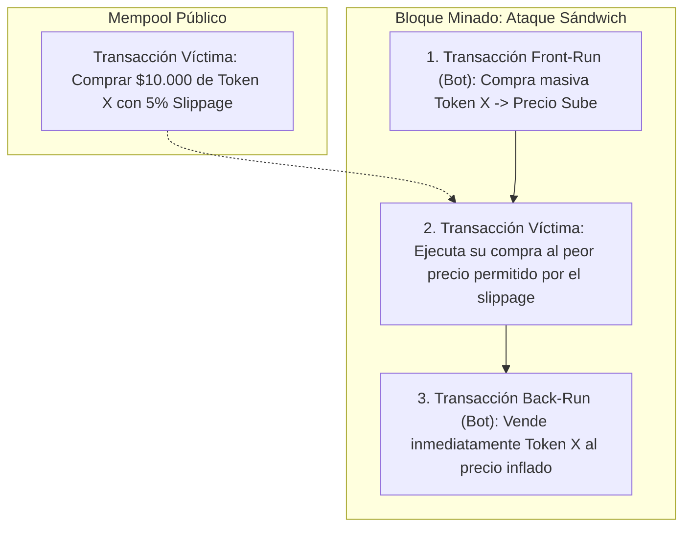

# MEV y Manipulación de Mempool

> [!INFO] Fuente
> Análisis del Valor Máximo Extraíble (*Maximal Extractable Value - MEV*), dinámicas de mempool público, ataques de arbitraje forzado y manipulación de slippage en finanzas descentralizadas.

---

## 1. ¿Qué es MEV?

**MEV (Maximal Extractable Value)** es el valor total que mineros, validadores o bots automatizados (*searchers*) pueden extraer de los usuarios reorganizando, incluyendo o excluyendo intencionalmente transacciones dentro de un bloque.

```
Mempool Público (Transacciones pendientes visibles para todo el mundo)
       │
       ├── Bots Searchers analizan el impacto en precios
       ├── Pujan gas fee superior (Priority Fee / Flashbots Bundle)
       │
Bloque Ordenado por Rentabilidad del Extractor
```

---

## 2. Tipos de Ataques Basados en Mempool

### Sandwich Attack (Ataque Sándwich)
Ocurre cuando una víctima envía una orden de swap en un DEX con una tolerancia de deslizamiento (*slippage*) amplia. Un bot detecta la transacción en el mempool y la "empareda":



El bot se embolsa la diferencia neta de precio menos las comisiones de gas pagadas al constructor del bloque (*block builder*), y la víctima recibe menos tokens de los que debería haber obtenido.

### Front-Running
El atacante copia los datos de una transacción lucrativa (ej. una liquidación de colateral o un arbitraje atómico entre DEXs) y le asigna una comisión de prioridad de gas más alta para que se ejecute primero.

### Back-Running
El atacante ubica su transacción inmediatamente después de una transacción objetivo grande (ej. la creación de un nuevo par de liquidez o una compra masiva de ballena) para capturar el arbitraje resultante sin interferir negativamente con la orden previa.

### Time-Bandit Attacks (Ataques Bandidos en el Tiempo)
Si el MEV disponible en un bloque anterior es significativamente mayor que la recompensa ordinaria por bloque, los validadores tienen un incentivo económico para reorganizar la cadena (*reorg*), minando bloques alternativos para robar ese valor retrospectivamente.

---

## Casos Reales y Métricas de Impacto

### 1. Operaciones del Bot `jaredfromsubway.eth`
* **Magnitud**: Extracción de decenas de millones de dólares en ganancias netas en Ethereum durante 2023 y 2024.
* **Mecanismo**: Empleo de contratos altamente optimizados en ensamblador EVM (*Yul*) para realizar sándwiches algorítmicos ultra-rápidos sobre cientos de pares de tokens volátiles en Uniswap v2 y v3, gastando millones de dólares únicamente en comisiones de gas para monopolizar los bloques de Ethereum.

### 2. Front-Running de Liquidaciones y Arbitrajes Atómicos
* Bots competidores incrementan las subastas de gas prioritario (*Priority Gas Auctions - PGAs*) hasta pagar el 99% del valor liquidado a los validadores con tal de quedarse con el 1% restante, congestionando la red para usuarios normales.

---

## ¿Dónde Podría Ocurrir Hoy? (Superficie de Ataque)

1. **Swaps con Tolerancia de Deslizamiento (Slippage) Desmesurada (> 1%)**:
   * Interfaces que configuran por defecto un slippage alto para evitar que la transacción falle cuando la red está congestionada.
2. **Intercambios en Pools de Liquidez Concentrada con Poca Profundidad**:
   * En pools con poca liquidez, incluso una orden pequeña de $1.000 mueve significativamente la curva de precios, haciéndola vulnerable al sándwich.
3. **Liquidaciones de Préstamos Enviadas al Mempool Público**:
   * Si un protocolo ejecuta sus liquidaciones mediante transacciones públicas normales, los bots de arbitraje compiten por front-runnear la operación.

---

## Contramedidas

* **Uso Obligatorio de RPCs Privados (MEV Protection)**:
  * Conectar la billetera a servicios como **Flashbots Protect** o **MEV Blocker**. Estos endpoints envían las transacciones directamente a los constructores de bloques sin publicarlas en el mempool visible de los nodos.
* **Ajuste de Slippage Riguroso (< 0.5%)**:
  * Limitar la tolerancia máxima de desviación de precio. Si un bot intenta emparedar la orden, la transacción revertirá inmediatamente.
* **Arquitecturas Basadas en Intenciones (Intent-Based Swaps)**:
  * Emplear protocolos como **CoW Swap** o **UniswapX**, donde las órdenes se agrupan en lotes (*batch auctions*) con precios uniformes y liquidación protegida contra bots extractores.

---

## Ver también

- [[SEGURIDAD/BLOCKCHAIN/00 - INDICE]]
- [[SEGURIDAD/BLOCKCHAIN/DeFi y Oráculos]]
- [[SEGURIDAD/BLOCKCHAIN/Smart Contracts EVM]]
- [[SEGURIDAD/BLOCKCHAIN/Consenso y Red]]
