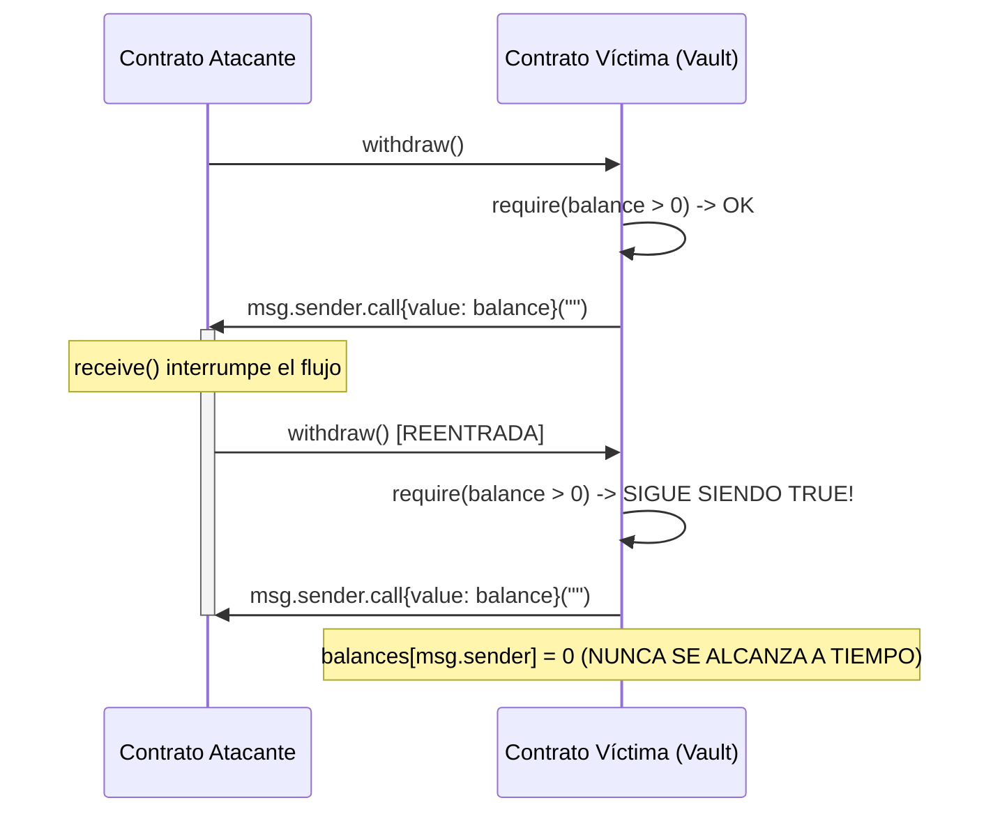

# Vulnerabilidades en Smart Contracts EVM

> [!INFO] Fuente
> Análisis técnico de vulnerabilidades a nivel de código de máquina en la Ethereum Virtual Machine (EVM) y contratos inteligentes desarrollados en Solidity y Vyper.

---

## 1. Reentrancy (Reentrada)

La reentrada ocurre cuando un contrato inteligente envía ether o tokens a una dirección externa antes de actualizar su estado interno. La dirección receptora puede ejecutar código malicioso en su función `fallback()` o `receive()` y volver a llamar al contrato original de forma recursiva.



### Código Vulnerable vs Código Seguro

```solidity
// VULNERABLE: Cede el control antes de actualizar balances
function withdraw() public {
    uint256 amount = balances[msg.sender];
    require(amount > 0, "Sin fondos");

    (bool sent, ) = msg.sender.call{value: amount}(""); // EXTERNAL CALL
    require(sent, "Fallo al enviar");

    balances[msg.sender] = 0; // ACTUALIZACIÓN TARDÍA
}

// SEGURO: Patrón Checks-Effects-Interactions (CEI)
function withdrawSafe() public {
    uint256 amount = balances[msg.sender];
    require(amount > 0, "Sin fondos");

    balances[msg.sender] = 0; // 1. EFECTO: Se actualiza el balance primero

    (bool sent, ) = msg.sender.call{value: amount}(""); // 2. INTERACCIÓN EXTERNA
    require(sent, "Fallo al enviar");
}
```

### Variante Moderna: Read-Only Reentrancy
No altera el balance del atacante en el ciclo de reentrada. En su lugar, mientras un pool (ej. Curve Finance) está a mitad de un retiro y su balance está desbalanceado pero sus variables internas aún no se ajustaron, el atacante consulta una función de solo lectura (`view`, como `get_virtual_price()`). Protocolos de préstamos terceros que consultan esa función como oráculo reciben un precio distorsionado, permitiendo liquidaciones fraudulentas.

---

## 2. Fallas de Control de Acceso (Access Control Bugs)

Funciones administrativas o de inicialización que quedan expuestas sin modificadores de permisos:

```solidity
// ERROR CRÍTICO: Función de inicialización pública sin timelock ni flag de ejecución
function initialize(address _owner) public {
    require(owner == address(0), "Ya inicializado"); // Si falta este require, cualquiera toma el control
    owner = _owner;
}

// ERROR: Uso de tx.origin en lugar de msg.sender
function transferTo(address to, uint256 amount) public {
    require(tx.origin == owner); // VULNERABLE a ataque de phishing si el owner interactúa con contrato malicioso
    payable(to).transfer(amount);
}
```

---

## 3. Delegatecall Injection y Proxies no Inicializados

`delegatecall` ejecuta el código de otro contrato pero dentro del contexto de almacenamiento (*storage*), balance y `msg.sender` del contrato que llama.

```
Contrato Proxy (Almacena datos, balance y variables de estado)
      │
      └── delegatecall ──► Contrato de Lógica (Implementación del código)
```

Si el contrato de lógica no tiene inicializador protegido o el proxy permite pasar direcciones arbitrarias a `delegatecall`, el atacante puede:
* Sobrescribir el storage slot 0 (donde reside `owner`).
* Destruir el contrato de implementación mediante `selfdestruct`.

---

## 4. Integer Overflow y Underflow

En versiones de Solidity anteriores a la 0.8.0, las variables enteras no contaban con chequeos de desbordamiento nativos:

```solidity
uint8 numero = 0;
numero = numero - 1; // En Solidity < 0.8.0 resulta en 255
```

> [!TIP] Estado Actual en Solidity >= 0.8.0
> El compilador incluye chequeos aritméticos automáticos que revierten la transacción (`Panic(0x11)`). El único vector residual ocurre cuando los desarrolladores usan bloques `unchecked { ... }` para ahorrar gas sin validar los límites previamente.

---

## Casos Reales Donde Ocurrió

### 1. The DAO ($60M — Junio 2016)
* **Vector**: Reentrancy clásica en la función `splitDAO()`.
* **Mecanismo**: El atacante solicitó dividir el DAO y retirar sus fondos. La llamada de transferencia se ejecutó antes de que se actualizaran las participaciones internas del usuario, permitiendo retirar fondos en bucle recursivo.
* **Consecuencia**: Condujo al hard fork de Ethereum que dio origen a la bifurcación entre Ethereum (ETH) y Ethereum Classic (ETC).

### 2. Parity Multisig Hacks ($30M robados + $150M congelados — 2017)
* **Incidente 1 (Julio 2017)**: La función `initWallet()` en el contrato de la librería era pública. El atacante la invocó directamente, se convirtió en el dueño de la billetera compartida y drenó $30M.
* **Incidente 2 (Noviembre 2017)**: Un desarrollador invocó `initWallet()` en el contrato lógico compartido de Parity y luego ejecutó `kill()` (que contenía `selfdestruct`). Al destruir el contrato de lógica, 513.774 ETH quedaron congelados permanentemente en cientos de multi-sig wallets dependientes.

### 3. Curve Finance / Vyper Reentrancy ($70M — Julio 2023)
* **Vector**: Falla de compilador en reentrancy locks recursivos.
* **Mecanismo**: Las versiones 0.2.15, 0.2.16 y 0.3.0 del compilador Vyper tenían un bug crítico en el manejo de memoria: el modificador `@nonreentrant` utilizaba slots de almacenamiento superpuestos, desactivando efectivamente la protección de reentrancy en pools de liquidez seleccionados (alETH, pETH, msETH).

---

## ¿Dónde Podría Ocurrir Hoy? (Superficie de Ataque)

1. **Tokens con Hooks Externos (ERC-777 y ERC-1155)**:
   * Tokens como ERC-777 implementan `tokensToSend()` y `tokensReceived()`. Cuando un contrato transfiere estos tokens, cede involuntariamente el control de ejecución al receptor, activando reentrancy aunque no se use ether nativo.
2. **Contratos de Implementación de Proxies UUPS sin Constructor**:
   * Si el contrato de implementación no invoca `_disableInitializers()` en su `constructor()`, un atacante puede llamar a `initialize()` directamente en la lógica, ejecutar una actualización maliciosa y autodestruir el contrato.
3. **Integración de Funciones `view` de AMMs para Valoración de Activos**:
   * Protocolos que consultan el balance de un par de liquidez en medio de una operación de staking/unstaking.

---

## Contramedidas

* **Patrón Checks-Effects-Interactions (CEI)**: Siempre validar condiciones (`require`), luego alterar el estado interno (`balances[user] = 0`), y por último ejecutar llamadas externas.
* **Uso de ReentrancyGuard**: Emplear modificadores probados en batalla de OpenZeppelin (`nonReentrant`).
* **Protección de Proxies**: Incluir siempre `_disableInitializers()` en el constructor de los contratos de implementación:

```solidity
/// @custom:oz-upgrades-unsafe-allow constructor
constructor() {
    _disableInitializers();
}
```

---

## Ver también

- [[SEGURIDAD/BLOCKCHAIN/00 - INDICE]]
- [[SEGURIDAD/BLOCKCHAIN/DeFi y Oráculos]]
- [[SEGURIDAD/BLOCKCHAIN/Bridges y Cross-Chain]]
- [[SEGURIDAD/BLOCKCHAIN/Wallets y Capa Humana]]
