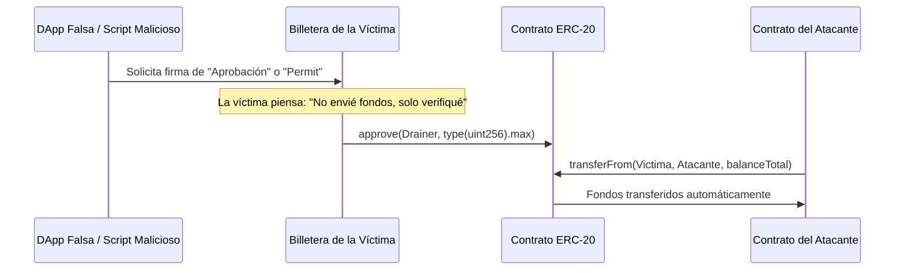

# Seguridad en Wallets y Capa Humana

> [!INFO] Fuente
> Estudio de vectores de ataque dirigidos a las credenciales, llaves privadas y mecanismos de autorización criptográfica del usuario final en Web3.

---

## 1. Phishing de Firmas y Approval Scams

A diferencia de los ataques tradicionales donde se roba una contraseña, en Web3 los atacantes inducen a la víctima a firmar un mensaje o transacción criptográfica legítima que concede permisos de extracción sobre sus activos:



### Mecanismos Técnicos de Aprobación

1. **ERC-20 `approve(address spender, uint256 amount)`**:
   * Otorga derecho a un contrato tercero para mover fondos en nombre del usuario mediante `transferFrom`. Los sitios maliciosos solicitan autorización para `type(uint256).max` ($2^{256} - 1$, saldo infinito).
2. **EIP-2612 `permit` (Firmas Gasless)**:
   * Permite autorizar gastos sin pagar gas mediante una firma off-chain `secp256k1` basada en el estándar EIP-712 `(v, r, s)`. El atacante toma la firma del usuario y la envía él mismo a la blockchain pagando el gas, drenando los tokens sin que la víctima haya emitido una transacción on-chain directa.
3. **Uniswap `Permit2`**:
   * Contrato canónico de autorizaciones compartidas. Si un usuario aprueba Permit2 una vez, cualquier firma off-chain posterior concedida a un atacante permite vaciar todos los tokens asociados.

---

## 2. Address Poisoning (Envenenamiento de Direcciones)

Los atacantes observan el historial público de transferencias de billeteras con balances altos:

```
Dirección Legítima de Destino:  0x71C...893F
Dirección Falsa (Vanity Poison): 0x71C...893F (con el medio alterado)
```

1. El atacante genera mediante fuerza bruta en GPU una dirección que comparte los primeros y últimos 4 a 6 caracteres con una contraparte frecuente de la víctima.
2. Envía una micro-transacción de 0 tokens hacia la víctima desde esa dirección falsa.
3. La dirección maliciosa queda grabada en el historial de transacciones recientes de la billetera.
4. Cuando la víctima quiere enviar fondos nuevamente, copia la dirección desde su historial en lugar de verificar la cadena completa de 42 caracteres, enviando los fondos directamente al atacante.

---

## 3. Drenadores de Billeteras (Drainers-as-a-Service)

Ecosistema criminal organizado donde desarrolladores alquilan kits de drenaje (*drainers*, como Inferno, Pink o Angel Drainer) a cambio de un porcentaje (usualmente 20%) de cada monto robado:
* **Inyección Web**: Inyección de scripts maliciosos en frontends de proyectos legítimos mediante compromiso de cuentas de Discord, Twitter o proveedores DNS/CDN.
* **Técnicas de Evasión**: Detección de herramientas de emulación de transacciones y retraso artificial de firmas.

---

## Casos Reales Donde Ocurrió

### 1. BadgerDAO ($120M — Diciembre 2021)
* **Vector**: Compromiso de API de Cloudflare e inyección de script malicioso.
* **Mecanismo**: Los atacantes obtuvieron una API key de Cloudflare de BadgerDAO e inyectaron un script malicioso en la interfaz oficial de la dApp. Cada vez que un usuario interactuaba con el protocolo, el script solicitaba autorizaciones adicionales de gasto (`approve`) a la dirección del atacante. Se drenaron $120M en BTC y ETH de cientos de billeteras legítimas.

### 2. Drenaje de Whale por Address Poisoning ($68M en WBTC — Mayo 2024)
* **Vector**: Copia apresurada de dirección desde el historial de transacciones.
* **Mecanismo**: Un operador de una billetera institucional quiso transferir 1.155 WBTC (valorados en $68 millones) a otra cuenta de su propiedad. El atacante había enviado una transacción de spam desde una dirección vanidosa con el mismo prefijo y sufijo. El usuario copió la dirección envenenada de su historial y ejecutó la transferencia completa hacia el atacante.

### 3. Campañas Masivas de Phishing (Inferno / Pink Drainer — $100M+ en 2023/2024)
* **Vector**: Creación masiva de clones de sitios web de proyectos (LayerZero, Arbitrum, zkSync) ofreciendo airdrops inexistentes que requerían firmar mensajes `permit` de EIP-712.

---

## ¿Dónde Podría Ocurrir Hoy? (Superficie de Ataque)

1. **Frontends de DApps con dependencias NPM desactualizadas o CDN compartidas**:
   * Si el frontend se compila con librerías vulnerables, un atacante puede alterar los prompts de firma de la interfaz web.
2. **Firmas ciegas (Blind Signing) en Hardware Wallets**:
   * Firmar mensajes en dispositivos de hardware sin soporte para decodificación clara de datos EIP-712 en pantalla.
3. **Uso de portapapeles en sistemas operativos infectados**:
   * Troyanos *clipboard hijackers* que monitorean el portapapeles y reemplazan cualquier dirección copiada que empiece por `0x` por la dirección del atacante.

---

## Contramedidas

* **Billeteras con Simulación de Transacciones**: Utilizar clientes como Rabby Wallet o extensiones como PocketUniverse que simulan y muestran el balance neto exacto antes y después de firmar.
* **Auditoría y Revocación Periódica de Permisos**: Monitorear y revocar aprobaciones huérfanas o ilimitadas en herramientas como `revoke.cash` o el *Token Approval Tool* de Etherscan.
* **Comprobación Estricta de Direcciones**: Utilizar libretas de direcciones con nombres guardados (address book) y nunca copiar direcciones de historiales recientes de transacciones.
* **Aprobaciones de Monto Exacto**: Prohibir por diseño de interfaz las aprobaciones infinitas (`type(uint256).max`), aprobando únicamente la cantidad exacta que se va a intercambiar.

---

## Ver también

- [[SEGURIDAD/BLOCKCHAIN/00 - INDICE]]
- [[SEGURIDAD/BLOCKCHAIN/Smart Contracts EVM]]
- [[SEGURIDAD/BLOCKCHAIN/DeFi y Oráculos]]
- [[SEGURIDAD/OSINT Profundo]]
